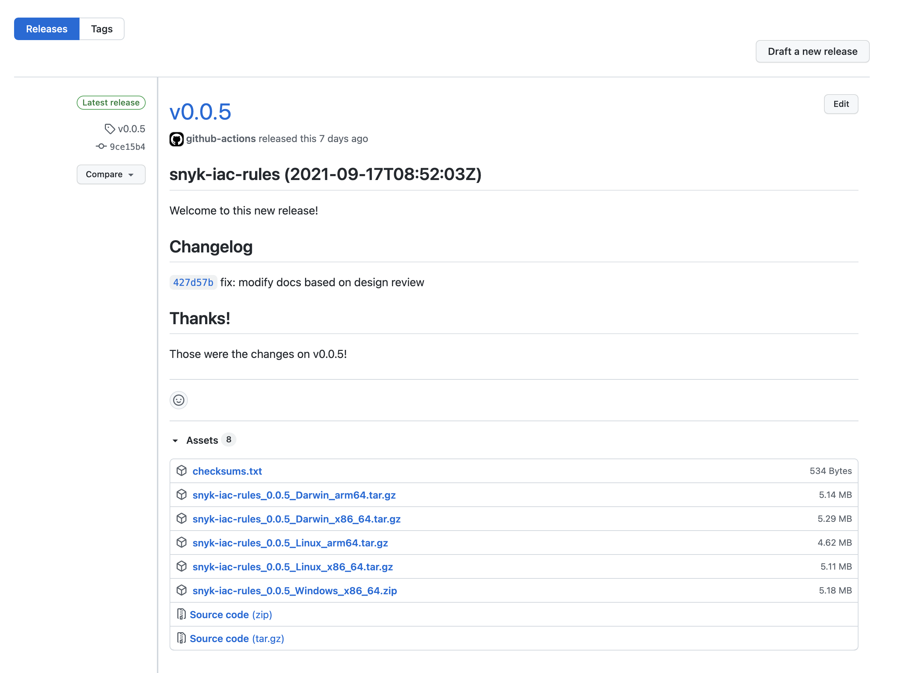

# Install the SDK

​Install the SDK using one of these options:

* [Install the SDK with npm](install-the-sdk.md#install-the-sdk-with-npm)
* ​[Install the SDK using the prebuilt binaries​](install-the-sdk.md#install-the-sdk-using-the-prebuilt-binaries)
* [Install the SDK with Homebrew](install-the-sdk.md#install-the-sdk-with-homebrew)
* [​Install the SDK with the Windows Scoop package manager](install-the-sdk.md#install-the-sdk-with-the-windows-scoop-package-manager)
* [Install the SDK with Docker](install-the-sdk.md#install-the-sdk-with-docker)

After installation, you can get started writing rules. For details, see [Writing rules using the SDK](writing-rules-using-the-sdk/).


After installation, Apple M1 users might encounter the error `Architecture not supported: ${process.arch}`. To resolve this, first install the Rosetta 2 software by running `softwareupdate --install-rosetta`.


## Install the SDK with npm

Install the SDK using npm.

### **Prerequisites for installing the SDK with npm**

Ensure you have installed the latest version of npm in your local environment, using Node version 10 or later.

### **Steps to install the SDK with npm**

Run this command to install the SDK for local use:

```
npm install -g snyk-iac-rules
```

After installation, you are ready to use the SDK. Run the following command to verify that the SDK works:

```
snyk-iac-rules --help
```

## Install the SDK using the prebuilt binaries

You can download and use the SDK's prebuilt binaries. To download the prebuilt binary, visit the [**Releases tab**](https://github.com/snyk/snyk-iac-rules/releases) on the SDK repository page in GitHub:

<figure><figcaption><p>Releases tab on the SDK repository page</p></figcaption></figure>

After you have downloaded the desired binary archive, open a terminal and run the following commands. Note that these commands assume you are running on an Intel-based macOS and downloading version `0.0.5` of the SDK.

```
$ tar xzf snyk-iac-rules_0.0.5_Darwin_x86_64.tar.gz 
$ sudo mv snyk-iac-rules /usr/local/bin
```

To verify that you can use the SDK, run:

```
snyk-iac-rules --help
```

## Install the SDK with Homebrew

From macOS and Linux environments, you can use Homebrew to install the Snyk SDK. The repository for installation is stored in the [Snyk GitHub](https://github.com/snyk/homebrew-tap).

### **Prerequisites for installing the SDK with Homebrew**

* You must have a macOS or Linux environment.
*   Ensure [Homebrew](https://brew.sh/index_he) has already been installed:

    ```
    brew tap snyk/tap
    ```

### **Steps to install the SDK with Homebrew**

Install the SDK as follows:

```
brew install snyk-iac-rules
```

## Install the SDK with the Windows Scoop package manager

From Windows environments, you can use Scoop to install the  `snyk-iac-rules` SDK. The repository for installation is stored in the [Snyk GitHub](https://github.com/snyk/scoop-snyk).

### **Prerequisites for installing the SDK with the Windows Scoop package manager**

* You must have a Windows environment.
*   Ensure [Scoop](https://scoop.sh) has already been installed:

    ```
    scoop bucket add snyk https://github.com/snyk/scoop-snyk
    ```

### **Steps to install the SDK with the Windows Scoop package manager**

Install the SDK as follows:

```
scoop install snyk-iac-rules
```

## Install the SDK with Docker

You can use Docker to install and run the `snyk-iac-rules` SDK while writing your custom rules in your local directory. The image is stored [in the Snyk Docker Hub repo](https://hub.docker.com/r/snyk/snyk-iac-rules).

### **Prerequisites for installing the SDK with Docker**

* Ensure [Docker](https://docs.docker.com/get-docker/) has already been installed.
* You must have a way to run Linux containers.

### **Steps to install the SDK with Docker**

Pull the Docker image as follows:

```
docker pull snyk/snyk-iac-rules
```

Run the SDK by using the following command:

```
docker run --rm -v $(pwd):/app snyk/snyk-iac-rules {SDK command}
```

For example, to generate a custom rules template, you can run the following:

```
docker run --rm -v $(pwd):/app snyk/snyk-iac-rules template -r {rule_name}
```

## More information about the SDK

* [​Getting started with the SDK​](writing-rules-using-the-sdk/)
* ​[SDK reference​](sdk-reference.md)
