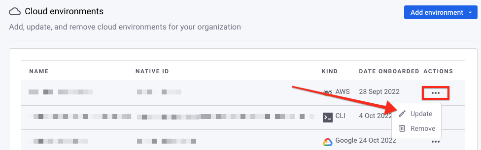

# Find an environment ID

Certain actions, such as updating or deleting an environment using the Snyk API, require the environment ID.

To find the ID of an environment, you can use the following methods:

* [Web UI](find-an-environment-id.md#web-ui)
* [API](find-an-environment-id.md#api)

## Web UI

To find an environment ID using the [Web UI](https://app.snyk.io/):

1. Navigate to your Organization **Settings** > **Cloud environments**.
2. In the **Actions** column, select the three dots for the desired environment.
3.  Select **Update**.

    <figure><figcaption><p>Update an environment from the Cloud environments page in Settings</p></figcaption></figure>
4.  In the **Environment ID** section, select **Copy** to copy the environment ID.

    <figure><figcaption><p>Copy the Environment ID</p></figcaption></figure>

## API

To find an environment ID using the API, send a request to the [`/cloud/environments`](https://apidocs.snyk.io/#get-/orgs/-org_id-/cloud/environments) endpoint in the following format:

```
curl -X GET \
  'https://api.snyk.io/rest/orgs/YOUR-ORGANIZATION-ID/cloud/environments?version=2022-12-21~beta' \
  -H 'Authorization: token YOUR-API-TOKEN'
```

In the output, look for the `data.id` property of the desired environment. In the shortened example that follows, the ID is `3b7ccff9-8900-4e54-0000-1234abcd1234`:

```
{
  "jsonapi": {
    "version": "1.0"
  },
  "data": {
    "id": "3b7ccff9-8900-4e54-0000-1234abcd1234",
    <trimmed for length>
  }
}
```

## Filtering environments

You can filter the list of environments using query parameters to make it easier to find a particular environment. For example, you can add `kind=google` to the API request to return only Google Cloud environments:

```
curl -X GET \
  'https://api.snyk.io/rest/orgs/YOUR-ORGANIZATION-ID/cloud/environments?kind=google&version=2022-12-21~beta' \
  -H 'Authorization: token YOUR-API-TOKEN'
```
