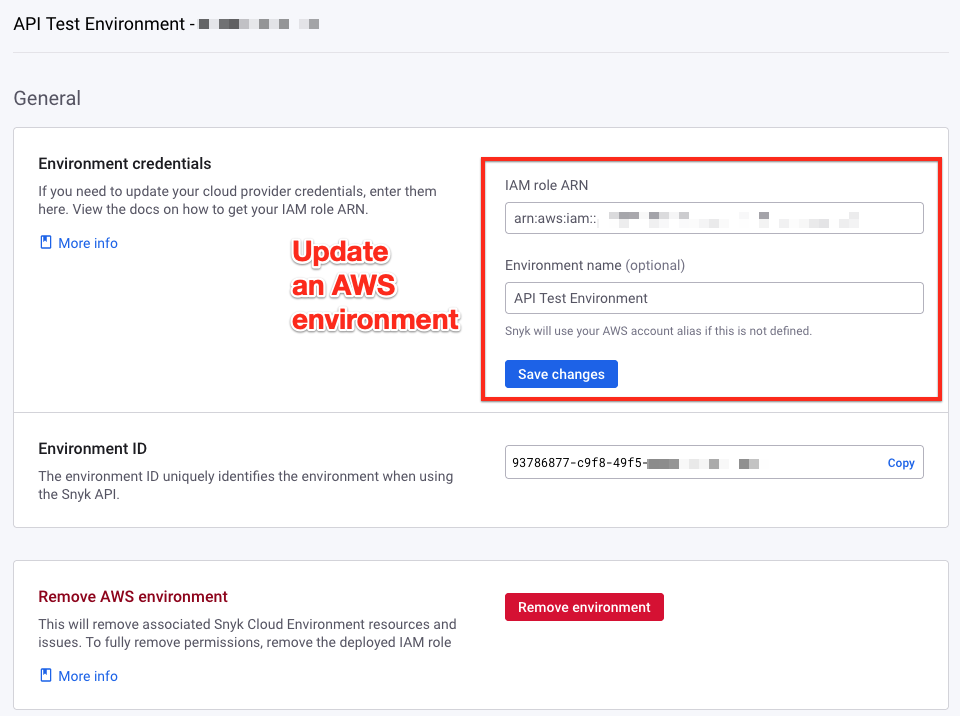
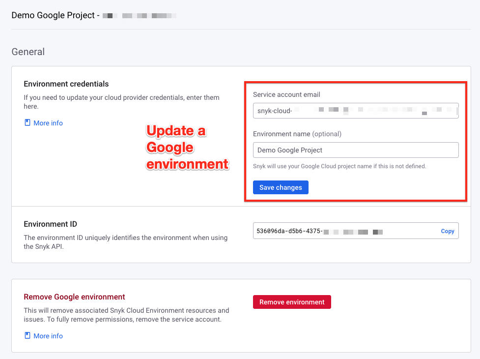

# Update a cloud environment

You can update the following attributes for a [cloud environment](../key-concepts-for-cloud-scans.md#environments):

* **AWS:** Environment name and IAM role ARN (Amazon Resource Name). The new role ARN must have the same AWS account ID as the old role ARN. See [Find the role ARN](../../cloud-platform-integrations/aws-integration/aws-integration-web-ui/step-3-create-and-scan-a-cloud-environment-web-ui.md#find-the-role-arn).
* **Google:** Environment name and service account email address. The new service account email must be associated with the same Project ID as the old one.
* **Azure:** Environment name and application ID. The new application ID must be associated with the same subscription and tenant as the old one.

For example, you must update the Snyk IAM role ARN if you change the role's name in the Terraform or CloudFormation template and deploy the changes.

You can update a Snyk Cloud Environment using the following methods:

* [Web UI](update-a-cloud-environment.md#web-ui)
* [API](update-a-cloud-environment.md#api)

## Web UI

To update an environment using the [Snyk Web UI](https://app.snyk.io):

1. Navigate to your Organization **Settings** > **Cloud environments.**
2. In the **Actions** column, select the three dots for the environment you want to update.
3.  Select **Update**.

    <figure><figcaption><p>Select the ... icon to update an environment.</p></figcaption></figure>
4.  In the **General** section, enter the updated environment name, credentials, or both.

    <div><figure><figcaption><p>Example of updating an AWS environment.</p></figcaption></figure> <figure><figcaption><p>Example of updating a Google environment.</p></figcaption></figure></div>
5. Select **Save changes**.

## API

To update an environment using the Snyk API:

1. [Find the environment ID](update-a-cloud-environment.md#find-the-environment-id)
2. [Send an API request to update the environment](update-a-cloud-environment.md#update-the-environment)

### Find the environment ID

First, find the ID of the Cloud environment you want to update. Send a request to the [`/cloud/environments`](https://apidocs.snyk.io/#get-/orgs/-org_id-/cloud/environments) endpoint in the following format:

```
curl -X GET \
  'https://api.snyk.io/rest/orgs/YOUR-ORGANIZATION-ID/cloud/environments?version=2022-12-21~beta' \
  -H 'Authorization: token YOUR-API-TOKEN'
```

In the output, look for the `data.id` property. In the shortened example that follows, the ID is `3b7ccff9-8900-4e54-0000-1234abcd1234`:

```json
{
  "jsonapi": {
    "version": "1.0"
  },
  "data": {
    "id": "3b7ccff9-8900-4e54-0000-1234abcd1234",
    <trimmed for length>
  }
}
```

### Update the environment

To update an environment, send a request to the [`/cloud/environments/{environment_id}`](https://apidocs.snyk.io/#patch-/orgs/-org_id-/cloud/environments/-environment_id-) endpoint in the format that follows for your cloud provider.

#### AWS

```
curl -X PATCH \
'https://api.snyk.io/rest/orgs/YOUR-ORGANIZATION-ID/cloud/environments/YOUR-ENVIRONMENT-ID?version=2022-12-21~beta' \
-H 'Authorization: token YOUR-API-TOKEN' \
-H "Content-Type:application/vnd.api+json"  -d '{
  "data": {
    "attributes": {
      "options": {
        "role_arn": "YOUR-NEW-ROLE-ARN"
      }
    },
    "type": "resource"
  }
}'
```

#### Google

`data.attributes.options.service_account_email` is required. You can choose to specify the Project ID explicitly with a `data.attributes.options.project_id` field, but it cannot be different from the current ProjectProject ID.

```
curl -X PATCH \
'https://api.snyk.io/rest/orgs/YOUR-ORGANIZATION-ID/cloud/environments/YOUR-ENVIRONMENT-ID?version=2022-12-21~beta' \
-H 'Authorization: token YOUR-API-TOKEN' \
-H "Content-Type:application/vnd.api+json"  -d '{
  "data": {
    "attributes": {
      "options": {
        "service_account_email": "YOUR-NEW-SERVICE-ACCOUNT-EMAIL"
      }
    },
    "type": "resource"
  }
}'
```

#### Azure

`data.attributes.options.tenant_id` and `data.attributes.options.subscription_id` are required and cannot be different from the current values.

```
curl -X PATCH \
'https://api.snyk.io/rest/orgs/YOUR-ORGANIZATION-ID/cloud/environments/YOUR-ENVIRONMENT-ID?version=2022-12-21~beta' \
-H 'Authorization: token YOUR-API-TOKEN' \
-H 'Content-Type:application/vnd.api+json' -d '{
  "data": {
    "attributes": {
      "name": "YOUR-NEW-ENVIRONMENT-NAME",
      "options": {
        "application_id": "YOUR-NEW-APPLICATION-ID",
        "tenant_id": "00000000-0000-0000-1234-12345678abcd",
        "subscription_id": "abcd1234-abcd-1234-0000-000000000000"
      }
    },
    "type": "resource"
  }
}'
```

### Understand the API response

Snyk returns a JSON document containing the updated environment details, for example, the following response showing an AWS environment:

```json
{
  "jsonapi": {
    "version": "1.0"
  },
  "data": {
    "id": "3b7ccff9-8900-4e54-0000-1234abcd1234",
    "type": "environment",
    "attributes": {
      "name": "Example AWS Environment",
      "options": {
        "role_arn": "arn:aws:iam::123412341234:role/snyk-cloud-role-updated"
      },
      "native_id": "123412341234",
      "properties": {
        "account_id": "123412341234"
      },
      "kind": "aws",
      "revision": 2,
      "created_at": "2022-07-31T00:50:49Z",
      "status": "success",
      "updated_at": "2022-08-17T18:18:01Z"
    },
    "relationships": {
      "organization": {
        "data": {
          "id": "d70c1768-5675-0000-1234-abcd1234abcd",
          "type": "organization"
        },
        "links": {
          "related": "/orgs/d70c1768-5675-0000-1234-abcd1234abcd?version=2022-12-21~beta"
        }
      }
    }
  }
}
```

The `data.attributes.options` and `data.attributes.properties` fields in the JSON output vary depending on the cloud provider and show the updated information.
