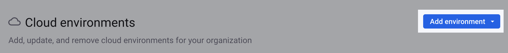
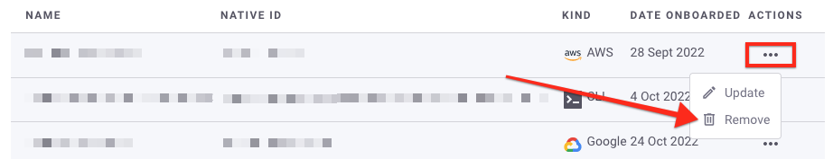

# View, add, and remove environments

To view all Snyk environments in an Organization, navigate to your Organization **Settings** > **Cloud environments**.

The cloud environments table displays the following information for each environment:

* Name
* Native ID (for example, AWS account ID, Google project ID, Azure subscription, CLI)
* Kind (for example, AWS, Google, Azure, CLI)
* Date onboarded

<figure><figcaption>
The Snyk environments page in the Snyk Web UI
</figcaption></figure>

## Add a cloud environment

To add a cloud environment, select the **Add environment** drop-down and select the cloud provider. Follow the steps in [AWS Integration: Web UI](../../cloud-platform-integrations/aws-integration/aws-integration-web-ui/), [Google Cloud Integration: Web UI](../../cloud-platform-integrations/google-cloud-integration/google-cloud-integration-web-ui/), or [Azure Integration: Web UI](../../cloud-platform-integrations/azure-integration-for-cloud-configurations/azure-integration-web-ui/) to create the environment.&#x20;

<figure><figcaption></figcaption></figure>

You can also add an environment using the Snyk API:

* [AWS Integration: API](../../cloud-platform-integrations/aws-integration/aws-integration-api/)
* [Google Cloud Integration: API](../../cloud-platform-integrations/google-cloud-integration/google-cloud-integration-api/)
* [Azure Integration: API](../../cloud-platform-integrations/azure-integration-for-cloud-configurations/azure-integration-api/)

## Remove a cloud environment

To remove a cloud environment:

1. In the **Actions** column, select the three dots for the environment you want to remove.
2. Select **Remove**.
3. In the confirmation modal, select **Yes, remove**.

<figure><figcaption></figcaption></figure>

You can also remove an environment using the [Snyk API](remove-a-cloud-environment.md#api).
