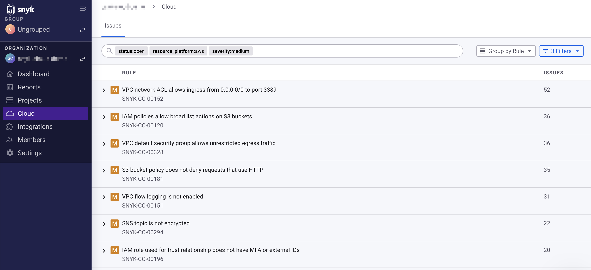

# Manage cloud issues

When Snyk scans a cloud environment, it tests infrastructure configurations against a comprehensive set of security rules. These rules identify misconfigurations that can lead to security problems. For example, Snyk can scan the configuration of an Amazon Web Services (AWS) S3 bucket to see if it is publicly readable, and so vulnerable to a data breach.

Any IaC or cloud misconfiguration Snyk finds is reported as an issue. The [cloud issues page](view-cloud-issues-in-the-snyk-web-ui.md) in the Snyk Web UI provides details about each issue, including status, severity, impact, associated resources, and other information.

<figure><figcaption>
Cloud issues page in the Web UI
</figcaption></figure>

## Understanding issues

Issues have the following components:

* **Resource:** The cloud resource that is tested, such as an AWS S3 bucket
* **Rule:** The rule that is used to test the resource, such as "S3 bucket is publicly readable"


See [Key concepts](../key-concepts-for-cloud-scans.md) for more details.


The first time a misconfiguration is detected, Snyk opens an issue for that rule and resource. The issue remains open across scans as long as the misconfiguration is present.

In a later scan, if the misconfiguration is resolved, Snyk closes the issue.

## Example issue lifecycle

If your environment contains an AWS S3 bucket named `prod-backups-bucket` that is publicly readable, the issue lifecycle could look as follows:

### **First scan**

1. During an environment scan, Snyk tests `prod-backups-bucket` against the rule "S3 bucket is publicly readable."
2. Snyk opens an issue.

### **Second scan**

1. You do not fix the bucket.
2. On the next scan, Snyk tests `prod-backups-bucket` against the rule again.
3. The issue stays open, with the same unique identifier.

### **Third scan**

1. In AWS, you configure `prod-backups-bucket` to be private.
2. On the next scan, Snyk tests `prod-backups-bucket` against the rule again.
3. Snyk closes the issue because the bucket is not publicly readable and no longer fails the rule.
