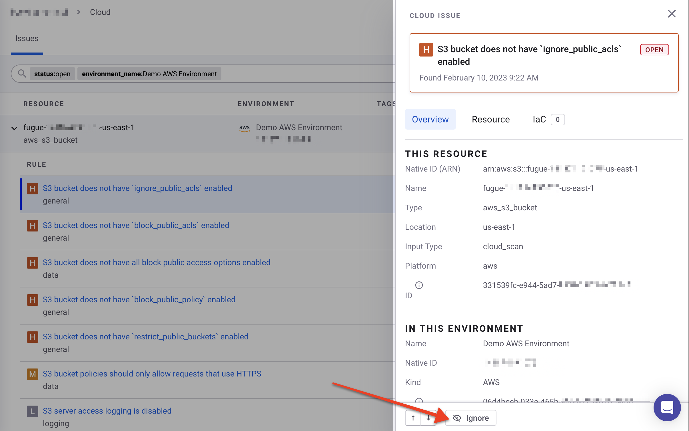
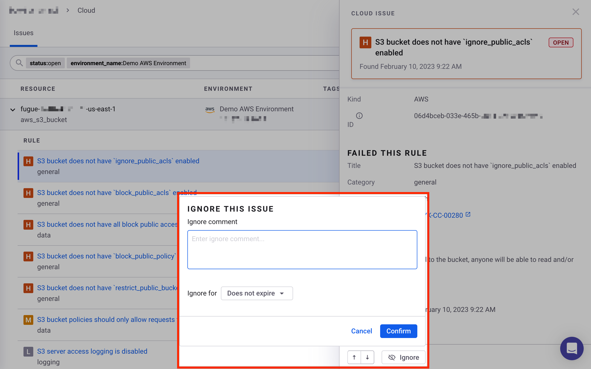
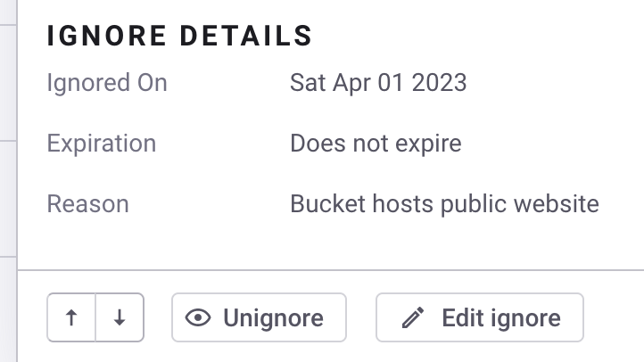

# Ignoring cloud issues

You can ignore a cloud [issue](./) from the Snyk Web UI.

Ignoring an issue can be useful if the rule that generated the issue is irrelevant for a resource or if you want to defer fixing the issue to a later date.

For example, you might want to permanently ignore an issue resulting from the rule "S3 bucket does not have `block_public_acls` enabled" for an S3 bucket that is meant to be public.

Or, you may temporarily suppress the issue to address it in the future.

Ignores are applied at the Organization level.

## Ignoring an issue 

To ignore an issue via the Snyk Web UI:

1. Navigate to your Organization's Cloud tab.
2. Select the issue you want to ignore.
3.  Select the **Ignore** button.\

    <figure><figcaption>
The Ignore button in a coud issue in the Snyk Web UI
</figcaption></figure>
4. Add a comment about why this issue is ignored.
5.  From the **Ignore for** drop-down menu, set how long the issue should be ignored. You can permanently ignore an issue by selecting **Does not expire**, or you can ignore the issue for 14, 30, 60, or 90 days, or a custom time period.\

    <figure><figcaption>
Setting ignore details for a cloud issue in the Snyk Web UI
</figcaption></figure>
6. Select **Confirm**.\
   The message "Issue successfully ignored and will be applied on next scan" appears.\
   In addition, the pending ignore state is displayed in the issue panel.\
   .png>)
7. To apply the ignore immediately, [re-scan the environment](../manage-cloud-environments/scan-a-cloud-environment.md).\
   You also can wait for the ignore to be applied on the next scheduled scan.
8. Refresh the page in your browser to see the "Ignored" message in the side panel.

<figure><figcaption>
An example of an ignored cloud issue in the Snyk Web UI
</figcaption></figure>

You can see the following details for the ignore by selecting **See details** in the side panel:

* Ignored on
* Expiration
* Reason

After an issue is ignored, you can unignore it or edit the ignore.

## Unignoring an issue

To unignore an issue via the Snyk Web UI:

1. Select the ignored issue from your Organization's Cloud tab.
2. Select the **Unignore** button.
3. The message "Issue successfully unignored and will be applied on next scan" appears.\
   In addition, the unignore pending state is shown in the issue panel: The ignore applied to this issue has been deleted and will be removed on the next scan.\
   .png>)
4. To apply the unignore immediately, [re-scan the environment](../manage-cloud-environments/scan-a-cloud-environment.md).\
   You also can wait for the unignore to be applied on the next scheduled scan.
5. Refresh the page in your browser to see that the "Ignored" message in the side panel is gone.

## Editing an ignore

To edit an ignore via the Snyk Web UI:

1. Select the ignored issue from your Organization's Cloud tab.
2. In the side panel, select the **Edit ignore** button.
3. Edit the comment, the ignore expiration date, or both.
4. Select **Confirm**.\
   The message "Ignore successfully edited and will be applied on next scan" appears.
5. To apply the edited ignore immediately, [re-scan the environment](../manage-cloud-environments/scan-a-cloud-environment.md).\
   You can also wait for the edited ignore to be applied on the next scheduled scan.
6. After the environment is scanned, refresh the page in your browser to see the edited ignore details.
