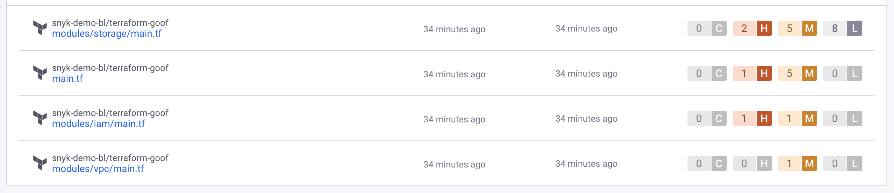
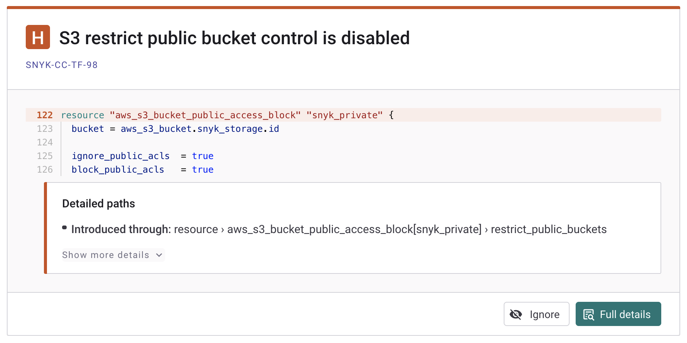

# Getting started with Snyk IaC

You can use Snyk IaC (Infrastructure as Code) in the Snyk Web UI to find, view, and fix issues in configuration files. You can also use Snyk IaC in the Snyk CLI. For details, see [Snyk CLI for Infrastructure as Code](../../developer-tools/snyk-cli/scan-and-maintain-projects-using-the-cli/snyk-cli-for-iac/).

On this page, you will find steps to find, view, and fix issues in configuration files for the supported environments: [Terraform](scan-your-iac-source-code/scan-terraform-files/), [AWS CloudFormation](scan-your-iac-source-code/scan-cloudformation-files/), [Kubernetes](scan-your-iac-source-code/scan-kubernetes-configuration-files/), including Helm, and [Azure Resource Manager (ARM)](scan-your-iac-source-code/scan-arm-configuration-files.md). These steps are specific to the current IaC.&#x20;

## **Prerequisites for Snyk IaC**

Before using Snyk IaC, be sure you have the prerequisites as follows:

* A Snyk account. For details, see [Getting started](../../discover-snyk/getting-started/).
* An existing Terraform, CloudFormation, Kubernetes, or ARM environment to work in.
* A Git repository you have integrated with Snyk in the same way as for other Snyk products. For details, see [Git repository (SCM)](../../developer-tools/scm-integrations/organization-level-integrations/).

For more information about IaC and supported environments, see the following pages:

* [Configure your integration to find security issues in your Terraform files](scan-your-iac-source-code/scan-terraform-files/configure-your-integration-to-find-security-issues-in-your-terraform-files-current-iac.md)
* [Configure your integration to find security issues in your CloudFormation files](scan-your-iac-source-code/scan-cloudformation-files/configure-your-integration-to-find-security-issues-in-your-cloudformation-files-current-iac.md)
* [Configure your integration to find security issues in your Kubernetes configuration files](scan-your-iac-source-code/scan-kubernetes-configuration-files/configure-integration-to-find-security-issues-in-kubernetes-configuration-files-current-iac.md)


You must use the Snyk CLI to scan ARM configuration files. See [Scan ARM configuration files](scan-your-iac-source-code/scan-arm-configuration-files.md).


## Import IaC Projects

You will start by importing [Projects](../../snyk-platform-administration/snyk-projects/) you want to scan with Snyk. In these steps, you choose repositories for Snyk to test and re-test:

1. Log in to Snyk and on your dashboard, select **Projects** from the navigation.
2. On the Projects page, from the **Add projects** dropdown, select the SCM where the repositories and projects that you want to scan are; for example, select GitHub.
3. From the list of **Personal and Organization repositories**, select the Git repositories and projects you want to import for scanning.\
   You can select one or more repositories or projects in a repository.
4. Click **Add selected repositories** to import the selected SCM projects and repositories into Snyk.
5. Select **View import Log** to see the results on the import log.\
   You can scan multiple types of configuration files simultaneously.\
   The import completes and the Projects page displays the Snyk Project imported.


After you have imported an IaC Project, Snyk re-tests your Project once a week by default. You can de-activate recurring tests on the **Settings** tab of the Projects page; Set **Test & Automated Pull Request Frequency** to **Test never**.


## View configuration file issues in IaC

On the Projects page, you can view the results for configuration files in the imported Projects.

* If **Group by targets** is selected, a list of [Targets](../../snyk-platform-administration/snyk-projects/#target) is displayed. These are the repositories with the Projects you imported. Select a Target to expand its list of Projects.
* If **Group by none** is selected: A list of all [Projects](../../snyk-platform-administration/snyk-projects/#project) is displayed.

In your **Projects** listing, select the Project to open to display detailed information about that Project.

<figure><figcaption>
List of Snyk Projects
</figcaption></figure>

Each Project detail page has a snapshot showing when the Project was last tested, the name of the user who imported the Project, and, on the **Issues** tab, the number of critical, high, medium, and low-severity issues found and issue cards for each scanned configuration file. You can also select the **Overview**, **History,** and **Settings** options. Choose **History** to see previous snapshots of the Project.

<figure><figcaption>
Snyk Project issue card
</figcaption></figure>

## Issue card details for Snyk IaC

Each issue card shows information about the resource and the path by which it was introduced.

<figure><figcaption>
Issue card details
</figcaption></figure>

The information on the issue cards includes the following:

* The severity level, for example, **H** for high, and the name of the issue, for example, **Non-encrypted S3 Bucket**
* The **ID** of the security rule, for example, [SNYK-CC-TF-99](https://security.snyk.io/rules/cloud/SNYK-CC-TF-99).\
  Click the link to view more information on the [Snyk Security Rules](https://security.snyk.io/rules/cloud/).
* A snippet of your code showing the exact area that is vulnerable
* The exact path of the issue
* More details, such as:
  * brief description of the issue
  * impact of the issue
  * remediation advice to resolve the issue

Click **Full details** to see a preview of the full code:

<figure><figcaption>
Preview of the full code
</figcaption></figure>

Click **Ignore** to ignore this vulnerability. For details, see [Ignore Issues](../../manage-risk/prioritize-issues-for-fixing/ignore-issues/).

## Fix configuration files in IaC

The steps to act on recommendations produced by Snyk IaC follow.

1. On a Project detail page, select an issue to see the details for that issue and specific recommendations from Snyk IaC.
2. Based on the recommendations, edit the configuration file to fix the issue identified and then commit the change.\
   Snyk automatically rescans the changed file.
3. View the change reflected in the issue display.

<figure><figcaption>
Example of an IaC issues that has been fixed
</figcaption></figure>

## Examples of IaC results

Examples follow of results displayed for current IaC.

### Terraform Cloud and Helm examples

Terraform Cloud and Helm do not show a code snippet, only the path details. There is no **Full details** button to show the preview of the full code.

<figure><figcaption>
Details for Helm
</figcaption></figure>

<figure><figcaption>
Details for Terraform Cloud
</figcaption></figure>

### Example showing the code preview is not available

If Snyk can not identify the exact line of the vulnerable path in the file, Snyk does not show a code snippet, only a message and the path details. If possible, Snyk shows the **Full details** button so you can see a preview of the full code.

<figure><figcaption>
Issue card without code snippet
</figcaption></figure>

<figure><figcaption>
Full code display
</figcaption></figure>
