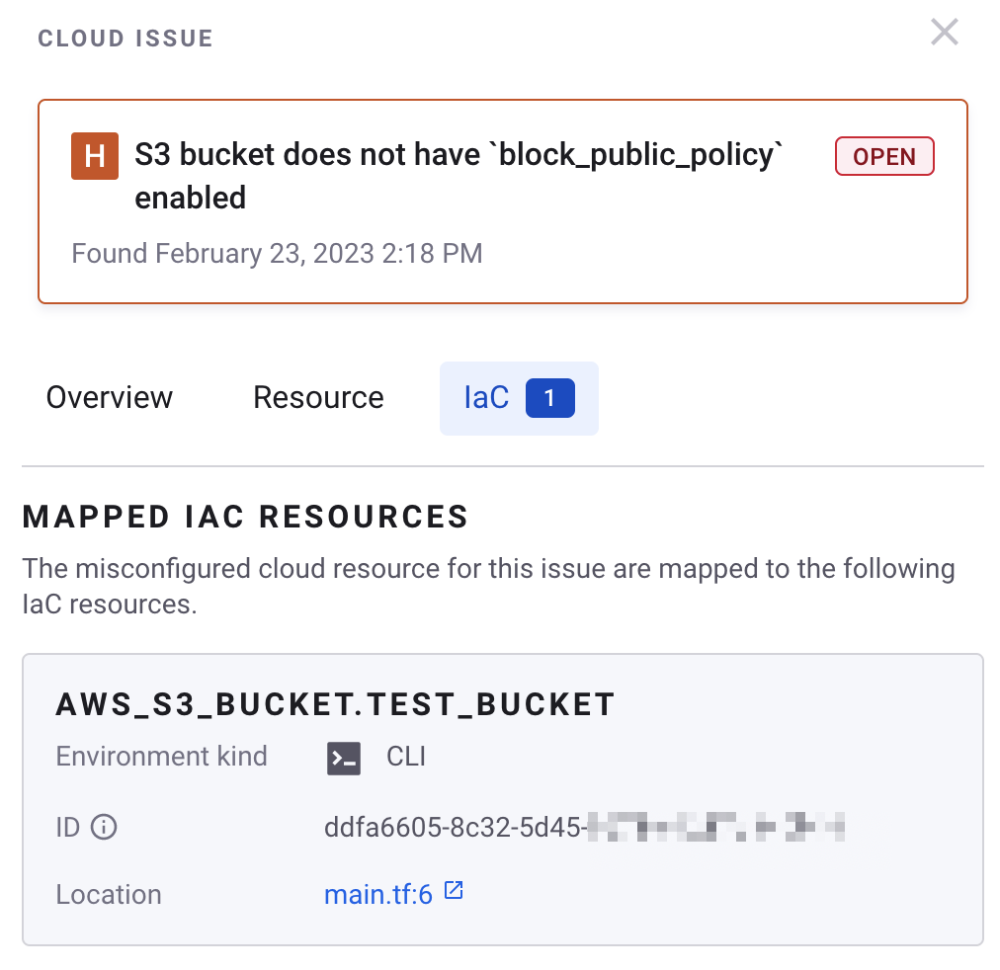

# Fix cloud issues in IaC


**Release** **status**

The fix cloud issues in IaC feature is available for [IaC+](./) only and supports AWS, Azure, and Google Cloud.


The fix cloud issues in IaC feature enables users to fix cloud issues directly in the IaC source code used to deploy the misconfigured cloud resources, by linking a cloud issue to the underlying IaC template via an SCM source code link.

Many Snyk customers use IaC to deploy and manage cloud resources. However, organizations may still deploy misconfigured IaC templates, which results in misconfigured cloud resources and therefore cloud context issues. This can be due to a number of factors, such as pipelines that are not configured to block deployments even if cloud misconfigurations are found.

To remediate these cloud issues, security teams have determined manually which teams own the resources that were incorrectly deployed, and then developers manually found the appropriate IaC templates that were used. This can be a very time-consuming process.

This feature eliminates these manual steps and provides the user with a link to the underlying IaC template that needs to be fixed.

## How does fix cloud issues in IaC work? <a href="#docs-internal-guid-445fbd0a-7fff-7c11-045c-437badbb9640" id="docs-internal-guid-445fbd0a-7fff-7c11-045c-437badbb9640"></a>

Snyk delivers this capability by “mapping” cloud resources to the source IaC templates where possible. Snyk does this by leveraging information contained in Terraform state files, such as resource IDs, which enable Snyk to map Cloud resources to Terraform state, and Terraform state to IaC source code.

Snyk accesses Terraform state files via the CLI, which should be integrated into your deployment pipeline. Snyk does NOT send the `.tfstate` file to the Snyk Platform, given the potential for sensitive information. Instead, Snyk obtains the minimum amount of data necessary for resource mapping, such as resource IDs, and includes this information in a [mapping artifact](../getting-started-with-iac+-and-cloud-scans/key-concepts-for-iac+-and-cloud.md#resource-mapping) that is sent to the Snyk Platform. All other configuration data is not included in the mapping artifact.

Snyk generates [resource mappings](../getting-started-with-iac+-and-cloud-scans/key-concepts-for-iac+-and-cloud.md#resource-mapping) from cloud resources to IaC source templates by analyzing mapping artifacts, cloud resources, and IaC resources when cloud environments are scanned.

## Prerequisites for fix cloud issues in IaC <a href="#docs-internal-guid-1c18d3e8-7fff-6839-26b4-06682c96a199" id="docs-internal-guid-1c18d3e8-7fff-6839-26b4-06682c96a199"></a>

You must have the following:

* Access to a Snyk [service account](../../../getting-started-with-the-snyk-enterprise-plan/service-accounts/) and API token
* Access to a Snyk Organization with IaC+
* Cloud resources deployed to AWS, Azure, and/or Google Cloud with Terraform via CI/CD
* Terraform version 0.11 or later

## Steps in fixing cloud issues in IaC

### Step 1: Onboard IaC and cloud environments to Snyk

[Onboard IaC+](../getting-started-with-iac+-and-cloud-scans/) environments via the Snyk CLI workflow (`snyk iac test --report`), and onboard relevant cloud environments via [AWS Integration](../../../integrate-with-snyk/cloud-platforms-integrations/aws-integration/), [Azure Integration](../../../integrate-with-snyk/cloud-platforms-integrations/azure-integration-for-cloud-configurations/snyk-cloud-for-azure-api/), or [Google Cloud Integration](../../../integrate-with-snyk/cloud-platforms-integrations/google-cloud-integration/).

`snyk iac test` must be run from the root folder of the cloned Git repository, not a subdirectory. If you are using GitLab or Azure DevOps, add a `target-reference` option so Snyk can generate an SCM link, as in the following CLI command:

```
snyk iac test --report --target-reference=$(git branch --show-current)
```

These cloud environments: AWS, Azure, or Google Cloud, should include resources deployed with Terraform via your CI/CD tool.

### Step 2: Configure CI/CD pipeline script <a href="#docs-internal-guid-d24f5230-7fff-18a1-9bd7-807654e06d0c" id="docs-internal-guid-d24f5230-7fff-18a1-9bd7-807654e06d0c"></a>

Configure a CI/CD script to:

* Pull down the Terraform state via `terraform state pull`
* Install the Snyk CLI and run [snyk iac capture](https://docs.snyk.io/snyk-cli/commands/iac-capture) with relevant options.

Snyk offers sample CI/CD scripts for your reference in the sections that follow.

* [GitHub Actions](fix-cloud-issues-in-iac.md#github-actions-example)
* [CircleCI](fix-cloud-issues-in-iac.md#circleci-example)

#### GitHub Actions example

Set the following environment variables in GitHub as [encrypted repository secrets](https://docs.github.com/en/actions/security-guides/encrypted-secrets#creating-encrypted-secrets-for-a-repository):

* `AWS_ACCESS_KEY_ID` - used for `terraform apply` and `terraform state pull`
* `AWS_SECRET_ACCESS_KEY` - used for `terraform apply` and `terraform state pull`
* `SNYK_TOKEN` - the Snyk service account's API token
* `SNYK_ORG_ID` - the Snyk Organization ID

```yaml
name: continuous-delivery
on:
  push:
    branches:
      - main
jobs:
  delivery:
    runs-on: ubuntu-latest
    env:
      AWS_ACCESS_KEY_ID: ${{ secrets.AWS_ACCESS_KEY_ID }}
      AWS_SECRET_ACCESS_KEY: ${{ secrets.AWS_SECRET_ACCESS_KEY }}
      SNYK_TOKEN: ${{ secrets.SNYK_TOKEN }}
    steps:
      - uses: actions/checkout@v3
      - uses: hashicorp/setup-terraform@v2
        with:
          terraform_wrapper: false
      - uses: snyk/actions/setup@master
      - run: terraform init

      - name: terraform plan
        run: terraform plan -input=false

      # Always report misconfigurations and continue with job
      - name: snyk iac test
        run: snyk iac test --org=${{ secrets.SNYK_ORG_ID }} --report || true

      - name: terraform apply
        run: terraform apply -auto-approve -input=false

      - name: capture terraform state
        run: terraform state pull | snyk iac capture --org=${{ secrets.SNYK_ORG_ID }} --stdin
```

#### CircleCI example

Set the following [environment variables](https://circleci.com/docs/env-vars/) in CircleCI:

* `AWS_ACCESS_KEY_ID` -  used for `terraform apply` and `terraform state pull`
* `AWS_SECRET_ACCESS_KEY` -  used for `terraform apply` and `terraform state pull`
* `SNYK_TOKEN` - the Snyk service account's API token
* `SNYK_ORG_ID` - the Snyk Organization ID

```yaml
version: 2.1

orbs:
  terraform: circleci/terraform@3.2.0
  snyk: snyk/snyk@1.5.0
jobs:
  delivery:
    machine:
      image: ubuntu-2204:current
    resource_class: medium
    steps:
      - checkout
      - terraform/install:
          terraform_version: 1.4.2
      - snyk/install

      - terraform/plan

      - run:
          name: snyk iac test
          command: snyk iac test --org=$SNYK_ORG_ID --report || true

      - terraform/apply
      
      - run:
          name: capture terraform state
          command: terraform state pull | snyk iac capture --org=$SNYK_ORG_ID --stdin

workflows:
  continuous-delivery:
    jobs:
      - delivery
```

### Step 3: Run the pipeline <a href="#docs-internal-guid-a2671bcf-7fff-a65d-b991-ff8b7f32cc9e" id="docs-internal-guid-a2671bcf-7fff-a65d-b991-ff8b7f32cc9e"></a>

By running your CI/CD pipeline to pull Terraform state and run [snyk iac capture](https://docs.snyk.io/snyk-cli/commands/iac-capture), Snyk generates a [mapping artifact](../getting-started-with-iac+-and-cloud-scans/key-concepts-for-iac+-and-cloud.md#resource-mapping) with a minimal amount of information from the Terraform state file and sends it to Snyk.

When a mapping artifact is created or updated, Snyk executes a mapping run by analyzing IaC resources, cloud resources, and mapping artifacts across a Snyk Organization, and generates resource mappings that include connections between cloud and IaC resources.

### Step 4: Wait a few minutes, and check the cloud issues page <a href="#docs-internal-guid-c33c6869-7fff-eb8c-a85d-9060c4575809" id="docs-internal-guid-c33c6869-7fff-eb8c-a85d-9060c4575809"></a>

Wait a few minutes so that Snyk can finish the cloud environment scan, complete the mapping run, and update resource mappings.

Navigate to the [cloud issues page](../getting-started-with-iac+-and-cloud-scans/manage-iac+-and-cloud-issues/view-iac+-and-cloud-issues-in-the-snyk-web-ui.md), and set the **has\_iac\_mappings** filter to `true`, either in the search bar or by selecting the appropriate filter. This will display cloud issues with resources that are mapped to IaC resources, for supported resource types.

<figure><figcaption><p>Use the <strong>has_iac_mappings</strong> filter</p></figcaption></figure>

Relevant cloud Issues should now include mapped IaC resources within the **IaC** tab. Each IaC resource includes information on the resource name, IaC template location, and where available, a link to the SCM tool.

<figure><figcaption><p>The IaC tab in a cloud issue shows mapped IaC resource information.</p></figcaption></figure>

## Supported resource types

The following is a list of resource types that have been verified to be supported.

### AWS

* aws\_api\_gateway\_deployment
* aws\_api\_gateway\_resource
* aws\_api\_gateway\_rest\_api
* aws\_cloudtrail
* aws\_cloudwatch\_log\_group
* aws\_db\_instance
* aws\_db\_subnet\_group
* aws\_default\_security\_group
* aws\_default\_vpc
* aws\_dynamodb\_table
* aws\_ebs\_volume
* aws\_eip
* aws\_flow\_log
* aws\_iam\_access\_key
* aws\_iam\_group
* aws\_iam\_group\_policy
* aws\_iam\_group\_policy\_attachment
* aws\_iam\_instance\_profile
* aws\_iam\_policy
* aws\_iam\_policy\_attachment
* aws\_iam\_role
* aws\_iam\_role\_policy
* aws\_iam\_role\_policy\_attachment
* aws\_iam\_user
* aws\_iam\_user\_policy
* aws\_iam\_user\_policy\_attachment
* aws\_instance
* aws\_internet\_gateway
* aws\_kms\_key
* aws\_lambda\_function
* aws\_lambda\_permission
* aws\_network\_acl
* aws\_network\_interface
* aws\_rds\_cluster
* aws\_rds\_global\_cluster
* aws\_route\_table
* aws\_route\_table\_association
* aws\_s3\_account\_public\_access\_block
* aws\_s3\_bucket
* aws\_s3\_bucket\_acl
* aws\_s3\_bucket\_logging
* aws\_s3\_bucket\_policy
* aws\_s3\_bucket\_public\_access\_block
* aws\_s3\_bucket\_server\_side\_encryption\_configuration
* aws\_security\_group
* aws\_security\_group\_rule
* aws\_sns\_topic
* aws\_subnet aws\_vpc

### Azure

* azurerm\_resource\_group
* azurerm\_storage\_account
* azurerm\_sql\_active\_directory\_administrator
* azurerm\_network\_interface
* azurerm\_subnet
* azurerm\_virtual\_machine\_extension
* azurerm\_virtual\_network
* azurerm\_managed\_disk
* azurerm\_subscription\_policy\_assignment
* azurerm\_storage\_data\_lake\_gen2\_filesystem
* azurerm\_synapse\_firewall\_rule
* azurerm\_synapse\_workspace
* azurerm\_storage\_account\_network\_rules
* azurerm\_service\_fabric\_cluster
* azurerm\_security\_center\_auto\_provisioning
* azurerm\_security\_center\_contact
* azurerm\_search\_service
* azurerm\_network\_security\_group
* azurerm\_network\_security\_rule
* azurerm\_key\_vault
* azurerm\_mssql\_server\_security\_alert\_policy
* azurerm\_mariadb\_server
* azurerm\_postgresql\_firewall\_rule
* azurerm\_postgresql\_server
* azurerm\_mysql\_firewall\_rule
* azurerm\_mysql\_server
* azurerm\_linux\_virtual\_machine
* azurerm\_windows\_virtual\_machine
* azurerm\_mssql\_server
* azurerm\_mssql\_server\_extended\_auditing\_policy

### Google Cloud

* google\_logging\_project\_sink
* google\_storage\_bucket
* google\_bigquery\_dataset
* google\_dns\_managed\_zone
* google\_compute\_instance\_template
* google\_compute\_instance
* google\_service\_account
* google\_compute\_network
* google\_compute\_subnetwork
* google\_compute\_ssl\_policy
* google\_compute\_project\_metadata
* google\_compute\_firewall
* google\_compute\_disk
* google\_kms\_crypto\_key
* google\_sql\_user
