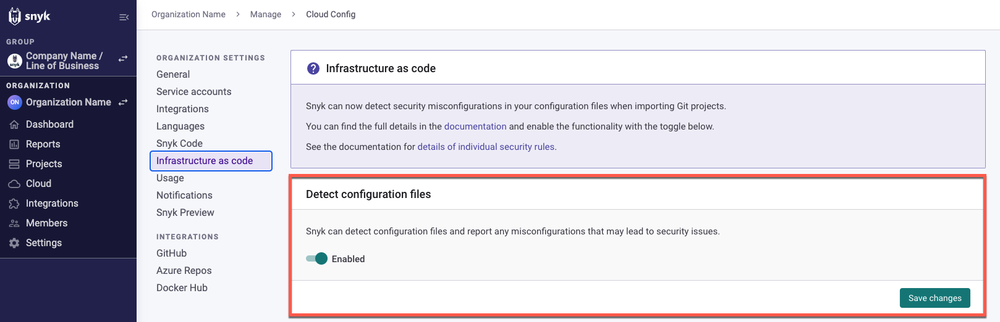

# Configure your integration to find security issues in your CloudFormation files

Snyk tests and monitors CloudFormation files from source code repositories. It gives advice on how to better secure cloud environments by catching misconfigurations before they are pushed to production, along with assistance on how best to fix them.

## Supported Git repositories and CloudFormation file formats

Snyk scans CloudFormation files in `JSON` and `YAML` format when imported from an integrated Git repository. Scan a CloudFormation module repository by either importing the repo that holds the module from an SCM or by specifying the directory itself with the `snyk iac test` CLI command.

Scanning CloudFormation provides security feedback on everything that is statically configured in the module. To benefit from recurring and scheduled testing, follow the best practice of importing custom modules directly from an SCM.

## Configure Snyk to scan your CloudFormation configuration files

### **Prerequisites for scanning CloudFormation files**

* You must be an administrator for the Organization you are configuring in Snyk.
* Ensure you have already integrated your Git repository, For details, see [Git repository (SCM) integrations](../../../../developer-tools/scms/organization-level-integrations/).

### **Configure Snyk to scan CloudFormation files**

* Log in to your account and navigate to the relevant Group and Organization that you want to manage.\
  Integrations are managed per Organization.
* Toggle the setting to enable Snyk to detect Infrastructure as code files as shown:

<figure><figcaption>
Enable detecting infrastructure as code configuration files
</figcaption></figure>

* If needed, review and adjust the **Infrastructure as code** **Severity settings** on the AWS tab in the example.\
  Check to select the file types to scan, CloudFormation, Terraform, or both, and from the pulldown selection, choose the severity level for each API Gateway.

<figure><figcaption>
Select Severity settings for IaC scans
</figcaption></figure>
