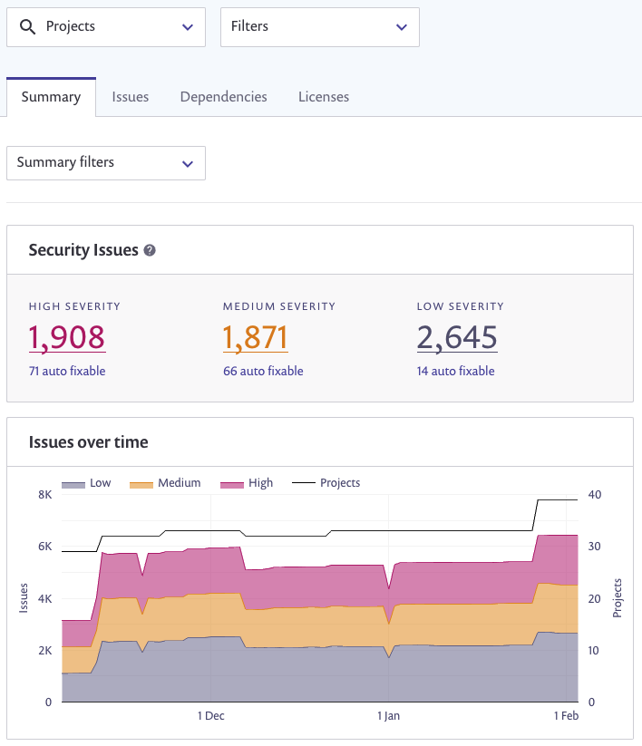
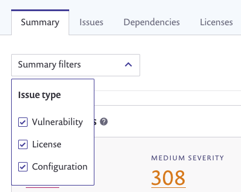

# View Snyk IaC issue reports

Use [Snyk reports](../../manage-risk/reporting/legacy-reports/) to view issues in your IaC configuration files.

## Summary page

Infrastructure as Code configuration issues appear in the summary statistics and graphs by default, showing all of the open issues across your Projects and issue types:

<figure><figcaption><p>Reports summary page</p></figcaption></figure>

To view IaC issues only, select **Configuration** from the **Summary filters** drop down:



For more details on the summary tab, see the [Reports Summary tab](../../manage-risk/reporting/legacy-reports/legacy-reports-summary-tab.md) documentation.

## Issues page

Select the **Issues** page to see detailed information on open issues across all of your Projects.

To view IaC issues only, select **Configuration** from the **Issue filters** drop-down.

<figure><figcaption><p>IaC issues page</p></figcaption></figure>

This shows the title of each issue, the type, and the severity.

You can also view the issues ungrouped; this shows more information about the Project file where the issue is found, and details on when it was first introduced:

 (1) (1) (1) (1) (1) (1) (1) (1) (1) (1) (1) (1) (1) (5) (1).png>)

For more details on the issues tab, see [Issues tab](../../manage-risk/reporting/legacy-reports/legacy-reports-issues-tab.md) documentation.

Use the **Export button to export issues** as a CSV file in the same format as your vulnerabilities.

## API access to IaC issues

You can see the full list of issues by using the API endpoint [Get list of latest issues](../../snyk-api/reference/reporting-api-v1.md#reporting-issues-latest).

To retrieve only your Infrastructure as Code issues, submit a body payload:

```
{
  "filters": {
    "orgs": ["my-public-org-id"],
    "types": [
      "configuration"
    ]
  }
}
```


You can obtain your **public-org-id** from the Snyk UI **Settings** page when you view your target Organization.


For the full list of parameters, see the documentation for the API endpoint [Get list of latest issues](../../snyk-api/reference/reporting-api-v1.md#reporting-issues-latest).
