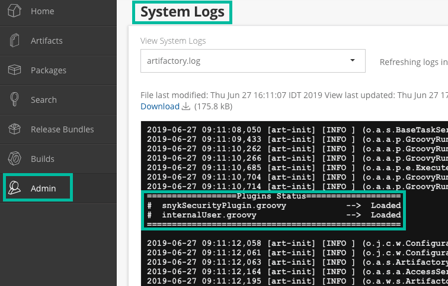

# Artifactory Gatekeeper Plugin


**Feature availability**\
This feature is available only with Enterprise plans. For more information, see [plans and pricing](https://snyk.io/plans/).


With the Snyk plugin for Artifactory, you can scan your artifacts for open-source vulnerabilities and license issues.

After the plugin is installed, it runs in the background and can do the following automatically:

* Add vulnerability and license issue counts from Snyk as properties in an artifact
* Block developers from downloading packages with vulnerability and license issues according to a configured threshold

By scanning artifacts as part of your workflow and then displaying those test results directly from the Artifactory UI, the Snyk Artifactory Gatekeeper Plugin enables you to track and identify issues that are risks to your application security more quickly and to avoid using those artifacts in your Projects.


This page refers to the Artifactory Plugin, an independent piece of software that is installed on the Artifactory machine and serves as a gatekeeper, blocking vulnerable packages from being downloaded from the Artifactory instance.

This plugin is separate from the [Artifactory Registry for Maven](../package-repository-integrations/artifactory-package-repository-connection-setup/artifactory-registry-for-maven.md), a Snyk integration that allows configuring SCM scans to use custom package registries.


## Package managers supported by the Artifactory Plugin

* npm
* Maven (.jar files)
* Gradle (.jar files)
* sbt (.jar files)
* pip (PyPi)
* CocoaPods
* Ruby Gems
* Nuget

## Prerequisites for the Artifactory plugin

* Snyk Enterprise Account
* Artifactory Version 7.4.3 and higher

## Data exchanged between Artifactory and Snyk

Artifactory transmits the package name and version to the test endpoint at the Snyk API instance. In the header, the authorization token is transmitted.

If the Artifactory installation is configured to use a proxy, Snyk will automatically use it too. Potentially, there could be an issue if the proxy is an authenticated or Kerberos proxy, but a standard, unauthenticated, forwarding proxy should work if the Artifactory installation and its underlying JVM are configured correctly with a proxy.

Snyk calls [`https://api.snyk.io/v1/test`](https://api.snyk.io/v1/test) for the right packager manager with the right name and version.

## Installation of the Artifactory Plugin

1. Log in to your Snyk account.
2. Select **Settings** > **General** to locate, copy, and save the following:
   1. Service account token or Organization API token
   2. The Organization ID for any one of your organizations
3. Navigate to [the Snyk Artifactory plugin repo in GitHub](https://github.com/snyk/artifactory-snyk-security-plugin) and then to **Releases**.
4. From the most current release, expand the **Assets** section to download the artifactory-snyk-security-plugin-\<version>.zip archive.
5. Extract the archive. It should have the following structure: `plugins (directory)` followed by
   * `snykSecurityPlugin.groovy — plugin`
   * `snykSecurityPlugin.properties — plugin configuration`
   * `lib (directory)`
     * `artifactory-snyk-security-core.jar - plugin library`
     * `snykSecurityPlugin.version - plugin version`
6. Open `snykSecurityPlugin.properties` in a text editor.
   1. Set the API Token and Organization ID from the earlier steps as `snyk.api.token` and `snyk.api.organization` respectively.
   2. Configure the rest of the properties as needed or leave them as defaults. See the section [Plugin configuration](artifactory-gatekeeper-plugin.md#plugin-configuration).
   3. For a full list of properties, [view the properties file on GitHub](https://github.com/snyk/artifactory-snyk-security-plugin/blob/master/core/src/main/groovy/io/snyk/plugins/artifactory/snykSecurityPlugin.properties).
7. Place all the files under `$JFROG_HOME/artifactory/etc/artifactory/plugins`.
8. Restart your Artifactory server. Note that **Refresh now** or **Reload** is not sufficient. Artifactory must be restarted.
9. Log in to your Artifactory instance and navigate to the **System Logs** to check that Snyk has been installed successfully.

<figure><figcaption><p>Successful installation of Snyk</p></figcaption></figure>

## How the Artifactory plugin works

Whenever a download is requested from an Artifactory remote repository, whether from a package manager or a URL, Snyk automatically scans the artifact for vulnerabilities and license issues. The issues found by Snyk are persisted as artifact properties. Access to the package is later controlled according to these properties, and in line with severity thresholds set in the plugin config.

Depending on the configuration, the plugin can periodically re-scan packages to keep the issue metadata up to date.

The plugin only works with remote repositories. It does not scan locally stored artifacts, but instead queries the Snyk API with the meta-information about the artifacts. Therefore, only published artifacts of the proxied remote repository can be examined by the Snyk Artifactory plugin.

To view details about the download status, open the **System Logs**.

If a scan finds issues, based on your configuration, the download request can be blocked with an HTTP status code "403 Forbidden".

You can find the results of a scan under the artifact properties, where you can decide to ignore the issues and allow downloads. To find the artifact, use the Artifactory search bar or navigate the **t**ree view.

<figure><figcaption><p>Results of a scan</p></figcaption></figure>

## Plugin configuration

Plugin configuration is loaded from this file: `$JFROG_HOME/artifactory/etc/artifactory/plugins/snykSecurityPlugin.properties`. For changes in this file to take effect, Artifactory must be restarted.

<table data-header-hidden><thead><tr><th width="411"></th><th width="116"></th><th></th></tr></thead><tbody><tr><td><strong>Parameter</strong></td><td><strong>Default value</strong></td><td><strong>Description</strong></td></tr><tr><td><code>snyk.api.token</code></td><td></td><td>Service account token or Organization API token</td></tr><tr><td><code>snyk.api.organization</code></td><td></td><td>The Organization ID for any one of your Snyk organizations</td></tr><tr><td><code>snyk.api.url</code></td><td>https://api.snyk.io/v1/</td><td>Snyk API base URL</td></tr><tr><td><code>snyk.scanner.test.continuously</code></td><td>false</td><td>Decides whether the plugin should periodically refresh vulnerability data from Snyk or filter access according to results obtained while the package was first requested. Without the continuous mode, new vulnerabilities aren't reported for a package that has already been allowed through the gatekeeper.</td></tr><tr><td><code>snyk.scanner.frequency.hours</code></td><td>168</td><td>Scan result expiry (continuous mode only). When the most recent scan was made within this time frame, filtering respects the previous result. Beyond that time, a new Snyk Test request is made. When this property is set to 0, the plugin triggers a test each time an artifact is accessed.</td></tr><tr><td><code>snyk.scanner.vulnerability.threshold</code></td><td>low</td><td>Global threshold for vulnerability issues. Accepted values: "low", "medium", "high", "critical", "none"</td></tr><tr><td><code>snyk.scanner.license.threshold</code></td><td>low</td><td>Global threshold for vulnerability issues. Accepted values: "low", "medium", "high", "critical", "none"</td></tr></tbody></table>

For a full list of properties, [view the properties file on GitHub](https://github.com/snyk/artifactory-snyk-security-plugin/blob/master/core/src/main/groovy/io/snyk/plugins/artifactory/snykSecurityPlugin.properties).

## Artifact properties

These are the properties set by the plugin on scanned artifacts. Artifact access is allowed or forbidden depending on the values of these properties.

<table data-header-hidden><thead><tr><th width="444"></th><th></th></tr></thead><tbody><tr><td><strong>Property</strong></td><td><strong>Description</strong></td></tr><tr><td><code>snyk.test.timestamp</code></td><td>Date and time when the artifact wast last scanned by Snyk.</td></tr><tr><td><code>snyk.issue.url</code></td><td>This is the URL to the Snyk database and explanation of the vulnerability, including specific details about vulnerable versions, available upgrades, and Snyk patches.</td></tr><tr><td><code>snyk.issue.vulnerabilities</code></td><td>Regardless of the thresholds configured, this row displays vulnerability summary scan results.</td></tr><tr><td><code>snyk.issue.vulnerabilities.forceDownload</code></td><td>When <code>true</code>, allows downloads for this artifact even when there are vulnerabilities.</td></tr><tr><td><code>snyk.issue.vulnerabilities.forceDownload.info</code></td><td>Use this field to provide additional information about why the forceDownload is enabled.</td></tr><tr><td><code>snyk.issue.licenses</code></td><td>Regardless of the thresholds configured, this row displays license summary scan results.</td></tr><tr><td><code>snyk.issue.licenses.forceDownload</code></td><td>When <code>true</code>, allows downloads for this artifact even when there are license issues.</td></tr><tr><td><code>snyk.issue.licenses.forceDownload.info</code></td><td>Use this field to provide additional information about why the forceDownload is enabled.</td></tr></tbody></table>

## Troubleshooting for the Artifactory Gatekeeper Plugin

You can enable debug logs by modifying your `${ARTIFACTORY_HOME}/var/etc/artifactory/logback.xml`file and adding the following line:

```
<logger name="io.snyk" level="debug"/>
```

Artifactory automatically picks up the new configuration. If this does not happen, restart Artifactory.
