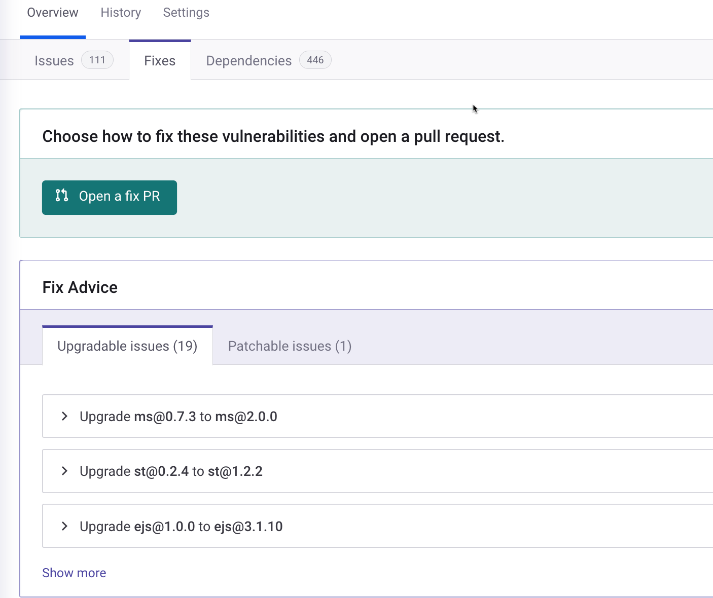

# Fix your vulnerabilities

Snyk helps you to fix vulnerabilities by upgrading the direct dependencies to a more secure version or by patching the vulnerability. After Snyk scans your Projects, the scan results allow you to resolve issues in your code with the help of clear suggestions and explanations.

Using Snyk Open Source, you can do the following:

* [View scan results on the Snyk Web UI](fix-your-vulnerabilities.md#view-scan-results-on-the-snyk-web-ui)
* [View scan results using Snyk CLI](fix-your-vulnerabilities.md#fixing-vulnerabilities-based-on-scan-results-using-snyk-cli)
* [Apply fixes](fix-your-vulnerabilities.md#apply-fixes)

## View scan results on the Snyk Web UI

For Snyk Open Source, on the **Issues** tab, the results are displayed as follows:

* The total number of dependencies that can be fixed is displayed in the tab title.
* Vulnerabilities grouped by dependency are shown, labeled by the current dependency version.
* Different versions are listed and can be expanded to show the full list of vulnerabilities remediated in that specific version.
* All vulnerabilities contain contextual information to help you prioritize the issues and start fixing them.

<figure><figcaption>
Example of issues diplayed on the Issues tab for a Project
</figcaption></figure>

## View fix advice

The **Fixes** tab also appears on the Project details page. On this page, Snyk offers you one of these solutions:

* An upgrade to the original package.
* Pinning a package, installing a package as a top-level dependency; that is, a specific version of an indirect dependency. This avoids having a direct dependency pull in a vulnerable version.
* A Snyk precision patch to fix the issue. If an upgrade to fix any of the vulnerabilities in the package is not currently available, Snyk offers patches to fix the issues

The summary area groups advice by package, and is displayed based on the best available fix. Advice in these summary lists includes these details for each package:

* All vulnerability names and severity details affecting that package
* The recommended fix, a link to the recommended fix for this package and its listed vulnerabilities: either the specific version to which to upgrade or the name of the patch.

<figure><figcaption>
Upgradable issues tab
</figcaption></figure>

You can also find additional advice and details further down on the Project details page:

* From the **Issues**, tab, a full description per vulnerability
* From the **Dependencies** tab, the entire tree of your Project dependencies, enabling you to clearly visualize affected paths

## Fixing vulnerabilities based on scan results using Snyk CLI

For information about fixing vulnerabilities, see [Fix vulnerabilities using the Snyk CLI](../../../cli-ide-and-ci-cd-integrations/snyk-cli/scan-and-maintain-projects-using-the-cli/fix-vulnerabilities-using-the-snyk-cli.md).

## Apply fixes

To apply fixes, you can:

* Click **Fix this vulnerability** on a specific [issue card](../../../snyk-admin/snyk-projects/issue-card-information.md) on the relevant Project page.
* If you are using a [Source code integration](../../../scm-integrations/organization-level-integrations/):
  * Click **Open a fix PR** on the Project page.
  * Use [automated pull requests](../../pull-requests/snyk-pull-or-merge-requests/create-automatic-prs-for-new-fixes-fix-prs.md) when new fixes become available that help you to fix a vulnerability.


**Automatic Fix PRs**\
When a new fixable vulnerability is found, Snyk can attempt to open a new pull request automatically. See [Automated pull request creation for new fixes](../../pull-requests/snyk-pull-or-merge-requests/create-automatic-prs-for-new-fixes-fix-prs.md) for details.

