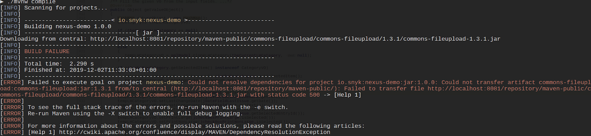

# Nexus Repository Manager Gatekeeper Plugin


**Nexus Repository Manager Gatekeeper Plugin End of Life: September 15, 2025**\
On September 15, 2025, this Enterprise-only feature reaches End of Life. Snyk will continue to offer support for using the plugin until September 15,  2025. However, note that no new enhancements or bug fixes will be released for the plugin during this period. After September 15, 2025, the plugin will no longer be available. If you need help, contact your Snyk team or [Snyk support](https://support.snyk.io/s/).


Install the Snyk Nexus Repository Manager Gatekeeper Plugin directly on the Nexus instance to track open-source vulnerabilities and license details in your artifacts based on your configurations.

After the plugin is installed, Snyk runs in the background and whenever a download is requested from the developer's CLI, Snyk automatically does the following:

* Scans artifacts for license issues and for vulnerabilities, and delivers fix data for known vulnerabilities found in the artifact
* Blocks developers from downloading vulnerable packages based on Snyk results and your severity threshold configurations

By scanning artifacts as part of your work and then displaying those test results, the Snyk plugin enables developers to see the risks associated with their packages and administrators to track and identify issues that are a risk to application security more quickly, and to avoid using those artifacts in Projects.

## **Supported languages and package managers**

Snyk Nexus Plugin supports Maven and npm dependency scanning.

## Data exchanged between Nexus and Snyk

Nexus transmits the package name and version to the test endpoint at the Snyk API instance. In the header, the authorization token is transmitted.

If the Nexus installation is configured to use a proxy, Snyk will automatically use it too. Potentially, there could be an issue if the proxy is an authenticated or Kerberos proxy, but a standard, unauthenticated, forwarding proxy should work if the Nexus installation and its underlying JVM are configured correctly with a proxy.

Snyk calls [`https://api.snyk.io/v1/test`](https://api.snyk.io/v1/test) for the right package manager with the right name and version.

## **How the Nexus Repository Manager Gatekeeper Plugin works**

Use the Snyk capability with your Nexus Repository Manager to test your artifacts for vulnerabilities and license issues at installation of this plugin and also every time developers make a request to download any one of the artifacts.

1. The admin installs and updates the Snyk configurations on the Nexus instance from the **Capabilities** section, including the authentication token and Organization ID from Snyk.
2. Snyk authenticates the account configuration using the API token and Organization ID that the admin entered and then runs in the background continuously.
3. When the developer attempts to download an artifact from the Nexus instance to the local environment, based on the severity thresholds configured for the Snyk Security Configuration capability, the package is blocked.
4. The error appears in the developer’s CLI and includes a link to the error with full details, and also appears from the Nexus interface for administrators, detailing the number of known issues for vulnerabilities and licenses.

## How to set up the Nexus Repository Manager Gatekeeper plugin

To set up and configure the plugin and start scanning and managing the artifacts of your Organization for vulnerabilities, follow these instructions.

### Prerequisites for the Nexus Repository Manager Gatekeeper Plugin

* You must sign up for an Enterprise account with Snyk before you begin.
* You must be an administrator or owner of the Snyk account.
* You must have one of the following installed for your team:
  * Nexus Repository Manager OSS v3.15.0 or greater
  * Nexus Repository Manager Pro v3.15.0 or greater

### Install the plugin on your Nexus server

1. Download the bundle from the [Snyk Nexus security plugin GitHub repository](https://github.com/snyk/nexus-snyk-security-plugin/releases).
2. Copy the `nexus-snyk-security-plugin.kar` file from the bundle onto your Nexus server at`/deploy`.
3. From the Nexus interface, enable the Snyk Security Configuration from the **Capabilities** area. For more information, see the [Sonatype documentation](https://help.sonatype.com/repomanager2/configuration/accessing-and-configuring-capabilities).

### **Configure the capability**

1. Navigate to your Snyk account to copy and save your personal API token or your service account token, and an **Organization ID**. Both a token and an Organization ID must be configured in order for Snyk to authenticate your account. Because this plugin does not import any data to Snyk, you can use any of your Organization IDs.
2. From your Nexus instance, navigate to the **Capabilities** section and select the **Snyk Security Configuration** in order to edit it.
3. Ensure **Enable this capability** is checked, and enter details for the remaining fields as follows:
   * **Snyk API URL** - enter the API endpoint to use for Snyk requests
   * **Snyk API token** - paste the token value you saved at step 1
   * **Snyk Organization ID** - paste the value you saved at step 1
   * **Vulnerability Threshold** - the default is `low`. Valid values include `none` (will not block artifacts download), `low`, `medium`, `high`. Manually update the configuration based on your needs.
   * **License Threshold** - the default is `low`. Valid values include `none` (will not block artifacts download), `low`, `medium`, `high`. Manually update the configuration based on your needs.
4. Shut down the Nexus service instance and then restart it.
5. Log in to your Nexus instance and check that the Snyk bundle has been installed successfully.

<figure><figcaption>
Capabilities to configure
</figcaption></figure>

### Track vulnerabilities in your team artifacts

After the plugin is installed, every time a developer requests a download of an artifact, the following occurs:

* Based on the severity thresholds that you configured, the download is blocked.
* Scan results are displayed for the developer with a link to full details for the error.
* Results are stored in the Snyk Security part of the **Attributes** section of the Nexus interface for the artifact.

<figure><figcaption>
Results of a scan
</figcaption></figure>

<figure><figcaption>
Attributes displaying results of a scan
</figcaption></figure>

By reviewing the results, you can evaluate the issues found in your artifact and determine a course of action.

The following explains the Snyk properties from Nexus.

| **Property**             | **Description**                                                                                                                                                        |
| ------------------------ | ---------------------------------------------------------------------------------------------------------------------------------------------------------------------- |
| `issues_licenses`        | Regardless of the thresholds configured, this row displays license summary scan results.                                                                               |
| `issues_url`             | This is the URL to the Snyk database and explanation of the vulnerability, including specific details about vulnerable versions, available upgrades, and Snyk patches. |
| `issues_vulnerabilities` | Regardless of the thresholds configured, this row displays vulnerability summary scan results.                                                                         |

### Troubleshooting for the Nexus Repository Manager Gatekeeper Plugin

If connecting to Snyk is unsuccessful, try checking the following points or [submit a request to Snyk Support](https://support.snyk.io).

* Check the Nexus logs for any related errors.
* Ensure you have entered the API URL correctly for the configuration of the capability.
* For Broker configurations, ensure the Snyk service is running.

## **Use Snyk in your build**

Snyk continuously runs in the background on the Nexus instance, and whenever any team member requests a download, Snyk automatically scans the artifact to evaluate vulnerabilities and license issues and blocks the request based on your configurations.

When the scan ends, you get an error message if the download was blocked, with a link to the full details for the known vulnerabilities found in that artifact, similar to the following example:

<figure><figcaption>
Error message example
</figcaption></figure>

Click the link to view the number of vulnerabilities found in the artifact and their severities.
