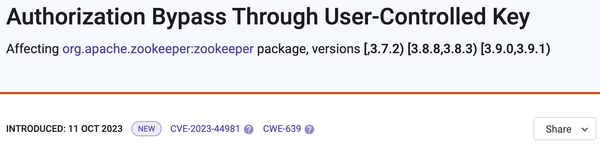

# Snyk Vulnerability Database

The [Snyk Vulnerability Database](https://security.snyk.io) contains a comprehensive list of known security vulnerabilities. This provides the key security information used by Snyk products to find and fix code vulnerabilities.

You can inspect the database at [https://security.snyk.io/](https://security.snyk.io/), or you can incorporate database information into your own systems.


This database is separate from standards bodies’ databases, as Snyk is recognized as an official authority on security.


## About the Vulnerability Database

### Snyk security team

The Snyk security team is a group of experts dedicated to finding new vulnerabilities. The team has contributed multiple discoveries to authorities such as CVE.


Snyk Vulnerability Database


The Snyk security team maintains the database to ensure that database remains consistently highly accurate, and eliminates false positives.

* All items in the database are analyzed and verified.
* The team also invests in proprietary research to discover new vulnerabilities. You can consult the [disclosed vulnerability list](https://security.snyk.io/disclosed-vulnerabilities) to see all discovered vulnerabilities, by both first-party and third-party research.

### Interval notation and semantic versioning

The Snyk Vulnerability Database uses interval notation to express [semantic versioning](https://semver.org/) across the many supported ecosystems.

You can check the interval notation for all vulnerabilities listed in the Snyk Vulnerabilities Database. Several different interval notations are supported by the Snyk Vulnerability Database:

* Open interval notation - This does not include any limit points and uses `()` parenthesis for the notation.

<figure><figcaption>
Open interval notation
</figcaption></figure>

* Closed interval notation - This includes all its limit points and uses `[]` parenthesis for the notation.&#x20;

<figure><figcaption>
Closed interval notation
</figcaption></figure>

* Half-closed interval notation - This includes only one of the limit points and uses `[)` or `(]` parenthesis for the notation. This example includes an infinite closed interval presented like this `[,3.7.2)`, meaning that it affects all versions up to `3.7.2`.&#x20;

<figure><figcaption>
Half-closed interval notation
</figcaption></figure>

### Vulnerability sources

Most of the vulnerabilities in the Snyk database originate from one of these sources:

1. Monitoring other vulnerability databases, such as CVEs from [NVD](https://nvd.nist.gov) and many others.
2. Monitoring user activity on GitHub, including issues, PRs, and commit messages that may indicate a vulnerability.
3. Bulk research, using tools that look for repeated security mistakes across open-source package code.
4. Manual research, done by the Snyk Security team to manually audit more widely used packages for security flaws.

For every issue deemed to be a real vulnerability, Snyk assigns the correct CVSS (severity) score and package version specification, creates an advisory, and makes this issue available to Snyk products for your use.

## Incorporating the Vulnerability Database into your systems

Incorporating information into your own systems is useful for customers who already have their own security products. You can benefit from Snyk’s expertise and accumulated knowledge with access to this database. This gives your development teams access to trusted intelligence, allowing them to rapidly secure open source and container code.

The Snyk Vulnerability Database includes two feeds:

* Application Feed: with manually-curated content and summaries, including code snippets where applicable.
* Operation System Feed: Linux vulnerabilities from all supported Linux distros.

These feeds are licensed separately as standalone products.
