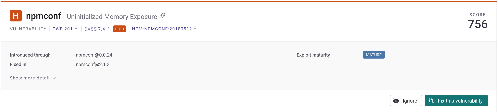
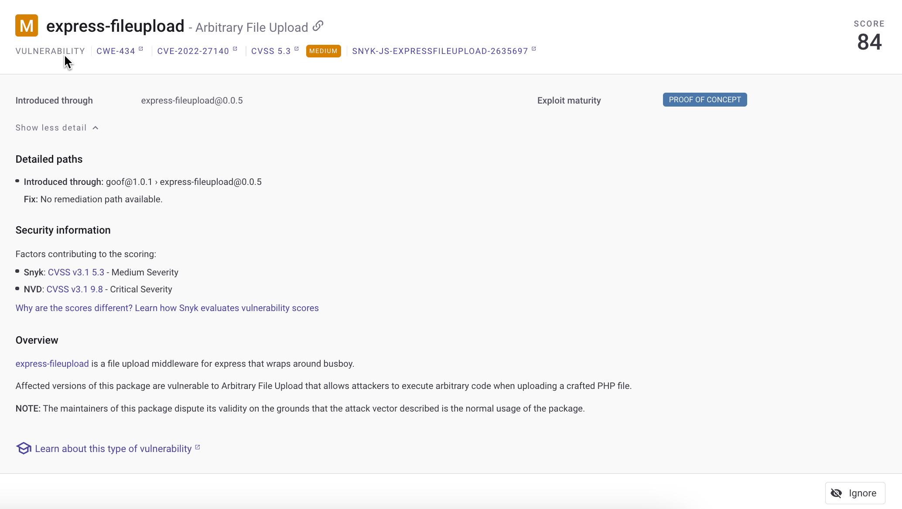
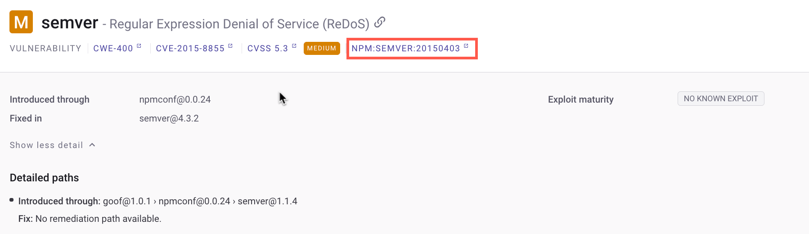

# Vulnerability fix types

After you have imported one or more Projects into Snyk through an integration or by scanning with the CLI, Snyk lists vulnerabilities found. To see the list, navigate to Projects, select the Target containing the Project where you want to see the vulnerabilities and select the Project to open the list of issues.


The list of issues does not show any vulnerabilities that have been fixed. These are no longer considered vulnerabilities.


The sidebar on the list of issues has groups of filters. The ones referring to vulnerabilities are:

* The **Computed Fixability** filters allow you to see the vulnerabilities based on their remediation paths.
* The "**Fixed in" Available** filters allow you to see if the found vulnerabilities have a version in which they were fixed.

## Computed Fixability filters

The Computed Fixability filters include the following values:

* **Fixable:** There is a fix for all the identified issues, meaning that all detailed paths have remediation, and the issue is fixable. The "Fix this vulnerability" button is available for supported ecosystems and imports. This option is not available for Projects imported using the CLI or ecosystems for which the Fix PRs are not supported.&#x20;
* **Partially fixable:** The issue has upgradable paths; Snyk has found ways of upgrading the current Project. If the ecosystem is JavaScript or TypeScript using the npm or Yarn package manager, and one but not all detailed paths have remediation, then the issue is Partially fixable, and the **Partially fix this vulnerability** option is available.
* **No supported fix**: The issue has no upgradable paths.&#x20;

### Fixable

The **Fix this vulnerability** button is available for Snyk Open Source and Snyk Container Projects imported through SCM workflows for a JavaScript, Java, Ruby, Python, or .NET ecosystem.


The Fix this vulnerability option is not available in CLI `monitor` workflows.\
The Fix this vulnerability option is not available for Docker Projects.&#x20;


For any fixable issue in a Project where **Fix this vulnerability** is available, Snyk can open a pull request against the repository to update to a secure version of the dependency.

The **Fix this vulnerability** button on the issue card shows whether Snyk can open a pull request against your Project. Examine the issue cards to see the specifics of fixability for an issue.

<figure><figcaption>
Example of a fixable vulnerability
</figcaption></figure>

### Partially fixable

You can partially fix a vulnerability if you are using a JavaScript or TypeScript ecosystem and npm or Yarn as a package manager.

You can view the **Partially fixed** vulnerabilities for an issue in the Detailed paths area of an issue card.


The option to partially fix vulnerabilities is available only for JavaScript and TypeScript.


<figure><figcaption>
Example of a partially fixable vulnerability
</figcaption></figure>

### No supported fix&#x20;

If there is **No supported fix** for the vulnerabilities or license issues, then the issue cards do not show any Fix options. An upgrade path where the only changes are in transitive dependencies is considered fixable only if the package manager supports it.

<figure><figcaption>
Example of a vulnerability with no supported fix 
</figcaption></figure>

## "**Fixed in" Available filters**

In the **"Fixed in" Available** filters, you can use the following values:

* **Yes**: The current version contains the vulnerability, but a new version that includes the fix is available, and you can remove the vulnerability by updating to the indicated version.
* **No**: There is no fix available for the detected vulnerability, in any of the versions.

You can view the **Fixed in** information for vulnerabilities on the issue card. This indicates the version of the package that no longer has the vulnerability.&#x20;

<figure><figcaption>
Fixed in information on an issue card
</figcaption></figure>

### Why is `Fixed in` showing when the issue is not fixable?

A direct dependency is fixable if a fixed, that is, secure, version of the package exists anywhere in the system. However, to be fixable, transitive dependencies must have a direct dependency that can be updated to the fixed version of the transitive dependency. An example follows of a transitive dependency.&#x20;

<figure><figcaption>
Example of a transitive dependency
</figcaption></figure>

Under **Detailed paths,** a mention is displayed that no remediation path is available. However, the issue card shows that the vulnerability is **Fixed in** the more recent version. Snyk does not have the ability to reach the level where the vulnerability exists in this specific Project, but the vulnerability does not match the definition of No supported fix.

### Fixing transitive dependencies


You cannot automatically fix transitive dependencies or open a Fix PR (see [Fix your vulnerabilities: Apply fixes](fix-your-vulnerabilities.md#apply-fixes)) due to their relationships with other components. To avoid breaking changes, Snyk provides only recommendations for transitive dependencies.


To fix a transitive dependency like the one in this example, follow the link to the [Snyk Vulnerability Database](snyk-vulnerability-database.md):

<figure><figcaption>
LInk to Snyk Vulnerability Database for a transitive dependency
</figcaption></figure>

From the Snyk Vulnerability Database, you can see remediation advice for more fix information:

<figure><figcaption>
Snyk Vulnerability Database remediation advice
</figcaption></figure>

### Fixing transitive dependencies through direct dependencies

If Snyk recommends using a direct dependency with the same version as the one used to fix an affected transitive dependency, you can update to a newer version of the transitive dependency by reinstalling the direct dependency.

Consider a Project that relies on `react-scripts@5.0.1`, a direct dependency that has a vulnerable component, a transitive dependency called`loader-utils@2.0.2`.  Snyk recommends updating `react-scripts` to the version `5.0.1` to fix the vulnerable component. After the update, the vulnerable package `loader-utils` is still at the version `2.0.2`. This indicates that another package in the Project is preventing the upgrade to a higher version. Reinstalling the `react-scripts@5.0.1` direct dependency addresses this issue, as you can later upgrade the vulnerable component.
