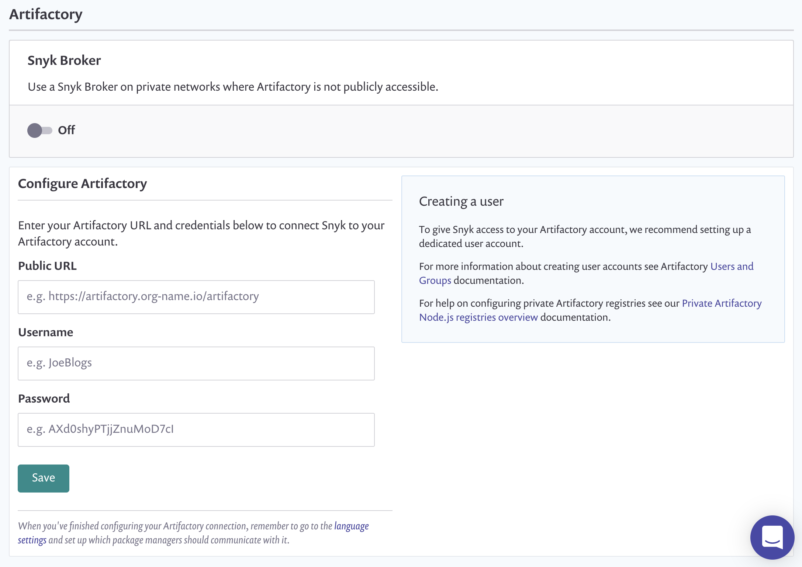

# Artifactory package repository connection setup


**Feature availability**\
Package repository integrations are available only with Enterprise plans. For more information, see [plans and pricing](https://snyk.io/plans/).

**Supported projects**\
The Artifactory Package Repository integration supports [Node.js](../../../../supported-languages/supported-languages-list/javascript/#package-managers-and-supported-file-extensions) (npm and Yarn) and [Maven](../../../../supported-languages-package-managers-and-frameworks/java-and-kotlin/#supported-package-managers-and-package-registries) Projects. For [Improved Gradle SCM scanning](../../../../supported-languages-package-managers-and-frameworks/java-and-kotlin/git-repositories-with-maven-and-gradle.md#improved-gradle-scm-scanning), use the Maven settings.


Connecting a custom Artifactory Package Repository enables Snyk to resolve all direct and transitive dependencies of packages hosted on the custom registry and calculate a more complete, accurate dependency graph and related vulnerabilities.

You can configure these types of Artifactory Package Repository:

* Publicly accessible instances protected by basic authentication
* Instances on a private network by using Snyk Broker (with or without basic authentication).

These instructions apply to configuring publicly accessible instances. For instructions on configuring a brokered instance, see the [setup instructions for Snyk Broker with Artifactory Repository](../../../../implementation-and-setup/enterprise-setup/snyk-broker/classic-broker/install-and-configure-snyk-broker/artifactory-repository-install-and-configure-broker/).

The steps to set up Artifactory Repository Manager follow.

1. Navigate to **Settings** > **Integrations** > **Package Repositories** > **Artifactory**.
2. Enter the URL of your Artifactory instance; this must end with `/artifactory`.
3. Enter your username and password.
4. Select **Save**.

<figure><figcaption>
Artifactory repository setup
</figcaption></figure>
