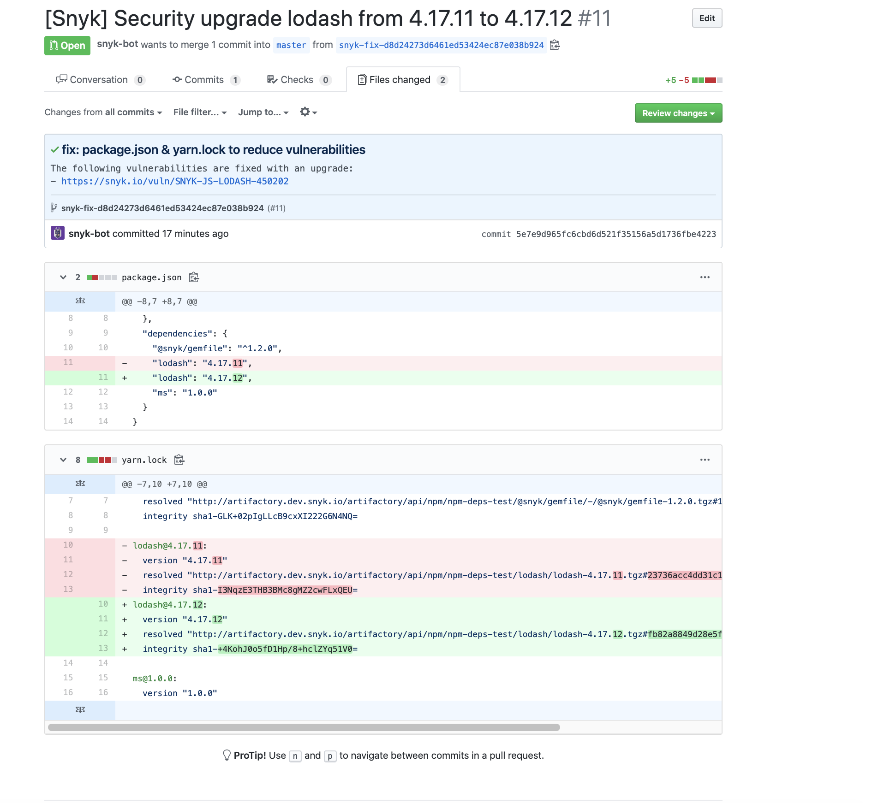

# Artifactory Registry for npm


**Feature availability**

Package repository integrations are available only with Enterprise plans. For more information, see [plans and pricing](https://snyk.io/plans/).

This guide is relevant for Snyk UI integrations only. The CLI supports Yarn and npm Projects with private Artifactory registries.


Snyk can use Artifactory Package Repositories with npm and Yarn Projects. This enables Snyk to regenerate lockfiles with the correct URLs when creating Pull/Merge Requests.

You can add configuration to tell Snyk where your private Artifactory Node.js packages are hosted and under what scope. This is the same information you would normally add in your `.yarnrc` or `.npmrc`

## JavaScript language settings

1. Navigate to **Settings** > **Languages** > **JavaScript** and either the npm or Yarn settings, depending on your Project type.
2. If you have not previously connected to Artifactory, you will be asked to configure an integration first; see [Artifactory Package Repository connection setup](./).
3. Select **Add registry configuration**.
   1. Select **Artifactory** as the Package source.
   2. If you want to configure this registry as the default registry url, leave the scope blank.
   3. If you want to configure only scoped packages to use this registry, add a scope. For example, `@snyk` which would use the configured registry for all deps prefixed or scoped with `@snyk.`
   4. If you want to add a mix of default registry url and scoped packages, add multiple configurations, one for the default and one per scope.
4. When you have added all the registries and scopes you want, click **Update settings**.

## Test the integration

Open a Pull/Merge Request on a Project that contains private dependencies that are hosted in Artifactory to see a lockfile updated and included in the Snyk Fix Pull Request with the correct URL to your repository.

<figure><figcaption>
Pull request to test Artifactory integration
</figcaption></figure>
