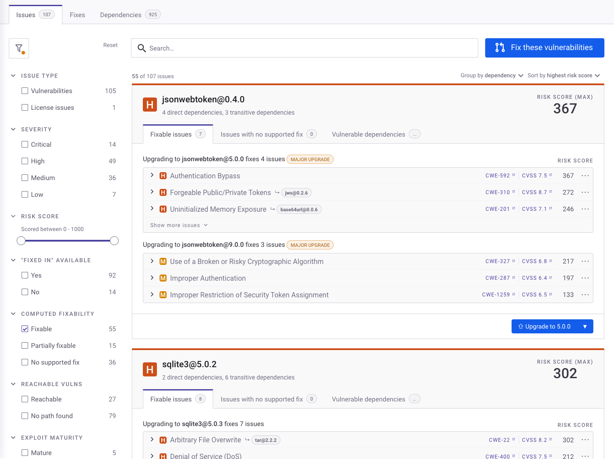

# Scan open-source libraries and licenses

You can scan your open-source libraries using Snyk Open Source:&#x20;

* In the Snyk eeb UI
* With your [IDE](../../../developer-tools/snyk-ide-plugins-and-extensions/)
* With a [CI/CD integration](../../../developer-tools/snyk-ci-cd-integrations/)
* Through the [Snyk CLI](../../../developer-tools/snyk-cli/scan-and-maintain-projects-using-the-cli/snyk-cli-for-open-source/)
* Through the [Snyk API](../../../snyk-api/reference/test-v1.md)

## View vulnerabilities in your open-source libraries

You can view vulnerability results for imported Projects. The **Projects** page appears by default after import, showing vulnerability information for the Snyk Projects you have imported, grouped into **Targets**, that is, the repositories you have scanned.

You can expand a **Target** to see vulnerability information for Projects, including the number of issues found, grouped by severity level:

Click a Project to open the issues page for that Project, where, for supported environments,  you can see the dependency cards, showing all of your dependencies, the versions where each associated issue was introduced, how to fix them, and more details about the individual vulnerabilities.

For unsupported environments, you can see a list of individual vulnerabilities. For more details, see [View Project information](../../../snyk-platform-administration/snyk-projects/project-information.md).

## Fix vulnerabilities in your open-source libraries

For some languages, Snyk can fix vulnerabilities using fix pull/merge requests. For more information, see [Automatic and manual PRs with Snyk Open Source](../../pull-requests/snyk-pull-or-merge-requests/).

Navigate to the **Issues** card for a Project.

<figure><figcaption>
Issues tab in an Open Source Project
</figcaption></figure>

To fix vulnerabilities:

1. Click **Upgrade to X.X.X** to open a fix PR for this dependency. Click **Fix these vulnerabilities** at the top of the page to fix multiple issues.
2. The **Open a Fix PR** screen opens, displaying the selected vulnerabilities.
3. Check or uncheck the issues you want to fix or remove from this fix.
4. Scroll to the bottom of the screen and click **Open a Fix PR**.
5. Snyk acts on the PR and displays a results screen.
6. Optionally, select the **Files changed** tab to see details of the changes made.

<figure><figcaption>
Files changed tab in GitHub after triggering Fix PR for an open source project
</figcaption></figure>

For more details, see [Fix your vulnerabilities](../manage-vulnerabilities/fix-your-vulnerabilities.md).
