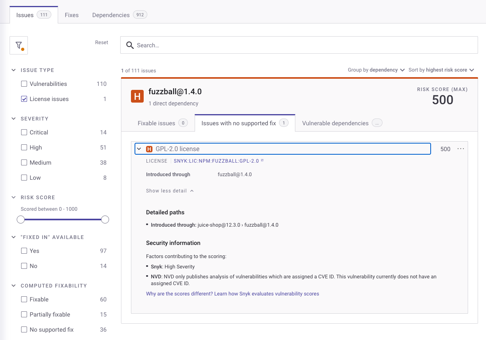
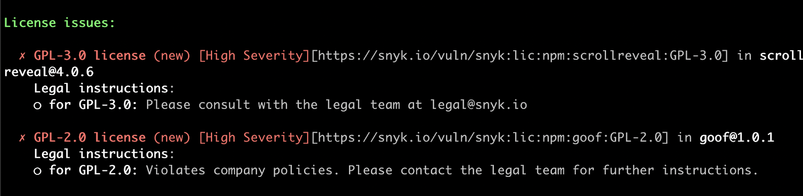
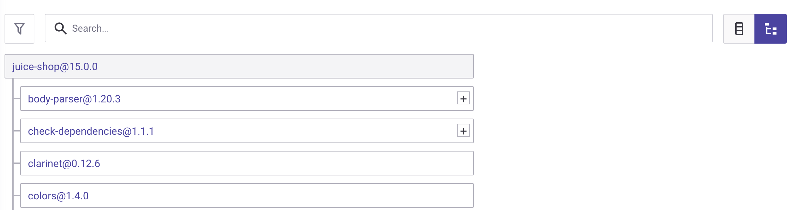

# Snyk License Compliance Management


**Feature availability**

Snyk License Compliance Management is available only with Enterprise plans. For more information, see [plans and pricing](https://snyk.io/plans/).


You can check compliance for open-source licenses in your code using Snyk License Compliance Management.

The Snyk Default License Policy defines how Snyk identifies potential license issues in the open-source packages your Projects are using. This policy applies to all Organizations created in your Group.

## **Prerequisites for using Snyk License Compliance Management**

Before checking license compliance with Snyk License Compliance Management, ensure you:

* Are part of a Snyk [paid plan](https://snyk.io/plans/).
* Have integrated and imported your Projects. See [Getting started](../../../getting-started/).

## **Define license policies**

To take effective action based on license issues, you need to define policies defining these actions based on license types. Policies provide a way to capture different requirements within an Organization based on factors such as line of business. Work with your legal team to create policies that are specific to your company.

To open your Snyk Group default license policy, navigate to the **Policies** menu option in your Group.

### Create policy rules

Each policy contains rules detailing which licenses are acceptable and which are forbidden for use, together with a severity level that indicates how severe the license violation is. For example, severity levels for internal-only license issues may be less severe than for those released externally.

You can create and edit multiple license policies for Organizations. For details, see [Create a license policy and rules](../../../manage-risk/policies/license-policies/create-a-license-policy-and-rules.md).

## View compliance issues

Snyk’s [Git-based integrations ](../../../scm-integrations/organization-level-integrations/)support license scanning as part of the regular workflow. During scanning, license issues appear as a filterable list in the **Issues** tab.

<figure><figcaption>
Issues overview with the "License issues" filter applied
</figcaption></figure>

The below example shows a high-severity issue for a GPL-2.0 license, with accompanying instructions as defined in the policies for that license.

You can also view license issues using the Snyk CLI tool after running `snyk test`:

<figure><figcaption>
License issue overview in Snyk CLI
</figcaption></figure>

### **View all license information**

You can view and share detailed lists of licenses being used by all Projects in your Organization and see a report that lists all the open-source components and licenses.&#x20;

### **View license dependencies**

Snyk shows license issues in both your direct and transitive dependencies in the **Dependencies** tab:

.png>)

Click the tree icon to view a full dependency tree. This shows the dependency that introduced the license issue:

<figure><figcaption>
Dependencies overview - tree view
</figcaption></figure>

## **Resolve license issues**

You can now take action to resolve the license issues identified during the scan, to help you build and deploy your application without outstanding licensing issues.

The actions you take depend on the license conditions and on your policies. For example, if a license violation has surfaced, this issue can be mitigated by either approaching your legal team or by replacing the dependency that added the violation.

Alternatively, you may want to ignore the issue. For details, see [ignore issues](../../../manage-risk/prioritize-issues-for-fixing/ignore-issues/).
