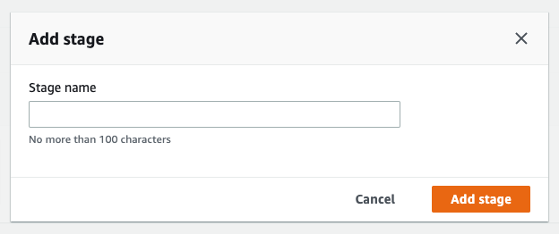
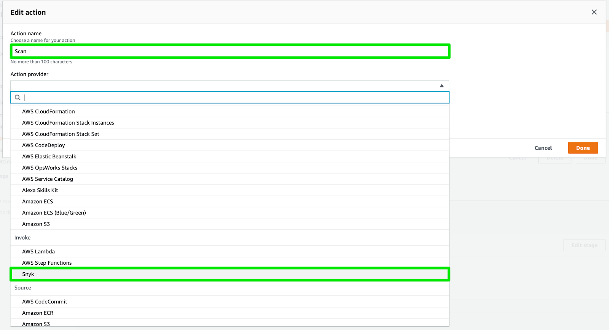
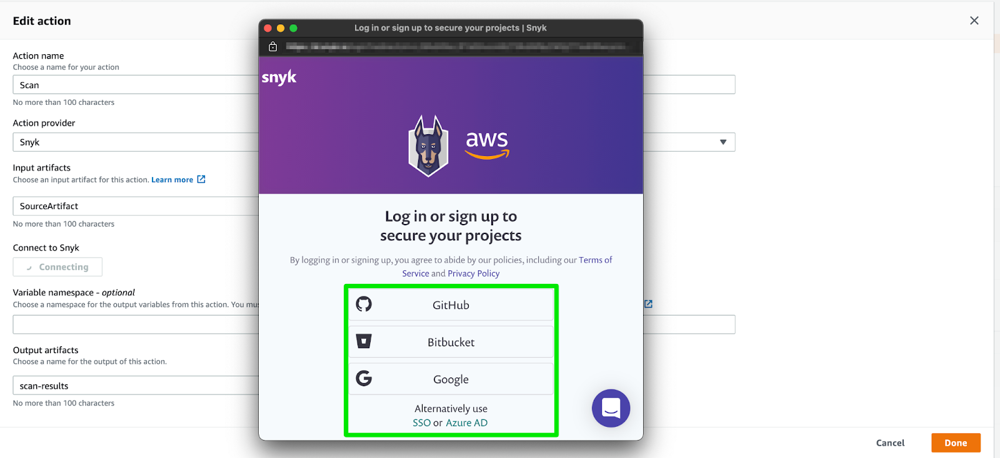
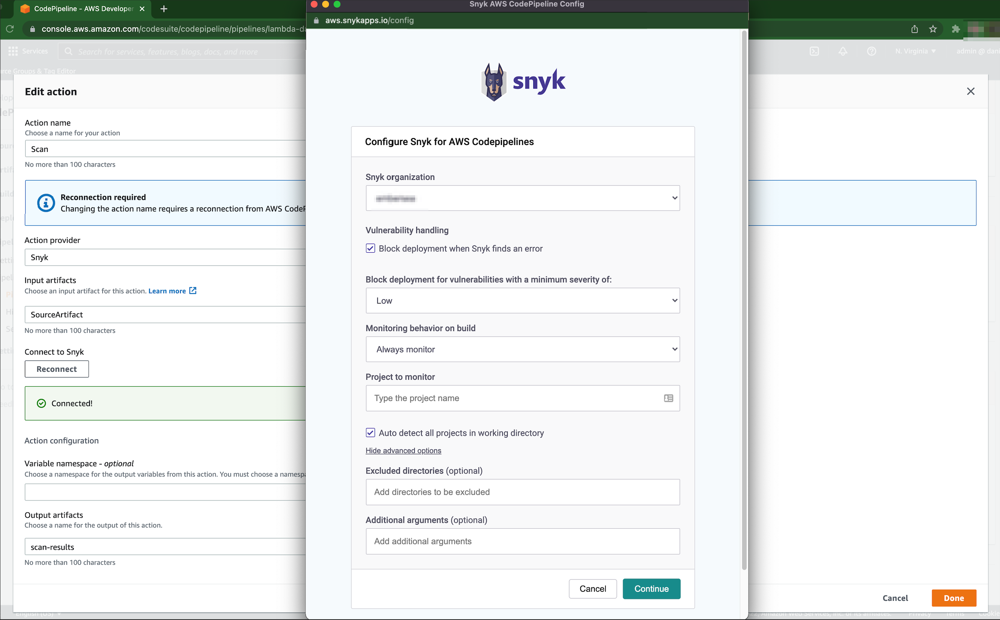
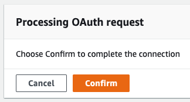

# Setup steps for AWS CodePipeline integration


**The Snyk integration for AWS CodePipeline will be discontinued**

\
**Action Required**

In order to safeguard the security of our services and our customers, Snyk has begun the deprecation of its integration with **AWS CodePipeline**. To minimize disruption, we recommend that you transition to using **AWS CodeBuild** and the Snyk CLI as an alternative which will support the same use case and functionality.&#x20;

**Migration Timeline**

Effective **Oct 30th, 2024**, you will no longer be able to add or modify the Snyk plug-in for new or existing pipelines. Existing pipelines will continue to work as-is for 6 months, though we recommend migrating to the new process as soon as possible. To avoid disrupting your CI/CD workflows, you must transition to the Snyk CLI before **April 30, 2025**. Please refer to the steps in this [migration guide](https://docs.snyk.io/scm-ide-and-ci-cd-integrations/snyk-ci-cd-integrations/aws-codepipeline-integration-by-adding-a-snyk-scan-stage/migrating-to-aws-codebuild) to use Snyk CLI with AWS CodeBuild.\

We are confident that AWS CodeBuild and the Snyk CLI will meet your requirements.&#x20;


You can initiate Snyk AWS CodePipeline integration directly from the AWS CodePipeline console.


Snyk integration with CodePipeline requires a UI based authentication step as part of the setup. This is not compatible with automation with non-interactive setup methods such as CloudFormation or Terraform.


Follow these steps to add Snyk to a new or existing pipeline:

## Step 1: Add stage

At any point after the Source stage, you can add a Snyk scan stage, allowing you to test your application at different stages of the CI/CD pipeline.

Click **Edit**, and **Add a Scan Stage**.

## Step 2: Add action group

Click **Add an Action Group** to open the **Edit Action** window:

Name the action, then select **Snyk** as the **Action Provider**.

Click **Connect with Snyk** to begin the connection process.

## Step 3: Connect to Snyk

Select how you would like to authenticate with Snyk to give AWS CodePipeline permission to begin scanning your open-source code.

## Step 4: Configure settings

The following options are available for configuration:

* **Snyk organization:** Select the Snyk organization where reports of findings are saved.
* **Vulnerability handling**: Define the pipeline behavior if a vulnerability is found. If the **Block deployment when Snyk finds an error** checkbox is checked, the pipeline fails and does not proceed to the next stage in the CodePipeline.
* **Block deployment for vulnerabilities with a minimum severity of**: **Low**|**Medium**|**High**|**Critical**: Report only vulnerabilities of the specified level or higher.
*   **Monitoring behavior on build**: Set the criteria to monitor projects from the AWS CodePipeline. The available options are:

    * **Always monitor**: The project snapshot is created independent of the test results.
    * **When test fails**: The project snapshot is created only when the test fails.
    * **When test passes**: The project snapshot is created only when the test is successful.
    * **Never monitor**: The project snapshot is never created.

    Unless the **Never monitor** option is selected, the **Project to monitor** field is mandatory. This is to prevent any unintentional project overrides due to naming conflicts. The report is created and associated with the selected **Snyk organization**.
* **Project to monitor**: Specify the project group name for your projects. This is the same as using the `remote-repo-url` option in the CLI. The field does not allow any spaces in the names. This field is mandatory except when the **Never monitor** option has been selected.
* **Auto-detect all projects in the working directory**: Check this checkbox to auto-detect all projects in the AWS CodePipeline. If this option is not selected the plugin tests the first project it finds because it is using the `--all-projects` option to detect all projects.
* **Advanced options** (all of them are optional):
  * **Excluded directories**: This option only appears when **Auto-detect all projects** is checked. Specify sub-directories to exclude; the directories must be comma-separated.
  * **Custom path to manifest file to test**: This option only appears when **Auto-detect all projects** is not checked. You can specify the file path to the manifest file that Snyk is to scan. When this option is omitted Snyk tries to auto-detect the manifest file for your project.
  * **Additional arguments:** A number of additional options are allowed, which can be applied to `test` and `monitor`. The options are as follows: `--dev`, `--detection-depth`, `--prune-repeated-subdependencies`, `--strict-out-of-sync`, `--yarn-workspaces`, `--skip-unresolved`. For more information on these options, see the [CLI help docs](../../../snyk-cli/commands/).


To change the configuration settings of a previously-configured stage, click the **Snyk** link.


Confirm the connection to Snyk when prompted.

Save the pipeline after successfully connecting to Snyk.

This configures your Snyk stage in the CodePipeline, so you can test your application. Release the latest changes through the CodePipeline options for the latest changes to take effect.
