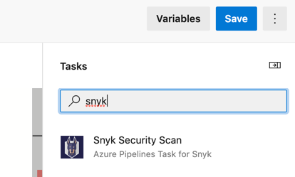
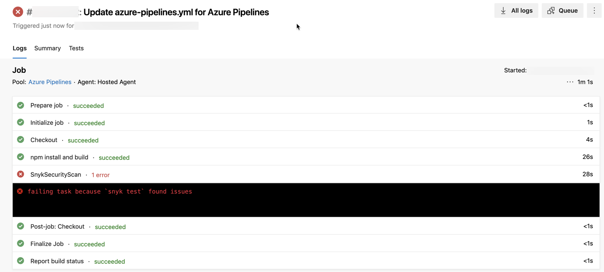

# Add the Snyk Security Task to your pipelines

## **Prerequisites to add Snyk Security Task to your pipelines**

* Ensure you have a pipeline within the repository for the code you want to test.
* If you created a pipeline with the Azure Repos wizard, this file is called `azure-pipelines.yml`.
* If this repository has multiple service connections, ask your Snyk admin which to use for your pipeline.
* If you want to add your Dockerfile for additional base image data to use when testing your container, ensure the image has been built.

## **Requirements to add Snyk Security Task to your pipelines**

This extension requires that Node.js and npm be installed on the build agent. These are available by default on all Microsoft-hosted build agents. However, if you are using a self-hosted build agent, you may need to explicitly activate Node.js and npm and ensure they are in your [PATH](https://en.wikipedia.org/wiki/PATH_\(variable\)). This can be done using the [NodeTool task from Microsoft](https://docs.microsoft.com/en-us/azure/devops/pipelines/tasks/tool/node-js?view=azure-devops) prior to adding the Snyk Security Scan task to your pipeline.

## **Steps to add Snyk Security Task to your pipelines**

1. Add the Snyk Security Scan task when you create your pipeline or while editing an existing one. See the [Azure Pipelines documentation](https://docs.microsoft.com/en-us/azure/devops/pipelines/?view=azure-devops).
2. From Azure, access the pipeline that you want to scan for vulnerabilities. Open it for editing and check that the Build step is included just before the point at which you want to insert the Snyk task. Note that this is not required but is considered best practice for consistency across projects.
3.  Open the **assistant**, search for the Snyk Security Scan task, and click it as shown in the screen image that follows. The configuration panel opens on top of the assistant.\


    <figure><figcaption><p>Search for the Snyk Security Scan Task</p></figcaption></figure>
4. Complete the fields in the configuration.
   1. Find full details about the parameters on the page [Snyk Security Scan task parameters and values](snyk-security-scan-task-parameters-and-values.md).
   2. Note that if you check the **Fail build if Snyk finds issue** option, when the build fails the pipeline job is failed by the Snyk task.
   3. If you uncheck the **Fail build if Snyk finds issue** option, the Snyk task tests for vulnerabilities but does not cause the pipeline job to fail.
   4. When testing a container image, you can specify the path to the Dockerfile with the dockerfilePath property to receive additional information about issues in your base image.
   5. To add your Dockerfile for additional base image data when testing your container, ensure the image has been built.
5. Place your cursor inside the pipeline, ensuring you place it before a deployment step, such as **npm publish** or **docker push**.
   1. You can have multiple instances of the Snyk Security Scan task within your pipeline.
   2. This might be useful, for example, if you have multiple project manifest files you want to test or if you want to test both the application and the container images.
6.  From the configuration panel, click **Add**. The task is inserted into your pipeline where your cursor was placed, similar to the following:

    ```
       - task: SnykSecurityScan@1
         inputs:
           testType: 'app'
           monitorWhen: 'always'
           failOnIssues: true
    ```

After the task is included in your pipeline, the task runs each time the pipeline runs, and the results appear in the Azure Pipelines output view:



If the Snyk task fails the build, an error message appears in the results indicating that the build failed due to `snyk test`.
