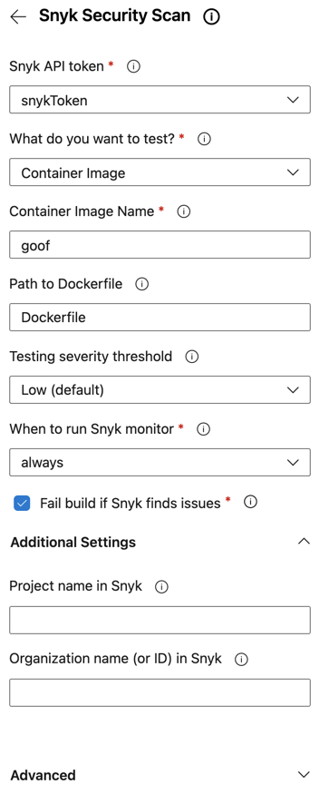
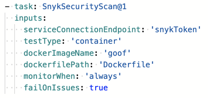

# Example of a Snyk task for a container image pipeline

The following is an example of the Snyk Security Scan task within the script for a container image pipeline.

When populated with the most common settings, the configuration panel in Azure looks much like the following:

<figure><figcaption>
Snyk Security Scan configuration panel
</figcaption></figure>

The following shows the same configuration once you have added it to your pipeline.

