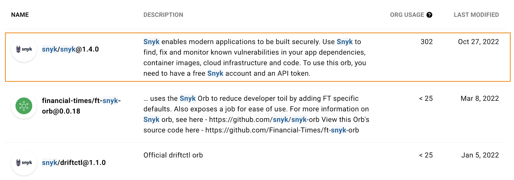
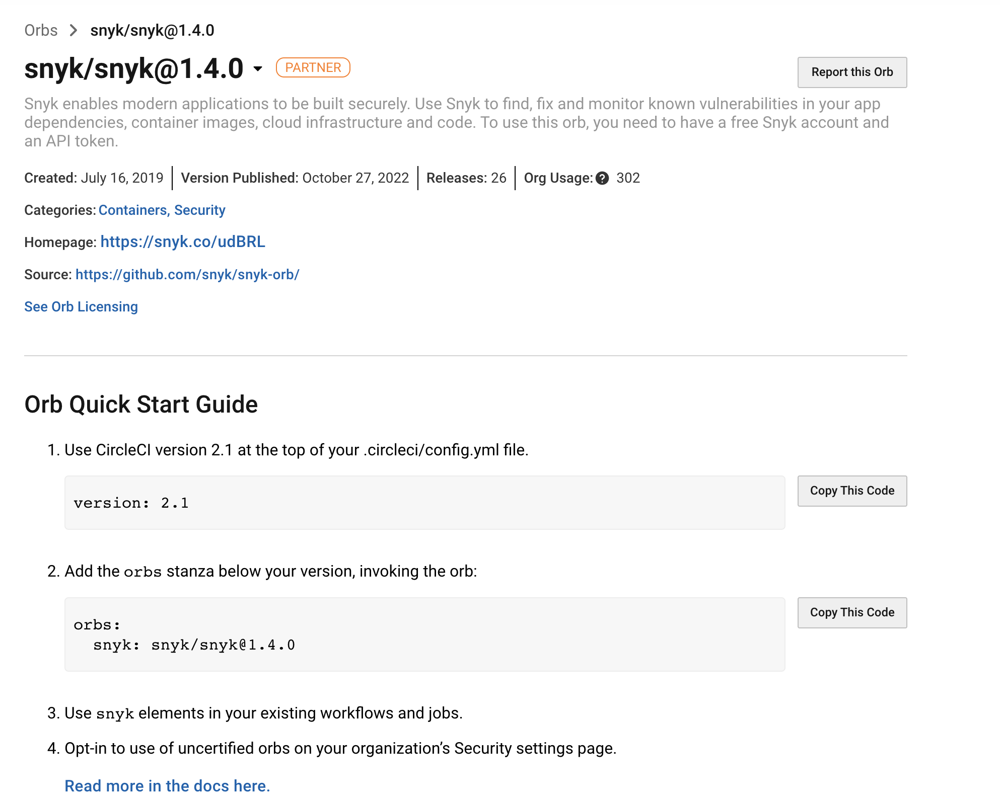

# CircleCI integration using a Snyk Orb

Snyk integrates with [CircleCI](https://circleci.com) using a **Snyk Orb**, seamlessly scanning your application dependencies and Docker images for open source security vulnerabilities as part of the continuous integration/continuous delivery (CI/CD) workflow.

CircleCI enables users to easily create CI/CD workflows using a group of ready-to-use commands ([Orbs](https://circleci.com/orbs/)) that can be added to your configuration file.

With the Snyk Orb, you can quickly add Snyk scanning to your CI/CD in order to test and monitor for open source vulnerabilities, based on your configurations. Results are then displayed from the CircleCI output view and can also be monitored on [Snyk.io](http://app.snyk.io).

## Implement the Snyk Orb

Refer to the following information about the Snyk Orb to get started with CircleCI, from implementation to a green build with Snyk.

* [Snyk Circle CI README](https://circleci.com/orbs/registry/orb/snyk/snyk) - includes all the information that you need to set up your CI/CD with Snyk including a list of parameters and samples
* [Adding application and image scans to your CI/CD pipeline (Circle CI blog post)](https://circleci.com/blog/adding-application-and-image-scanning-to-your-cicd-pipeline/) - discusses how to set up a secure pipeline with the Snyk Orb

## How CircleCI integration works

Once you add a project to CircleCI and add the Snyk Orb to the configuration file, every time that a build runs, the Snyk Orb is also used and performs the following actions:

### Scan

1. Scans app dependencies or container images for vulnerabilities or open source license issues, and lists the vulnerabilities and issues.
2. If Snyk finds vulnerabilities, it does one of the following (based on your configuration):
   * Fails the build
   * Lets the build complete

### **Monitor**

Optionally, if the build completes successfully and **MONITOR** is set to **True** in the Snyk step, then Snyk saves a snapshot of the project dependencies from the Snyk Web UI. From the Snyk Web UI you can view the dependency tree displaying all of the issues, and you can receive alerts for new issues found in the existing app version.

## **Prerequisites for implementing CircleCI integration**

1. Create a Snyk account and retrieve the **Snyk API token** from your **Account settings**.
2. Import the relevant repo into CircleCI.
3. Go to `Settings -> Security -> Orb security settings` and make sure you allow `opt-in to third party Orbs`.
4. Make sure your configuration (`config.yml`) file follows version 2.1.
5. Add the required environment variables to CircleCI (including the Snyk API token as `SNYK_TOKEN`).

## Getting Snyk Orb details from the CircleCI registry

On the [Orbs registry](https://circleci.com/orbs/registry/), CircleCI displays a list of available Orbs customized for you directly, similar to the image that follows.

<figure><figcaption>
Snyk Orb for CircleCI
</figcaption></figure>

In this list, find and click the relevant **Snyk** line to view the Snyk Orb information with examples, parameters, and values:


Be sure to use the latest version of the Snyk orb from the list.


<figure><figcaption>
Snyk Orb information
</figcaption></figure>
