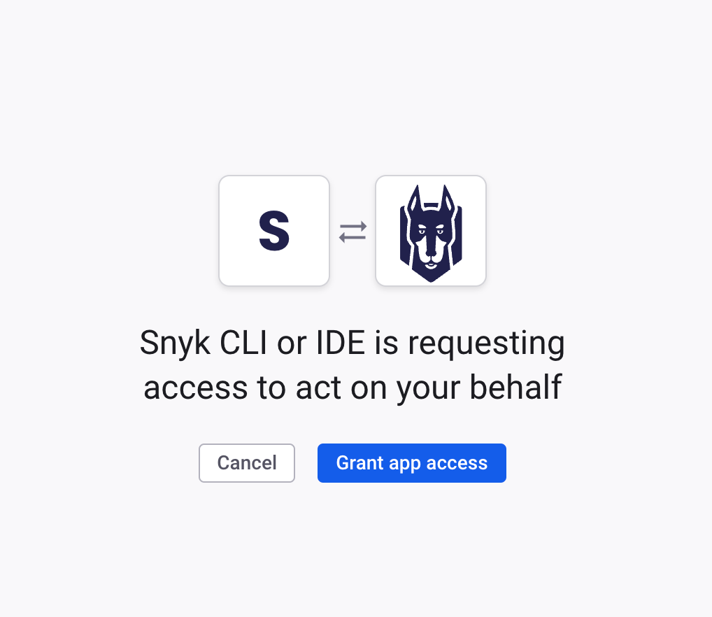
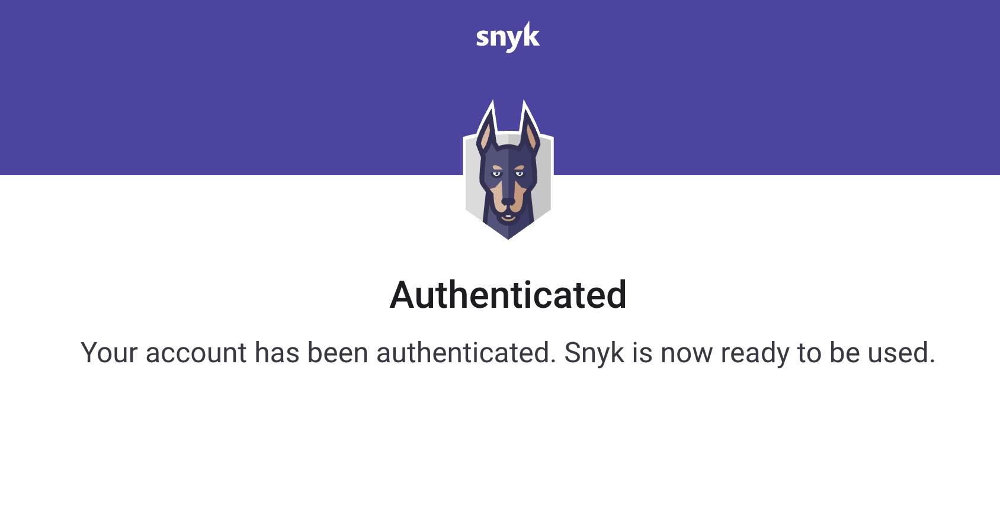

# Authentication for the Eclipse plugin

To scan your Projects you must authenticate with Snyk.&#x20;

Snyk supports the following protocols for authentication:

* OAuth 2.0 (default)
* Snyk API token (fallback option)

## Steps to authenticate using the OAuth 2.0 protocol

After the extension is installed, to authenticate follow these steps:

1. In the dialog that opens, configure your Snyk region properly if you use Snyk on the EU and AU tenants, For more information, see [Regional hosting and data residency](../../../working-with-snyk/regional-hosting-and-data-residency.md#cli-and-ci-pipelines-urls).

<figure><figcaption>
Snyk tenant configuration
</figcaption></figure>

2. On the next page with additional information, click **Finish**:

<figure><figcaption>
Additional information and finish
</figcaption></figure>

3. The extension opens a new page in a default browser and asks you to log into your Snyk account:

<figure><figcaption>
Snyk login
</figcaption></figure>

4. The next page asks for your authorization for the IDE to act on your behalf. Click **Grant app access**.

<figure><figcaption>
Grant app access
</figcaption></figure>

5. After you authenticate successfully, view the confirmation message.

<figure><figcaption>
Successful authentication
</figcaption></figure>

6. The IDE reads and saves the authentication tokens on your local machine. Close the browser window and return to the IDE.

The analysis starts automatically. If you have problems, see [OAuth 2.0 authentication does not work](../troubleshooting-ides/how-to-set-environment-variables-by-operating-system-os-for-ides-and-cli-1.md).


OAuth 2.0 tokens are not static and cannot be copied from Snyk account page.


## Steps to authenticate using your Snyk API token


This method is inferior to the OAuth method.


To authenticate using the API token, follow these steps:

1. Navigate to **Preferences** > **Snyk**.
2. Set the flag **Use token authentication**.
3. Copy your API token. For details, see [How to obtain your Snyk API token](../../../getting-started/how-to-obtain-and-authenticate-with-your-snyk-api-token.md).
4. Be sure to use your personal token.  Paste or enter the token in the **Token** field.
5. Click **Apply and Close.** The analysis starts automatically.

## How to switch accounts

To re-authenticate with a different account, follow these steps:

1. Navigate to **Preferences** > **Snyk**.
2. Clear the value of the **Token** field
3. Click **Apply and Close**.
4. When you have logged out, start authentication from scratch.
