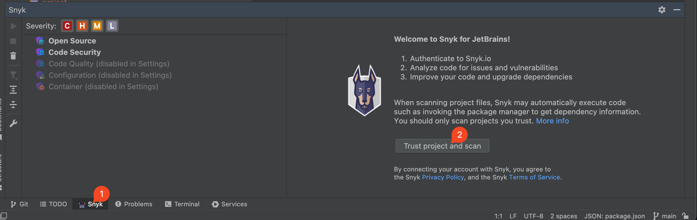

# Authentication for the JetBrains plugin

To scan your Projects, you must authenticate with Snyk.&#x20;


Before authenticating, be sure you have set your region properly. For details, see [IDEs URLs](../../../working-with-snyk/regional-hosting-and-data-residency.md#ides-urls).


Snyk supports the following protocols for authentication:

* OAuth 2.0 (default)
* Snyk API token (fallback option)

## Steps to authenticate using the OAuth 2.0 protocol

To authenticate, follow these steps:

1. After the extension is installed, click the **Snyk icon** in the navigation bar, then click **Trust project and scan**.

<figure><figcaption>
Snyk icon and connect and trust
</figcaption></figure>

2. A new browser window opens; in response to the prompt, log in to your Snyk account.
3. In the next prompt, the Snyk IDE plugin requests access to act on your behalf; click **Grant app access**.
4. When you have authenticated successfully, a confirmation message appears; close the browser window and return to the IDE.

The analysis starts automatically. The IDE reads and saves the authentication tokens on your local machine.&#x20;


OAuth 2.0 tokens are not static and cannot be copied from the Snyk account page.


If you have problems, see [OAuth 2.0 authentication does not work](../troubleshooting-ides/how-to-set-environment-variables-by-operating-system-os-for-ides-and-cli-1.md).

## Steps to authenticate using your Snyk API token


This method is inferior to the OAuth method.


To authenticate, follow these steps:

1. In the JetBrains plugin, navigate to **Preferences** > **Tools** > **Snyk**.
2. Find the **Authentication Method** and change it to **Token authentication**
3. Copy your API token. For details, see [Obtain and use your Snyk API token](../../../getting-started/#obtain-and-use-your-snyk-api-token).
4. Be sure to use your personal token. Paste or enter the token in the **Token** field.
5. Click **Apply** or **OK**.

The analysis starts automatically.

## How to switch accounts

To re-authenticate with a different account, follow these steps:

1. In the JetBrains plugin, navigate to **Preferences** > **Tools** > **Snyk**.
2. Clear the value of the **Token** field.
3. Click **Apply** or **OK**.
4. When you have logged out, start authentication again from the beginning.

## Requirements for Linux and Unix

When authenticating with Snyk, users have the option to copy the authentication URL to their clipboard.

For Linux and Unix users, this requires the `xclip` or `xsel` utility to be installed.
