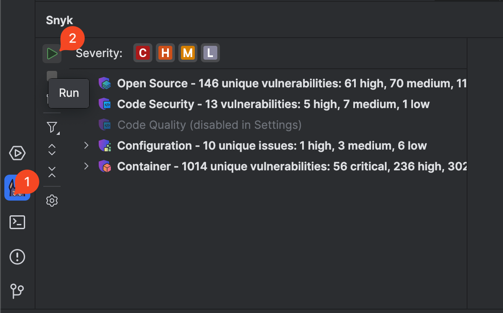
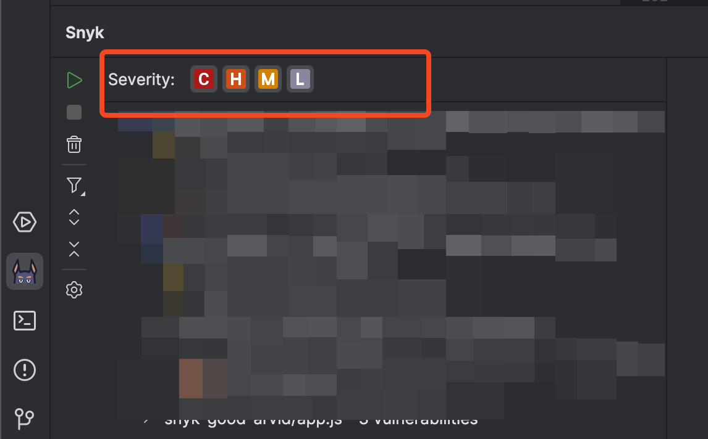

# Run an analysis with the JetBrains plugins


Ensure the Snyk extension is configured, authenticated, and trusted for your current Project, as described in the configuration and authentication pages.


You can trigger `snyk test` using one of these methods:

* automatic (default)
* manual

A Snyk scan is triggered automatically when your Project is opened and when any supported files are saved. This behavior can be turned off using the [existing configuration](configuration-for-the-snyk-jetbrains-plugin-and-ide-proxy.md#user-experience).


Ensure your files are saved before manually running an analysis.


To manually trigger `snyk test`, click the run (play) button at the top of the plugin's sidebar.

<figure><figcaption>
How to manually trigger a Snyk analysis
</figcaption></figure>

If the play button is grayed out, there is a scan in progress. Wait for it to complete before starting another can.

## Scan configuration

You may customize your scan behavior to reflect your company's security policy, or to focus on certain areas.&#x20;

### Severity filter

Snyk reports critical, high, medium, and low severities. There are two ways to control severity:

* plugin settings for the [Scan configuration](configuration-for-the-snyk-jetbrains-plugin-and-ide-proxy.md#scan-configuration)
* small buttons on top of the issues in the Snyk panel as shown in the screen image that follows

By default, all levels are selected. You must select at least one.

<figure><figcaption>
Choose severity level or levels
</figcaption></figure>

Snyk severity icons have the following meaning:

|  (1) (1) (1) (1) (1) (1) (1) (1) (1) (1) (1) (1) (1) (1) (1) (1).png>) Critical severity                                                                                                    | May allow attackers to access sensitive data and run code on your application.                                                               |
| ------------------------------------------------------------------------------------------------------------------------------------------------------------------------------------------------------------------------------------ | -------------------------------------------------------------------------------------------------------------------------------------------- |
|  (1) (1) (2) (1) (1) (1) (1) (1) (1) (1) (1) (1) (1) (1) (1) (1) (1) (1) (1) (1) (1) (1) (1) (1) (1) (1) (1) (1) (1) (1) (1) (1) (1) (1) (1) (1) (1) (1) (1) (1) (5) (3).png>) High severity | May allow attackers to access sensitive data on your application.                                                                            |
|  (1) (1) (1) (1) (1) (1) (1) (1) (1) (1) (1) (1) (1) (1) (1) (1) (1) (1) (1) (1) (1) (1) (1) (1) (1) (1) (1) (1) (1) (5) (6).png>) Medium severity                                          | May allow attackers under some conditions to access sensitive data on your application.                                                      |
|  (1) (1) (1) (1) (1) (1) (1) (1) (1) (1) (1) (1) (1) (1) (1) (1).png>) Low severity                                                                                                         | The application may expose some data allowing vulnerability mapping, which can be used with other vulnerabilities to attack the application. |

### Filter by issue type

Snyk reports the following types of issues:

* **Open Source** issues: found in open source dependencies. see details in [the section below](run-an-analysis-with-the-jetbrains-plugins.md#snyk-open-source-issues).
* **Code Security** issues: found in your application’s source code; see details in [the section below](run-an-analysis-with-the-jetbrains-plugins.md#snyk-code-issues).
* **Code Quality** issues: found in your application source code; see details in [the section below](run-an-analysis-with-the-jetbrains-plugins.md#snyk-code-issues).
* **Infrastructure as Code** issues: found in infrastructure as code files; see details in [the section below](run-an-analysis-with-the-jetbrains-plugins.md#snyk-infrastructure-as-code-issues).
* **Container** issues: found in images sourced from Kubernetes workload files; see details in [the section below](run-an-analysis-with-the-jetbrains-plugins.md#snyk-container-issues).


The exact capabilities and available scanners depend on your plan. Be sure your Organization's admin has enabled all Snyk products prior to configuring any of them in the IDE plugin.


There are two ways to show or hide specific issue types:

* plugin settings for the [Scan configuration](configuration-for-the-snyk-jetbrains-plugin-and-ide-proxy.md#scan-configuration)
* filter button in the panel's sidebar as shown in the screen image that follows

By default, all issue types shown are selected.

<figure><figcaption>
Show or hide specific issue types
</figcaption></figure>

### Net New Issues versus All Issues

Starting with version [2.10.0](https://plugins.jetbrains.com/plugin/10972-snyk-security/versions/stable/623034), it is possible to see **only newly introduced issues**.

This functionality _**reduces noise**_ and allows developers to _**focus on current changes**_ only. Developers can prevent issues early, thus unlocking their CI/CD pipeline and speeding up delivery.

The logic uses a local Git repository and shows the difference between current findings minus those in a base branch.

This can be [configured using scan configuration settings](configuration-for-the-snyk-jetbrains-plugin-and-ide-proxy.md#scan-configuration). Net New Issues is turned off by default, so you must take manual action to turn it on.

After this feature is enabled, Snyk only reports the delta findings.&#x20;

For newly created feature branches, there will be no reported issues. That is an intended state, that developers would aim for; see the screen image that follows:

<figure><figcaption>
Successful state. No Net New issues found
</figcaption></figure>

The base branch is usually automatically determined for each Git repository. In advanced cases, developers may change their base branch by clicking on the top level; see the screen image that follows).

<figure><figcaption>
Change base branch for calculation Net New issues
</figcaption></figure>

## Available Snyk issues types

### Snyk Code issues

Snyk Code analysis shows a list of security vulnerabilities and code issues found in your application code. For more details and examples of fixes others used to fix the issue, select the security vulnerability or the code security issue.

<figure><figcaption>
Snyk Code issue details
</figcaption></figure>

### Snyk Open Source issues

Snyk Open Source analysis shows a list of vulnerabilities and license issues found in all manifest files. To see more detailed information, select a vulnerability or license issue.

<figure><figcaption>
Snyk Open Source issue details
</figcaption></figure>

### Snyk Infrastructure as Code issues

With every scan, Snyk IaC analysis shows issues in your Terraform, Kubernetes, AWS CloudFormation, and Azure Resource Manager (ARM) code. The scan is based on the Snyk CLI and s fast and friendly for local development. To see more detailed information, select an issue.

<figure><figcaption>
Snyk IaC issue details
</figcaption></figure>

### Snyk Container issues


This is an experimental feature, that is likely to change.


The JetBrains plugin scans Kubernetes configuration files and searches for container images. Vulnerabilities are found quickly using the extracted container images and comparative analysis against the latest information from the [Snyk Vulnerability Database](https://security.snyk.io).

Snyk Container analysis shows each of the security vulnerabilities that might affect your image. To see more detailed information, select a vulnerability.

A comparison table is displayed with the severity levels such as critical or high. This shows the difference in vulnerabilities between the current image and the image recommended by Snyk, with the same characteristics sorted by severity. This helps you decide if you want to upgrade your image to the recommended one and increase the level of confidence in the image you are running in production.
