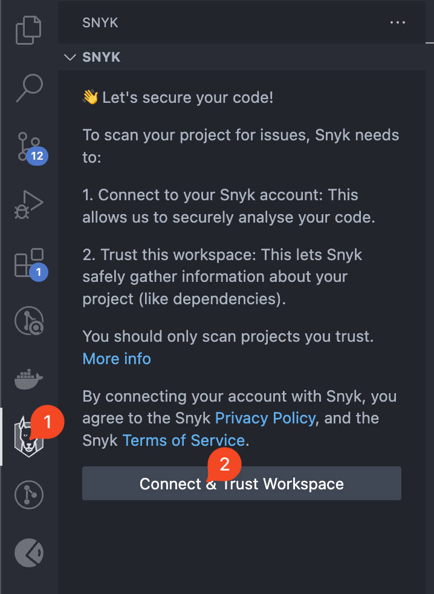
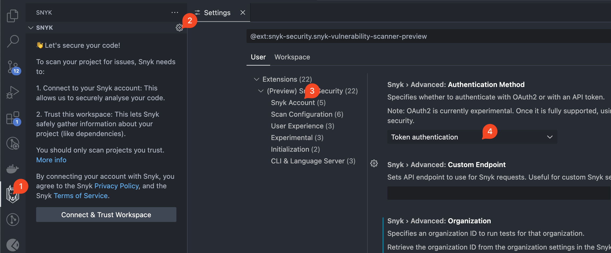

# Authentication for Visual Studio Code extension

To scan your Projects, you must authenticate with Snyk.&#x20;

Snyk supports the following protocols for authentication:

* OAuth 2.0 (Recommended)
* Personal Access Token
* Snyk API token (Legacy)

For all authentication methods, Snyk uses the [Secret Storage API](https://code.visualstudio.com/api/references/vscode-api#SecretStorage) to store the token securely. This storage uses the keychain of the system to manage the token.


Before authenticating, ensure you have set your region properly. For details, see [IDEs URLs](../../../working-with-snyk/regional-hosting-and-data-residency.md#ides-urls).


## Steps to authenticate using the OAuth 2.0 protocol

Follow these steps to authenticate:

1.  After the extension is installed, click the **Snyk Icon** in the navigation bar, then click **Connect & Trust Workspace**:

    <figure><figcaption>
Connect and trust workspace
</figcaption></figure>
2. A new browser window opens, requiring you to log in to your Snyk account.
3. In the next prompt, the Snyk IDE extension requests access to act on your behalf. Click **Grant app access**.
4. When you have authenticated successfully, a confirmation message appears. Close the browser window and return to the IDE.
5. The IDE reads and saves the authentication on your local machine. Close the browser window and return to the IDE.

The analysis starts automatically. The IDE reads and saves the authentication on your local machine.


OAuth 2.0 tokens are not static and cannot be copied from the Snyk account page.


If you have problems, see [OAuth 2.0 authentication does not work](../../../cli-ide-and-ci-cd-integrations/snyk-ide-plugins-and-extensions/troubleshooting-ides/how-to-set-environment-variables-by-operating-system-os-for-ides-and-cli-1.md).

## Steps to authenticate using your Personal Access Token




The Personal Access Token (PAT) authentication is progressively rolled out to all Enterprise customers. To check if this feature is available for your Organization at this time, please reach out to your Snyk account team.


When using this feature,  ensure you generate and use a Personal Access Token (PAT). This feature is not compatible with Service Account tokens, and using them may result in unexpected behavior or errors.


Whenever you use this feature in your IDE, ensure to also retrieve the PAT details from the Snyk Web UI. Contact Snyk Support to enable the PAT feature within your Snyk Web UI Organization.&#x20;


To authenticate using the Personal Access token, follow these steps:

1.  Click the **Snyk Icon** in the navigation bar, then click the **Settings** icon, find **Authentication Method,** and change it to **Personal Access Token**.&#x20;

    <figure><figcaption></figcaption></figure>
2. Create your **Personal Access** **Token**. For details, see the [Authentication for API](../../../snyk-api/authentication-for-api/) page.&#x20;
3.  Run the `Snyk: Set Token` command and paste the token in the text field.

    <figure><figcaption></figcaption></figure>

## Steps to authenticate using your Snyk API token



Follow these steps to authenticate:

1. After the extension is installed, click the **Snyk Icon** in the navigation bar, then click the **Settings** icon, find **Authentication Method,** and change it to **Token authentication**:

<figure><figcaption>
Change authentication method 
</figcaption></figure>

2. Press **Connect & Trust Workspace**.
3.  Click **Authenticate** in the web browser window that opens.

    <figure><figcaption></figcaption></figure>

The analysis starts automatically.


Alternatively, run the `Snyk: Set Token` command and paste the token in the text field.


<figure><figcaption>
Set token manually
</figcaption></figure>

## How to switch accounts

To re-authenticate with a different account, follow these steps:

1. Run the provided `Snyk: Log Out` command.

<figure><figcaption>
Snyk: Log out
</figcaption></figure>

2. When you have logged out, start authentication again from the beginning.

## Requirements for Linux and Unix

When authenticating with Snyk, users have the option to copy the authentication URL to their clipboard.

For Linux and Unix users, this requires the `xclip` or `xsel` utility to be installed.
