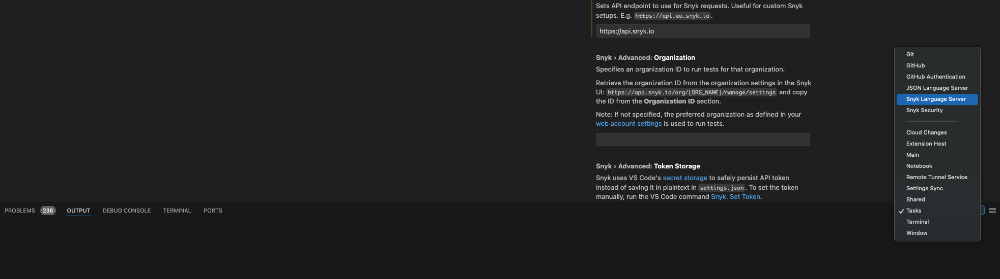

# Troubleshooting for Visual Studio Code extension


Snyk plugins are not supported on any operating system that has reached End Of Life (EOL) with the distributor.&#x20;


## Failing CLI download

The Snyk extension for Visual Studio Code downloads the CLI so the extension can operate. When the extension cannot download the required version of the CLI from the configured release channel, one of the following may be the reason:

1. Network connectivity issues
2. Misconfigured release channel settings
3. Temporary unavailability of the requested CLI version

Follow these steps to resolve the issue:

1. Check your internet connection and proxy settings.
2. Verify the release channel configuration in the extension settings.
3. Try switching to a different [release channel](../../../snyk-cli/releases-and-channels-for-the-snyk-cli.md) (for example, from **stable** to **preview**).
4. Restart Visual Studio Code and attempt to [reinstall the extension](./#how-to-install-and-set-up-the-extension).
5. If the problem persists, check for any known issues or updates on the [Snyk GitHub VS Code](https://github.com/snyk/vscode-extension/releases) repository

## Logs

You can find the logs for VS Code in the output channels for the Snyk extension and Snyk Language Server. Both are needed for troubleshooting.

To enable the debug log level, start VS Code from the terminal like this:

`cd your-repo SNYK_LOG_LEVEL=debug code .`

Alternatively, you can add `-d` to additional parameters in the Snyk settings.

You can obtain additional logs by navigating to **Help** > **Toggle Developer Tools** and selecting the **Output** tab to see additional output. From the list displayed, select the **Snyk Language Server** channel and then the **Snyk Security** channel to see the debugging information.

The Snyk Security channel has information on the extension itself. The Snyk Language Language Server channel receives the Language Server logs, displaying everything that is going on inside the Language Server and the CLI when you are using the extension.

<figure><figcaption>
Obtain additional output
</figcaption></figure>

## Command not found (getActiveUser, LoginCommand, and so on)

This indicates that the required binaries are not available. To start the extension and use it, ensure that the following are available and executable:

* Snyk Language Server (snyk-ls)
* Snyk CLI

These are usually downloaded automatically by the extension. If downloading automatically is not possible, the Language Server will not start, and thus, it will not provide the commands being used to VS Code.

To resolve this problem, try the following:

* Check to see if automatic download is activated and if it works.
  * Proxy/SSL problems could be the reason why the download does not finish.
  * Missing write permissions in the configured path could be another reason why automatic download does not work.
* Before reaching out for help, check the following:
  * Secure debug logs (`-d` in `additional parameters` )
  * Configuration
  * Manual CLI run logs and information on the network:
    * Is there a proxy?
    * Is this an MITM proxy that intercepts SSL connections?
    * If yes, is the custom certificate authority available to the OS?
* If automatic management of dependencies is not enabled, do the following:
  * Download the Language Server and the CLI manually.
  * Make them executable.
  * Provide the path to the binary in the Snyk settings in the corresponding fields.
