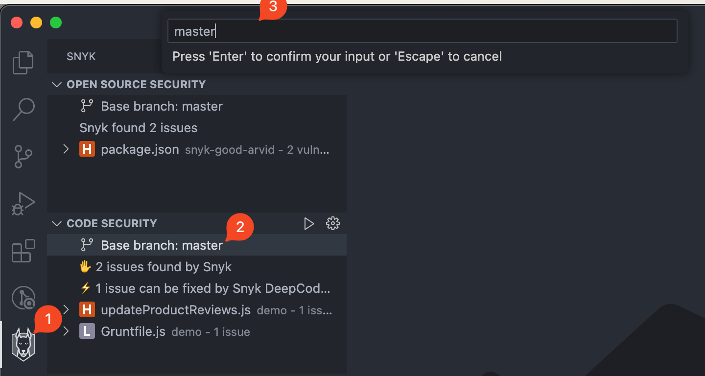

# View analysis results from Visual Studio Code extension

Snyk analysis shows a list of security vulnerabilities and code issues in the application code. Select a security vulnerability or a code security issue to view more details and examples of how others fixed the issue. The Issue details panel appears in a tab on the right side of the screen.

The **Snyk analysis panel** on the left in the following screen image shows how much time the analysis took and a list of issues with the suggestions found for those issues.

Each issue contains a severity icon that has the following meaning:

|  (1) (1) (1) (1) (1) (1) (1) (1) (1) (1) (1) (1) (1) (1) (1) (1).png>) Critical severity                                                                                                    | May allow attackers to access sensitive data and run code on your application.                                                               |
| --------------------------------------------------------------------------------------------------------------------------------------------------------------------------------------------------------------------------------------- | -------------------------------------------------------------------------------------------------------------------------------------------- |
|  (1) (1) (2) (1) (1) (1) (1) (1) (1) (1) (1) (1) (1) (1) (1) (1) (1) (1) (1) (1) (1) (1) (1) (1) (1) (1) (1) (1) (1) (1) (1) (1) (1) (1) (1) (1) (1) (1) (1) (1) (5) (3).png>) High severity | May allow attackers to access sensitive data on your application.                                                                            |
|  (1) (1) (1) (1) (1) (1) (1) (1) (1) (1) (1) (1) (1) (1) (1) (1) (1) (1) (1) (1) (1) (1) (1) (1) (1) (1) (1) (1) (1) (5) (6).png>) Medium severity                                          | May allow attackers under some conditions to access sensitive data on your application.                                                      |
|  (1) (1) (1) (1) (1) (1) (1) (1) (1) (1) (1) (1) (1) (1) (1) (1).png>) Low severity                                                                                                         | The application may expose some data allowing vulnerability mapping, which can be used with other vulnerabilities to attack the application. |

<figure><figcaption>
Snyk Security extension with Snyk Code issue
</figcaption></figure>

## Scan configuration

You may customize your scan behavior to reflect your company's security policy or to focus on certain areas.&#x20;

### Severity filter

Snyk reports critical, high, medium, and low severities. This can be adjusted in the [Scan configuration](../visual-studio-code-extension-configuration.md#scan-configuration) settings.

By default, all levels are selected. You must select at least one.

### Filter by issue type

Snyk reports the following types of issues:

* **Open Source** issues: found in open source dependencies; for more details, see [Snyk Open Source results](analysis-results-snyk-open-source.md).
* **Code Security** issues: found in your application’s source code; for more details, see [Snyk Code results](analysis-results-snyk-code.md).
* **Code Quality** issues: found in your application source code (same structure as Code Security)
* **Infrastructure as Code** issues: found in infrastructure as code files; Ffor more details, see [Snyk IaC results](visual-studio-code-extension-analysis-results-snyk-iac-configuration.md).


The exact capabilities and available scanners depend on your plan. Be sure your Organization's admin enabled all Snyk products prior to configuring any of them in the IDE plugin.


Issues types that will be shown can be adjusted in the [Scan configuration](../visual-studio-code-extension-configuration.md#scan-configuration) settings.

By default, all issue types shown are selected.

### Net New Issues versus All Issues

Starting with version 2.19.0, it is possible to see **only newly introduced issues**.

This functionality _**reduces noise**_ and allows developers to _**focus on current changes**_ only. Developers may prevent issues early, thus unlocking their CI/CD pipeline and speeding up delivery.

The logic uses a local Git repository and shows the difference between current findings minus those in a base branch.

This can be configured using [plugin settings](../visual-studio-code-extension-configuration.md#scan-configuration). It is turned off by default, so to turn it on, you must take manual action.

After this feature is enabled, Snyk reports only the delta findings.&#x20;

For the newly created feature branches, there will be no reported issues. That is an intended state that developers would aim for, as shown in the following screen image.

<figure><figcaption>
Successful state. No Net New issues found. 
</figcaption></figure>

The base branch is usually automatically determined for each Git repository.&#x20;

In advanced cases, developers may change their base branch by following these steps (see the screen image that follows):&#x20;

1. Click on the top level node in the Issues tree
2. Use text input to specify any branch name
3. Click Enter to save the selection

<figure><figcaption>
Change base branch for calculation Net New issues
</figcaption></figure>
