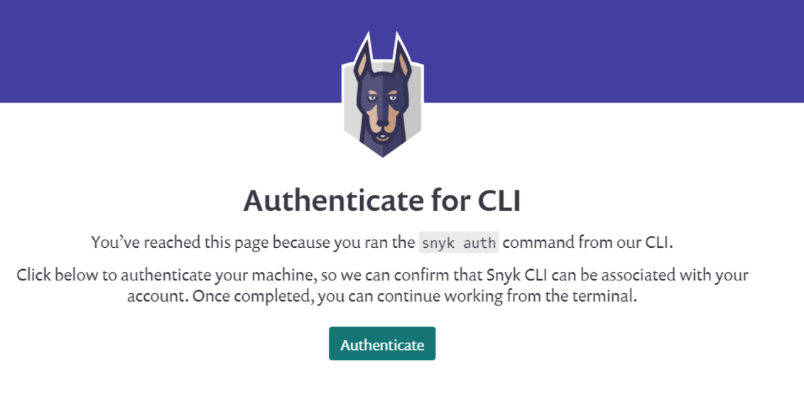

# Visual Studio extension authentication

Authenticate using **Connect Visual Studio to Snyk** link on the Overview page.

You can also authenticate using Options. Open Visual Studio **Options** and go to the **General Settings** of the Snyk extension, or use the **Settings** button in the toolbar.

If the automated method does not work, you can trigger authentication by pressing the **Authenticate** button or entering the user API [token](../../../snyk-api/rest-api/authentication-for-api/) manually. If you must enter your token, use your personal token. For more information, see [How to obtain and authenticate with your Snyk API token](../../../getting-started/how-to-obtain-and-authenticate-with-your-snyk-api-token.md). You can also submit a request to [Snyk support](https://snyk.zendesk.com/agent/dashboard).

On the Snyk website, verify your identity and connect to the IDE extension. Click the **Authenticate** button.

Afterthe authentication has been confirmed, close the browser and go back to the IDE extension. The Token field has been populated with the authentication token, and authentication is complete.

##
