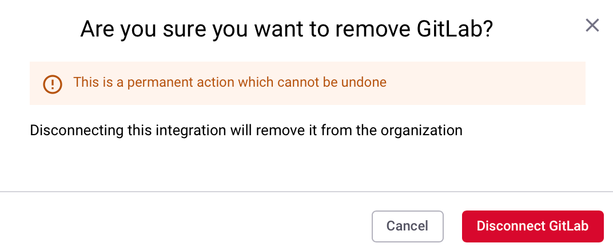
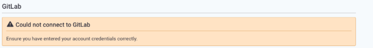

# GitLab

When you want to add new integrations to your Snyk account you need to first decide the level type at which you want to install the integration.

* [Group level ](gitlab.md#group-level-snyk-apprisk-integrations)- Add integrations to your Snyk application that will be available for your Snyk AppRisk Essentials or Snyk AppRisk Pro. If you want to set up integrations for Snyk AppRisk, use the Integrations menu at the Group level.
* [Organization level](gitlab.md#organization-level-snyk-integrations) - Add integrations for your Snyk application that will be available for all Snyk products, except Snyk AppRisk.

## Organization level - Snyk integrations


**Feature availability**

The GitLab integration is available only with Enterprise plans. For more information, see [plans and pricing](https://snyk.io/plans/).

[Snyk Broker](../../enterprise-setup/snyk-broker/) is required if you are integrating from a private network.


### Prerequisites for GitLab integration

* GitLab versions 9.5 and above (API v4).
* A public or private GitLab group or project.

### GitLab integration features

The GitLab integration allows you to:

1. Check for vulnerabilities in your pull requests.&#x20;
2. From the **Report** page or the **Project** page on the Snyk Web UI, [trigger a Snyk pull request](gitlab.md#fix-vulnerabilities-with-snyk-merge-requests) for the fixes listed.
3. Receive [email alerts](gitlab.md#receive-email-alerts-for-new-vulnerabilities) when new vulnerabilities that affect your repository arise and fixes for those vulnerabilities are shown.
4. Receive [email alerts](gitlab.md#receive-email-alerts-for-new-upgrades-or-patches) containing a new pull request if a new upgrade or patch is available for a vulnerability.

### GitLab access tokens

To set up the GitLab integration with Snyk, create a GitLab access token and enter this into the Snyk application.

Typically, the first user in a Snyk Organization, a [Snyk admin](../../admin/#user-types) and GitLab Owner or Maintainer, sets up an integration with a **GitLab Personal Access Token** or **Group Access Token.** This token is then authenticated with GitLab, enabling access by Snyk to the repositories in that GitLab account.

* A **GitLab Personal Access Token** is used to perform actions on and manage personal GitLab projects individually. These differ from Group Access Tokens as they are attached to a user rather than a GitLab group. For AppRisk to show all repositories from GitLab, the user generating the PAT should be part of the GitLab group where their GitLab permissions can be a minimum of Guest.
* A **GitLab Group Access Token** is used to perform actions for and manage more than one GitLab project within a GitLab group. The Group Access Token also grants access to all GitLab projects in a GitLab group or subgroup without contributing to GitLab's licensed user count.

To trigger the creation of fix pull requests manually, all users in a Snyk Organization can add and work with any related Snyk Projects, while the merge requests themselves will appear in GitLab as having been opened by the Snyk admin who set up the configuration.


Group Access Tokens can only be created by a GitLab Owner using a GitLab Premium or Ultimate [account tier](https://about.gitlab.com/pricing/). This can be done in [GitLab's web UI](https://docs.gitlab.com/ee/user/group/settings/group_access_tokens.html), their Rails console, or through the GitLab API.


### How to set up the GitLab integration

#### Add a GitLab Personal Access Token in GitLab

1. Generate a GitLab Personal Access Token in a GitLab instance.\
   Select the profile icon, then **Edit Profile > Access Tokens**.\
   Set the token name, for example, Snyk, and select the **api** scope. The **api** scope grants complete read/write access to the API, including all groups and projects, the container registry, and the package registry.
2. Navigate to the Snyk [**Integrations**](https://app.snyk.io/integrations) page, select the GitLab integration tile, and enter the URL of the GitLab instance and the token you generated.
3. Click **Save**.
4. When the tile on the **Integrations** page indicates the integration is **Configured**, click the tile and select the GitLab projects to test or select **Add projects** from the **Snyk** **Dashboard**.

#### Add a GitLab Group Access Token

Generating a GitLab Group Access Token requires selecting the Maintainer role for access.

Selecting the **api** scope with a **Maintainer** role allows Snyk to authenticate user accounts and create webhooks, enabling the following:

* Automation of fix pull requests and Snyk tests on your pull requests.
* Manual creation of fix pull requests.
* Manual creation of re-trigger tests.

#### Create a GitLab Group Access Token

1. Locate the GitLab Group and select **Settings** > **Access Tokens**.
2. Enter a descriptive token name such as `SnykToken`, select the **Maintainer** role, and check the **api** scop&#x65;**.**

#### Add a GitLab Group Access Token to Snyk

1. Copy the token generated from GitLab.
2. Navigate to the Snyk GitLab integration page by selecting the tile.
3. Paste the GitLab Group Access Token into the Snyk application field the same way you would add a GitLab Personal Access Token.

### **Uses of the GitLab integration**

#### **Fix vulnerabilities with Snyk merge requests**

When viewing a Snyk test report for a Snyk Project that you own or when looking at a GitLab Project that you are watching with Snyk, you see two options for fixing a vulnerability:

* **Fix these vulnerabilities:** generate a Snyk merge request with the minimal changes needed to fix all the Snyk Project's detected vulnerabilities.&#x20;
* **Fix this vulnerability:** generate a Snyk merge request on an individual issue that fixes the vulnerability.

You can review the vulnerabilities that will be fixed, change your selection with the checkboxes, and choose to ignore any vulnerabilities that cannot be fixed now before opening the merge request on the **Open a Fix Merge Request** page.


GitLab webhooks send out an event to Snyk when merge requests occur. This starts a series of other events, such as pulling GitLab project files, running the test process, and posting the results to GitLab, all of which occur on the Snyk side.


#### Receive email alerts for new vulnerabilities

When a new vulnerability is detected on a Snyk Project you are watching, Snyk will send you an email with a generated Snyk merge request to address the vulnerability.

#### Receive email alerts for new upgrades or patches

You may find yourself in a situation where no upgrade is found for a vulnerability, and only a patch is available. When a fix does become available, Snyk notifies you by email and generates a merge request containing the new fix.


Patching is only available on Node.js Projects.


### How to disconnect the GitLab integration


Disconnecting the GitLab integration removes all Snyk webhooks, along with the Snyk credentials, and deactivates the GitLab Projects in the Snyk Web UI.

The Projects will be set to inactive, and you will no longer get alerts, pull requests, or Snyk tests on your pull requests.


1. Navigate to the Snyk GitLab integration **Settings**.
2. At the bottom of the page, select **Remove GitLab**.
3.  A confirmation screen opens. To proceed, select **Disconnect GitLab**.\

    <figure><figcaption>
Confirm disconnecting from GitLab
</figcaption></figure>

After GitLab is disconnected, Snyk Projects imported from GitLab will be set to inactive, and you will no longer get alerts, pull requests, or Snyk tests on pull requests. The webhook that enables the integration for this repository will be removed.

You can re-connect anytime; however, re-initiating GitLab projects for monitoring requires setting up the integration again.

### GitLab integration Troubleshooting

#### Error message: Could not connect to GitLab

When you are adding the environment URL and access token to set up the integration, the following message may appear:

<figure><figcaption>
Could not connect to GitLab integration error message
</figcaption></figure>

This is a permissions issue unless [Snyk Broker](https://support.snyk.io/hc/en-us/articles/360005105598-Gitlab-Broker-is-not-working) is involved. In the PAT settings in GitLab, ensure you have selected the api scope and the **Maintainer** role.

## Group level - Snyk AppRisk integrations

The Integrations page shows all active integrations, including data from your existing Snyk Organizations that is automatically synced and provides access to the Integration Hub.

### GitLab setup guide

#### Pulled entities 

* Users
* Repositories&#x20;

#### Integrate using Snyk AppRisk 

1. Profile name (`mandatory`): Input your integration profile name.&#x20;
2. Access Token (`mandatory`):
   * API Token (`mandatory`): Create your GitLab PAT from your GitLab organization. Follow the instructions in [Generate a Personal access token from your GitLab settings section](gitlab.md#generate-a-personal-access-token-from-your-gitlab-settings). Authorize your personal access token if you have configured SAML SSO.
   * Host URL (`mandatory`): The IP/URL of the GitLab server. The default URL is [`https://gitlab.com`](https://gitlab.com)
3. Broker Token (`mandatory`): Create and add your Broker token if you use Snyk broker for AppRisk.
   * Generate your Broker token by following the instructions from the [Obtain your Broker token for Snyk Broker ](../../enterprise-setup/snyk-broker/snyk-broker-code-agent/install-snyk-broker-code-agent-using-docker/obtain-the-required-tokens-for-setup.md#obtain-your-broker-token-for-snyk-broker-code-agent)page.&#x20;
   * Copy and paste the Broker token on the integration setup menu from the Integration Hub.
4. Verify SSL (`optional`): Enable the option if you want to verify the SSL.
5. Pull personal repositories (`optional`): Enable the option If you only want to pull the repositories you own.
6. Add Backstage Catalog (`optional`): If you want to add your Backstage catalog, follow the instructions from the [Backstage file for SCM Integrations](application-context-for-scm-integrations/) page.

#### Generate a [Personal access token](gitlab.md#gitlab-access-tokens) from your GitLab settings

1. Navigate to your GitLab profile.
2. Select Edit Profile.
3. On the left sidebar, select Access Token.
4. Select Add New Token.
5. Enter a name and expiry date for the token.
6. Ensure to enable this permission:
   * `read_api` - Grants read access to the API, including all groups and projects, the container registry, and the package registry.
   * `read_repository` - Grants read-only access to repositories on private projects using Git-over-HTTP or the Repository Files API.
7. Click the Create personal access token button.
8. Copy and store the displayed key.

#### API version 

You can use the[ GitLab REST API v4](https://docs.gitlab.com/ee/api/index.html) repository to access information about the API.
