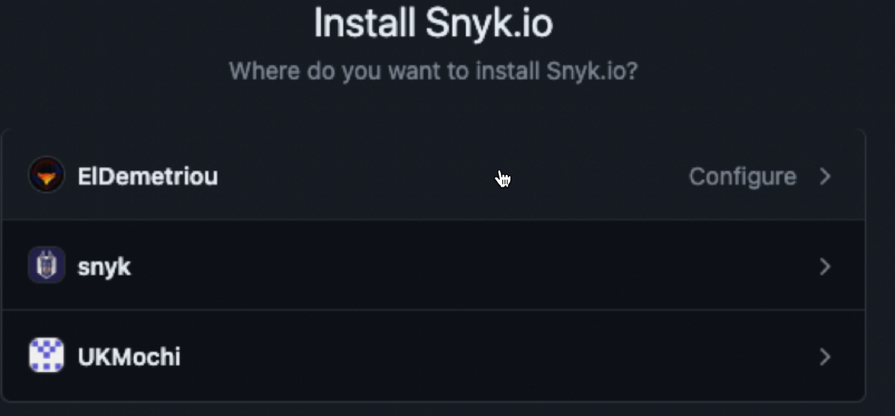
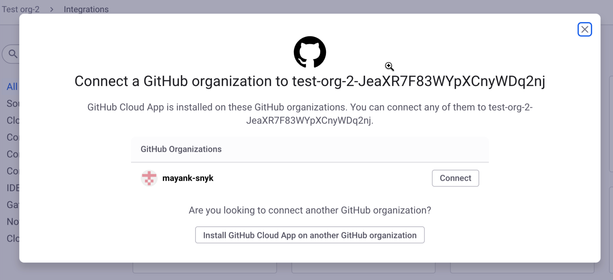

# Snyk GitHub Cloud App


**Release status and feature availability**

The Snyk GitHub Cloud App is in [Early Access](../../getting-started/snyk-release-process.md). \
This feature is not yet supported for Snyk Broker.

If you are using a self-hosted instance of GitHub, you must use the [Snyk GitHub Server App](snyk-github-server-app.md).

As Snyk does not have static IP addresses, this integration will not work with IP allowlisting in GitHub.


## Prerequisites for GitHub Cloud App

* Snyk Organization Admin user role.
* GitHub Organization Admin user role.
* A public or private GitHub repository.


Users can install the app on GitHub Organizations they are Repository Admins on through the GitHub UI.


## GitHub Cloud App benefits

The Snyk GitHub Cloud App improves on many features as compared to the current GitHub integration, including role-based, granular access control, increased API rate limits, and creation of an entry point for expanded and enhanced developer experiences.

* **RBAC (Role-Based Access Control) Compliance**: With the GitHub Cloud App, the access control mechanism is decoupled from individual user accounts. Instead, it is associated with the app entity itself. This separation allows for better management and enforcement of RBAC policies, as access control is handled at the application level rather than being tied to individual user accounts.
* **Granular access control**: The GitHub Cloud App allows for fine-grained control over access permissions at the repository level.&#x20;
* **Increased API rate limit**: The GitHub Cloud App provides higher rate limits, allowing Snyk to make a larger number of API requests. This increased limit will assist in handling large-scale use cases, such as monorepos with a large number of Projects, GitHub organizations with a large number of repositories, and more.
* **Enabler for an enhanced developer experience:**
  * Pull request checks: The Checks tab experience in GitHub is exclusively accessible through the GitHub Cloud App, enabling an SCM native experience as part of potential future PR check workflow improvements.
  * Fix and upgrade pull requests: Pull requests initiated by Snyk are performed directly by the GitHub App rather than a service account.

## How to set up the Snyk GitHub Cloud App

Log in to your Snyk account and navigate to the Integrations section in the Snyk Organization where you would like to set up the GitHub Cloud App.

Select the **GitHub Cloud App** tile.

<figure><figcaption>
Source Control integration tiles
</figcaption></figure>

In the confirmation modal, select **Configure GitHub Cloud App.**\

<figure><figcaption>
Configuration notice for the GitHub Cloud App
</figcaption></figure>

When the install screen in GitHub opens, you can select the GitHub organization where you wish to install the app.\

<figure><figcaption>
Selection of the GitHub organization to install the app into
</figcaption></figure>

If the GitHub Cloud App is already installed in a GitHub organization, you can select that same GitHub organization during the integration process for a different Snyk Organization.\

<figure><figcaption>
Connect another GitHub organization into a Snyk Organization
</figcaption></figure>

Specify whether you wish to install the app in all of the repositories belonging to the selected GitHub organization, or you want to install the app in a select number of repositories belonging to a GitHub organization; then click **Install & Authorize**.

<figure><figcaption>
Install and authorize settings for the GitHub organization you are installing the GitHub Cloud App into
</figcaption></figure>


The GitHub Cloud App will lose access to Snyk if it is uninstalled from the GitHub organization or if the repositories to which the app instance has access are edited.


## How to migrate to the Snyk GitHub Cloud App

If you are an Enterprise plan customer, you can migrate Snyk Targets to the Snyk GitHub Cloud App using the [snyk-migrate-to-github-app](https://github.com/snyk-labs/snyk-migrate-to-github-app) tool in the [tool repository](https://github.com/snyk-labs/snyk-migrate-to-github-app).

## Feedback on the Snyk GitHub Cloud App

Because this feature is in  [Early Access](../../getting-started/snyk-release-process.md), the functionality will likely evolve based on your feedback. If you would like to provide any feedback, contact your Account Manager or [Snyk support](https://support.snyk.io/hc/en-us/requests/new).

