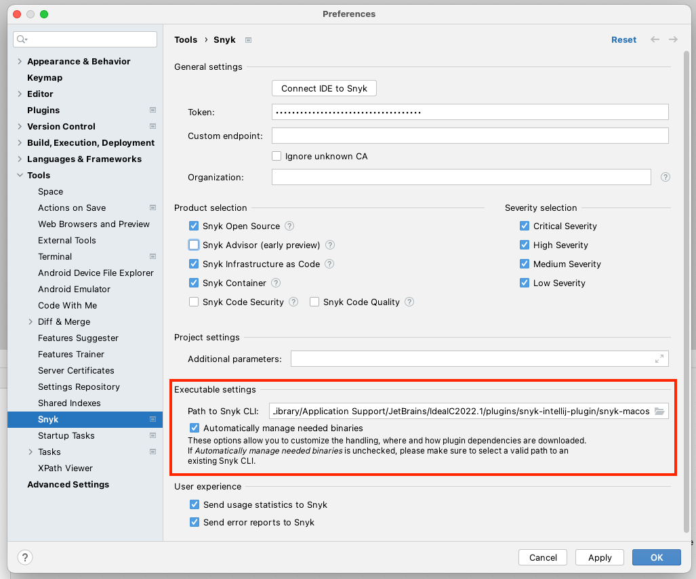

# Configuration, environment variables, and proxy for the JetBrains plugins

## JetBrains plugin configuration

After the plugin is installed, you can opt out of downloading the CLI through the plugin and thus use your own installation of the CLI.

You can set the following configurations for the plugin, using **Preferences → Tools → Snyk**:

* **Token**: set the token that should be used for authentication with Snyk (see [Authentication for the JetBrains plugins](authentication-for-the-jetbrains-plugins.md)).
* **Custom endpoint**: set the custom endpoint for the Snyk Web UI, if needed. Use this field for single tenant setups as well instead of https://api.snyk.io. See [IDE URLs](../../../working-with-snyk/regional-hosting-and-data-residency.md#ides-urls).
* **Ignore unknown CA**: ignore the SSL cert, if needed
*   **Organization**: set the org to run `snyk test` against (similar to the `--org=` option in the CLI). Snyk recommends using the `ORG_ID`. If you specify an Organization slug name, the value must match the URL slug as displayed in the URL of your org in the Snyk UI: `https://app.snyk.io/org/[orgslugname]`.

    If not specified, the preferred organization as defined in your [web account settings](https://app.snyk.io/account) is used to run tests.
*   **Additional parameters**: set additional `snyk test` [CLI options](https://docs.snyk.io/snyk-cli/cli-reference#options-for-multiple-commands) for Open Source scanning.

    For **unmanaged** [**C/C++**](../../../supported-languages-and-frameworks/c-c++/) **scanning**, use the CLI option `--unmanaged` to find vulnerabilities in open-source packages. This option works only for unmanaged C/C++ scanning; do not use this option for other languages. For all .NET Projects, Snyk recommends adding the `--all-projects` additional parameter.\
    Additional parameters do not apply to Snyk Code or IaC.
* **Snyk Open Source vulnerabilities**: use to analyze the project for open source vulnerabilities through the CLI using Snyk Open Source; enabled by default.
* **Snyk Infrastructure as Code issues**: use to analyze the project for insecure configurations in Terraform and Kubernetes code; enabled by default.
* **Snyk Container vulnerabilities**: use to analyze the project for container vulnerabilities in container images and Kubernetes applications; enabled by default.
* **Snyk Code Security issues**: use to analyze the project for security vulnerabilities in your application code using Snyk Code; enabled by default
* **Snyk Code Quality issues**: applies to Snyk Code only; disabled by default.
* **Snyk Advisor issues**: health status (maintenance, community, popularity, and security) of your open source packages. Advisor scores are shown only for packages with an advisor score of less than 70.
* **Automatically manage needed binaries** and **Cli Path**: Opt out of downloading the CLI through the plugin and thus use your own installation of the CLI.
  * When **Automatically manage needed binaries** is checked, the plugin will automatically download and keep the CLI updated.
  * When **Automatically manage needed binaries** is not checked, and **ClI Path** contains a path, the plugin will use the provided CLI path. Use this option if downloading the CLI is not possible due to your network configuration (for example, due to firewall rules), and you need to obtain the CLI through other means.

<figure><figcaption>
Path to Snyk CLI setting
</figcaption></figure>

## Environment variables for the JetBrains plugins

To analyze Projects, the plugin uses the Snyk CLI which needs the following environment variables depending on the type of project you analyze:

* `PATH`: the path to needed binaries, for example, to maven
* `JAVA_HOME`: the path to the JDK to use to analyze Java dependencies

Setting these variables only in a shell environment (for example, using `~/.bashrc`) is not sufficient, if you do not start the JetBrains IDE from the command line or create a script file that starts it using a shell environment.

* On **Windows**, you can set the variables, using the GUI or on the command line using the `setx` tool.
* On **macOS**, the process `launchd` needs to know the environment variables if you want to launch the IDE from Finder directly. Set environment variables for applications launched using Finder by running the `launchctl setenv` command. You can do this start-up or by using a script you launch at user login.\
  **Note:** The provision of environment variables to the macOS UI can change between operating system releases, so it can be easier to create a small shell script that launches the IDE to leverage the shell environment, that can be defined using`~/.bashrc`.
* On **Linux**, updating the file `/etc/environment` can be used to propagate the environment variables to the windows manager and UI.

## Proxy for the JetBrains plugins

If you need to use a proxy server to connect to the internet, configure it using the [Jetbrains IDE settings](https://www.jetbrains.com/help/idea/settings-http-proxy.html). The Snyk plugin will use the settings.
