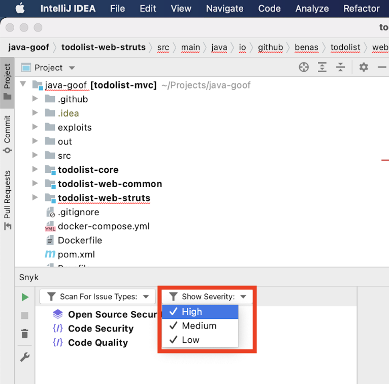
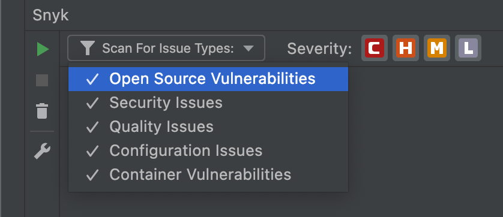

# Filter JetBrains results

## Filter by severity

Snyk reports critical, high, medium, and low severities. You can filter for the severity level you need by selecting the value from the dropdown as shown in the screenshot that follows. By default all levels are selected. You must select at least one.

## Filter by issue type

Snyk reports the following types of issues:

* **Open Source Vulnerabilities**: found in open source dependencies
* **Security Vulnerabilities**: found in your application’s source code
* **Quality Issues**: found in your application source code
* **Configuration Issues**: found in infrastructure as code files
* **Container Vulnerabilities**: found in images sourced from Kubernetes workload files

You can filter for each one of them by selecting the value from the dropdown as shown in the screenshot that follows. By default all issue types shown are selected.

##
