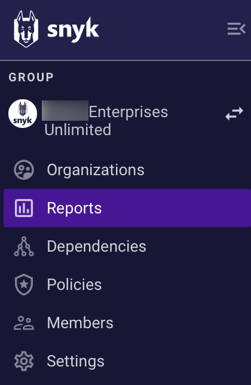

# Groups


**Feature availability**\
This feature is available with Enterprise Plans. See [Plans and pricing](https://snyk.io/plans/) for details.


Snyk Groups make it easier for you to work in teams. Groups can contain many Organizations, and each Organization can contain many collaborators and Projects.

As part of your onboarding, Snyk will set you up with a Group for your company. You can then add your current Organizations to this Group. If you think your company will need multiple Groups, submit a request to [Snyk Support](https://snyk.zendesk.com/agent/dashboard). See [Structure your account for high application performance](../../structure-your-account-for-high-application-performance.md) for details concerning multiple Groups.

## Group-level options

You can use Group-level options to view [Organizations](./#group-organizations), [reports](./#group-reports), [dependencies](./#group-dependencies), and [policies](./#group-policies) across all of the Organizations in your Group, configure your [Group settings](./#group-settings), and view all the [users](./#group-members) in a Group.

<figure><figcaption>
Group-level options for Enterprise plan users
</figcaption></figure>

### Group Organizations

Select **Organizations** to view all the Organizations you have access to and your assigned role inside each one:

<figure><figcaption>
A list of all the Organizations a user has access to
</figcaption></figure>

If your Group is set up to let its users join Organizations, you also see a list of all the Organizations in the Group and options to join the Organizations where you are not currently a member.


For a detailed breakdown of user roles and their associated access permissions, see [User roles](../../manage-permissions-and-roles/).


### Group Reports

Select **Reports** to view the vulnerability status of the Organizations in your Group in one place as a report:

<figure><figcaption>
Group report filtered to show open issues
</figcaption></figure>


See [Reporting](../../../manage-issues/reporting/) for more details.


### Group Dependencies

Select **Dependencies** to view the dependencies and license issues for your Groups:

<figure><figcaption>
View Group dependencies
</figcaption></figure>


See [Dependencies and licenses](../../snyk-projects/dependencies-and-licenses/) for more details.


### Group Policies

Select **Policies** to view the license and security policies for your Group:

<figure><figcaption>
View Group policies
</figcaption></figure>


See [Policies](../../../manage-risk/policies/) for details.


### Group Members

Select **Members** to view users in the Group.

Group members are users who have access to all Organizations in the Group. Users of the Organizations are managed in the Settings of each Organization.

<figure><figcaption>
Members view for Group users
</figcaption></figure>


See [Manage users in a Group](manage-users-in-a-group.md) for details.


### Group Settings

Select **Settings** to view and manage Group settings.

<figure><figcaption>
Listed Group Settings for Enterprise plan users
</figcaption></figure>


See [Manage settings](../group-and-organization-settings.md) for details.

