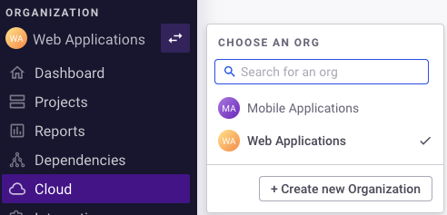
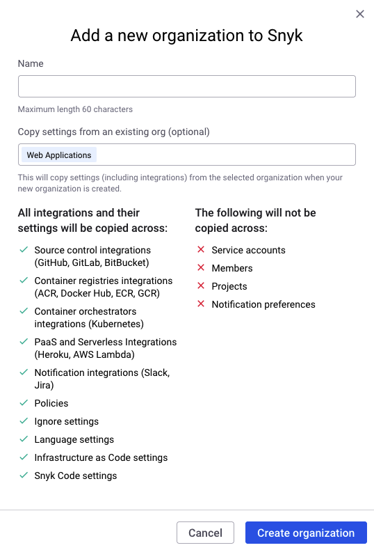
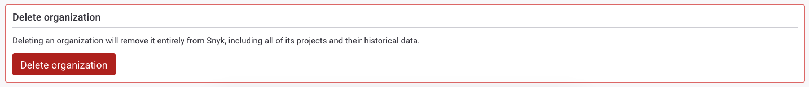
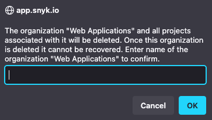

# Create and delete Organizations

You can use Organization-level options to [create](create-and-delete-organizations.md#create-an-organization) and [delete](create-and-delete-organizations.md#delete-an-organization) Organizations and [Set your preferred Organization](set-your-preferred-organization.md)

## Create an Organization

You can have an unlimited number of Organizations on Snyk. Your Organizations can be on different pricing plans.


When you are satisfied with the settings and integrations for an Organization, you can copy its settings and use them when you create additional Organizations.


Follow these steps to create an Organization:

1\. On the Snyk Web UI, open the Organizations dropdown list from the top menu and click **Create new Organization**:

<figure><figcaption>
Create an Organization
</figcaption></figure>

2\. Enter a name for the new Organization. Consider using a structured naming convention to identify your Organizations.


It is highly recommended to enter a unique name for the new Organization.


3\. From the dropdown list, select an Organization from which to copy all settings and integrations.

4\. Click **Create organization**.

<figure><figcaption>
Create an Organization
</figcaption></figure>

A new Organization is created and is added to your Organizations list.

By default, each Organization has a unique Snyk ID and internal name, which you can find on the **Settings** page of the Organization.

Review the settings and integrations for the new Organization and adjust them to meet your requirements before importing Projects to the new Organization.

## Delete an Organization

Organization Admins can delete Organizations when there are no Groups. If the Organization is in a Group, only a Group Admin can delete the Organization.

Follow these steps to delete an Organization:

1\. On the Snyk Web UI, open the Organization dropdown list on the top menu and select the Organization you want to delete.

2\. After the selected Organization appears, click **Org Settings** on the Group menu.

3\. On the **Settings** page, select **Genera**l on the menu.

4\. Scroll down to the **Delete organization** section and click **Delete organization**:

<figure><figcaption>
Delete Organization
</figcaption></figure>

5\. In the Confirmation dialog, enter the name of the Organization you want to delete to confirm its deletion. Then click **OK**:

<figure><figcaption>
Confirm delete Organization
</figcaption></figure>

The selected Organization is deleted from your Snyk account.
