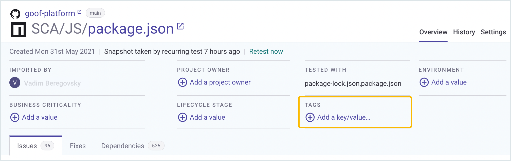
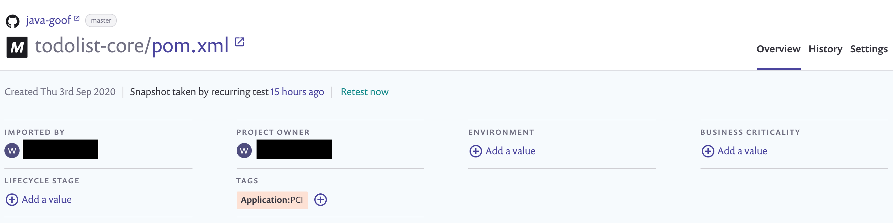
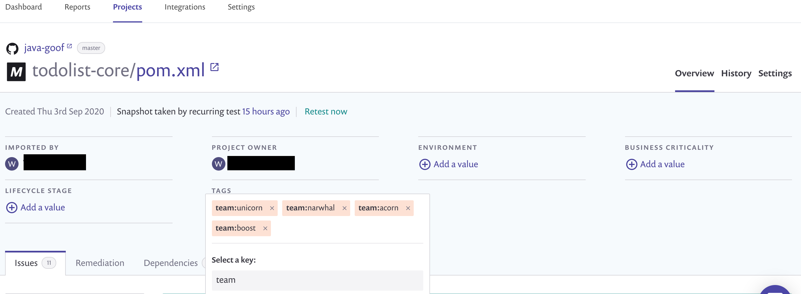
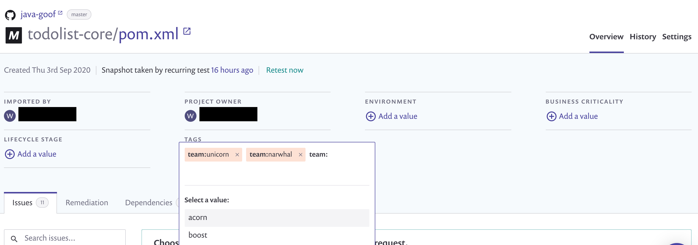

# Project tags


**Feature availability**\
Project tags are available for Snyk Enterprise plan customers. See the [plans and pricing page](https://snyk.io/plans/) for details.


## Project tags use and conditions

### Using tags in the Web UI


Group and Organization admins can perform the actions explained on this page. Collaborators can perform the actions if they are in an Organization which is part of the Group.


The Project tags feature allows you to add custom metadata to Snyk Projects. You can create and delete tags, apply tags to and remove tags from Projects, and filter Projects using tags.

You can perform most of these actions in the Snyk Web UI, as shown on this page.

You can perform some of these actions and additional actions in the Snyk API v1:

* [Add a tag to a Project](https://snyk.docs.apiary.io/#reference/projects/project-tags/add-a-tag-to-a-project)
* [Remove a tag from a Project ](https://snyk.docs.apiary.io/#reference/projects/remove-project-tag/remove-a-tag-from-a-project)
* [List all tags in a Group](https://snyk.docs.apiary.io/#reference/groups/list-members-in-a-group)
* [Delete a tag from a Group](https://snyk.docs.apiary.io/#reference/groups/delete-tag-from-group/delete-tag-from-group)

You can set values for a tag applied to a Project and clear the Project tags using the Snyk CLI option `--project-tags`. See the [CLI commands and options summary](../../snyk-cli/cli-commands-and-options-summary.md). for the commands that support this option.

### Tag conditions

The following conditions apply to Project tags:

* Keys are limited to 30 characters.
* Values are limited to 256 characters.
* Keys allow only alphanumerics and the following characters **`-`**, **`_`**
* Values allow these characters plus **`/`**, **`:`**, **`?`**, **`#`**, **`@`**, **`&`**, **`+`**, **`=`**, **`%`**, **`~`**
* You can create 1,000 unique key and value combinations per Snyk Group and apply ten unique tags per Project.
* Reusing a key and value combination does not add to the count.

## **How to create and delete tags**

To create a new tag for a Snyk Project:

1.  On the Project details page, under **TAGS,** click **Add a key/value...**

    ***

    <figure><figcaption>
Choose the option to create a Project tag
</figcaption></figure>
2. Add the new key and click **Enter**.
3. Add a new value and click **Enter**.

You have created a new tag. When a new tag is created, it is automatically applied to the Project it was created in. The tag can also be used for any other Project in the Group.

<figure><figcaption>
Project details page showing tag applied
</figcaption></figure>

You can apply multiple Project tag values to the same Project tag key.

<figure><figcaption>
Multiple Project tag values applied to the same key
</figcaption></figure>

After you create a tag, it can be applied to other Projects in the Snyk Group.

To delete a Project tag from the Group, you must use the Snyk API v1. There are two endpoints to help you delete Project tags:

* [List all tags in a Group](https://snyk.docs.apiary.io/#reference/groups/list-members-in-a-group)
* [Delete a tag from a Group](https://snyk.docs.apiary.io/#reference/groups/delete-tag-from-group/delete-tag-from-group)

The [Delete a tag from a Group](https://snyk.docs.apiary.io/#reference/groups/delete-tag-from-group/delete-tag-from-group) endpoint has the option in the Body to specify `"force": false` or `"force": true`_._ For `"force": true`, the tag will be removed from any Projects to which it is applied, and it will then be deleted. For `"force": false` the error is 403 “the tag has entities”. The error occurs if the tag is still applied to any Projects; otherwise, tag deletion should succeed.&#x20;

## **How to apply and remove tags**

If a tag exists in your Group, you can apply it to any Snyk Project.

1. On the Project details page, click the **+** icon under **TAGS**.
2. You can either select a key from the list of recently used keys or type out the key for the tag you want to apply to the Project.
3. You can either select a value from the list of recently used values or type out the key value you want to apply to the Project.
4. After you select the value, the tag is applied to your Project.
5. To remove a tag from a Project, click the **x** for the tag.

<figure><figcaption>
Select a key value for a tag
</figcaption></figure>

## How to filter the Projects listing by tags

When **Group by none** (ungrouped) is applied to the Projects listing page, you can filter the list by tags using the option in the menu.

There is a filter by tag autocomplete. This is intentionally limited to a small number of results. If your tag is not displayed, enter more characters for the tag until it rises to the top of the results.

<figure><figcaption>
Filter by tag option
</figcaption></figure>
