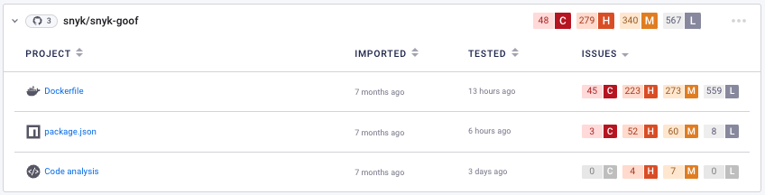
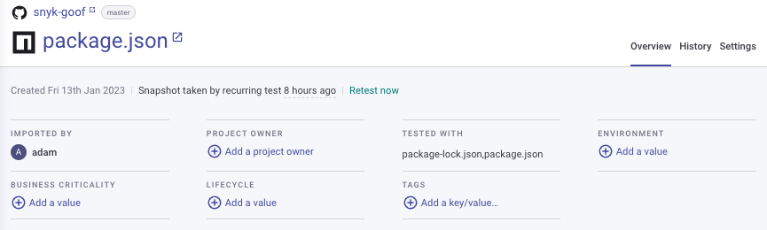

# View Project information

You can view Project information on your Projects pages. For example, to view your Open Source vulnerabilities and licensing issues, navigate to [your Projects listing](https://app.snyk.io/projects), and open a Target to see the list of Projects:

<figure><figcaption>
Projects listed in the Target <code>snyk-goof</code>
</figcaption></figure>

## Detailed information for a Project

Click on a Project entry to view detailed information for that Project:

<figure><figcaption>
Detailed information for the <strong><code>package.json</code></strong> Project
</figcaption></figure>

The following information is available:

* **Header**: shows Project[ summary information](view-project-information.md#project-summary-information).
* **Issue cards**: show summaries of issues found. See [Issue card information](issue-card-information.md).
* **Views** (links at top right):
  * **Overview**: shows [Project issues, fixes, and dependencies](view-project-issues-fixes-and-dependencies.md).
  * **History**: shows historical snapshots of recent tests. See [View Project history](view-project-history.md).
  * **Settings**: shows [Project settings](view-and-edit-project-settings.md).

## Project summary information

<figure><figcaption>
Header showing Project summary information for <code>package.json</code> Project
</figcaption></figure>

The summary information shows:

* File and history details:
  * The name (plus link) of the monitored repository
  * The monitored branch name
  * A direct link to the Project file in the SCM
  * The time when the Project was first imported to Snyk
  * The time when an up-to-date snapshot of the file was fetched from the SCM and tested
* Project import information:
  * **Imported by**: The user who imported the project.
  * **Project owner**: Click **Add a project owner** to add an owner for this Project from a list of everyone who has access to the Project, that is, everyone who is a member of the Organization. This information can also be viewed through the [List all Projects](https://apidocs.snyk.io/#get-/orgs/-org\_id-/projects) endpoint in the Snyk API.
* Predefined [Project attributes](project-attributes.md) and any additional [Project tag](project-tags.md) metadata.
