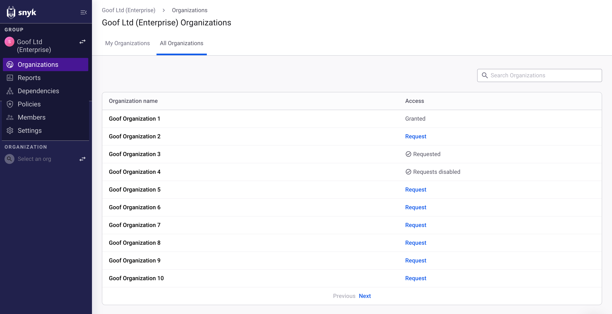
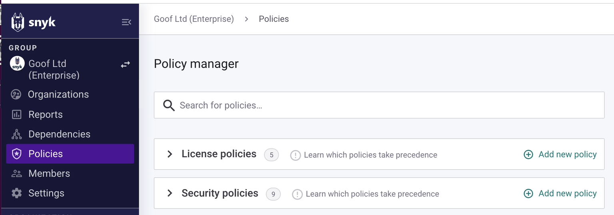

# Use Group-level options

You can use Group-level options to view [Organizations](use-group-level-options.md#group-organizations), [reports](use-group-level-options.md#group-reports), [dependencies](use-group-level-options.md#group-dependencies), and [policies](use-group-level-options.md#group-policies) across all of the Organizations in your Group, configure your [Group settings](use-group-level-options.md#group-settings), and view all the [members](use-group-level-options.md#group-members) in a Group.

<figure><figcaption>
Group-level options
</figcaption></figure>

## Group Organizations

Select **Organizations** to view all the Organizations you have access to and your assigned role inside each one:

<figure><figcaption>
The Organizations a user has access to under My Organizations
</figcaption></figure>

See [Determine Member Roles](../../implement-snyk/enterprise-implementation-guide/phase-1-discovery-and-planning/determine-member-roles.md) for more details about Organization roles.

If your Group is set up to let its members join Organizations, you also see a list of all the Organizations in the Group and options to join the Organizations where you are not currently a member.

<figure><figcaption>
All the Organizations of the Group and their access status
</figcaption></figure>

For more informaton on joining an Organization, see [Requests for access to an Organization](../manage-users-in-organizations-and-groups/requests-for-access-to-an-organization.md).&#x20;

## Group reports

Select **Reports** to view the vulnerability status of the Organizations in your Group in one place as a report:

<figure><figcaption>
Group report filtered to show open issues
</figcaption></figure>

See [Reporting](../../manage-issues/reporting/) for more details.

## Group dependencies

Select **Dependencies** to view the dependencies and license issues for your Groups:

<figure><figcaption>
View Group dependencies
</figcaption></figure>

See [Dependencies and licenses](../../manage-issues/dependencies-and-licenses/) for more details.

## Group policies

Select **Policies** to view the license and security policies for your Group:

<figure><figcaption>
View Group policies
</figcaption></figure>

See [Policies](../../scan-with-snyk/policies/) for details.

## Group members

Select **Members** to view members (users) in the Group.

Group members are users who have access to all Organizations in the Group. Members of the Organizations are managed in the Settings of each Organization.

See [Manage users in a Group](../manage-users-in-organizations-and-groups/manage-users-in-a-group.md) for details.

## Group settings

Select **Settings** to view and manage Group settings.&#x20;

See [Manage settings](../manage-settings/) for details.
