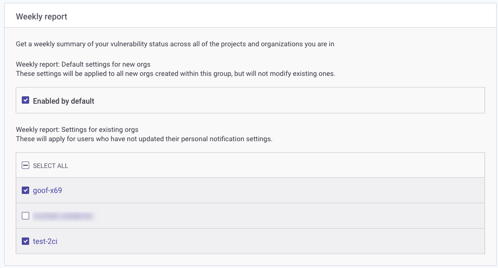
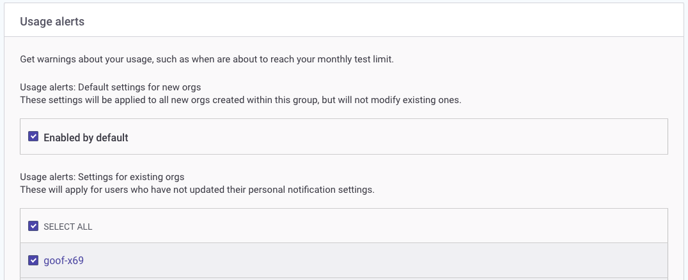
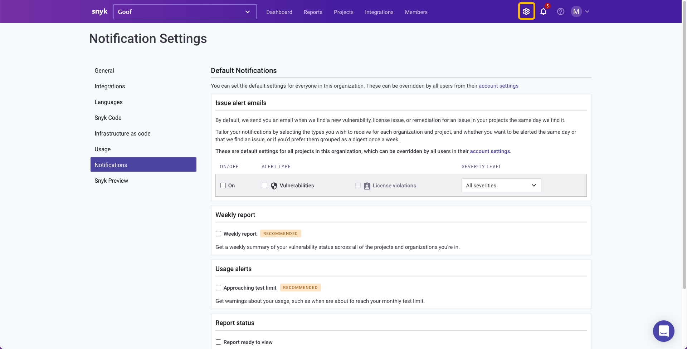

# Manage notifications

Snyk automatically notifies you when new issues are found in the Projects you are monitoring. These notifications can help make you aware of new risks in these Projects.

Notifications can be sent:

* By email, if you have not disabled these in [your notification settings](https://app.snyk.io/account/notifications).\
  **Note**: setting a Project to inactive will not stop Snyk from sending notifications, you must disable notifications separately for that Project.
* By Slack, if you have set up [Slack integration](https://docs.snyk.io/integrations/untitled-3/slack-integration).

Snyk also sends you a weekly update summarizing your security status across all of your Organizations.

Snyk offers notifications for:

* vulnerabilities
* license issues
* weekly summary report
* usage alerts
* report status


**FedRAMP environment notifications**\
Both [issue alert emails](manage-notifications.md#issue-alert-emails) and [weekly report emails](manage-notifications.md#weekly-report-emails) are disabled for FedRAMP environments. Their respective notification settings may be hidden from the page.


## **Managing notifications**

Snyk includes a range of controls to manage your own notifications.

Administrators can also manage the notification defaults for others in the [Group](manage-notifications.md#define-group-notification-defaults) or [Organization](manage-notifications.md#define-organization-notification-defaults).

You can also send notifications for an Organization to a designated [Slack channel](https://docs.snyk.io/integrations/notifications-ticketing-system-integrations/slack-integration).

<figure><figcaption>
Notification example
</figcaption></figure>

### Define Group notification defaults

Define the notification settings at the [Group](manage-groups-and-organizations/introduction-to-groups.md) level to define the template for how Snyk sends issue alert emails, weekly report emails, usage alert emails, and report status emails for Organizations created in that Group. You can also access the default settings for existing individual Organizations at the Group level.


When you change the Group default settings, it does not change the settings for existing Organizations or Projects. Individual users can override the default notification settings.


To navigate to the Group level notification settings:

1. Navigate to the Group overview for the group you want to change.
2. Select the Settings icon.
3. Select **Notifications**.

<figure><figcaption>
Set Group-level notifications
</figcaption></figure>

#### Issue alert emails

Issue alert emails are notifications Snyk sends the same day as it finds a new vulnerability, license issue, or remediation.

To set the defaults for issue alert emails:

1. Check the **Vulnerabilities** box when members of new organizations in this group should receive alert emails by default for new issues or remediations for all Projects in that Organization.
2. Check the **License Violations** box when members of new Organizations in this Group should receive alert emails for new license issues or remediations for all Projects in that Organization.
3. If either the **Vulnerabilities** or **License Violations** boxes are checked, indicate the severity of issues for which Snyk should send alert emails by selecting **All severities** or **Critical and high severity** from the drop down list.
4. To change the default for individual organizations, change the **Vulnerabilities**, **License Violations,** and **Severity** settings next to the Organization name. These settings apply for any individual user who has not updated their personal notifications when you create new Organizations in this group.

#### Weekly report emails

Weekly report emails are notifications Snyk sends to provide a summary of the vulnerability status across all Projects and Organizations to which a user belongs. For an Organization with zero vulnerabilities across its Projects, the notification lists the number of active Projects, number of known vulnerabilities, and total dependencies.

<figure><figcaption>
Weekly report emails
</figcaption></figure>

To set the defaults for weekly report emails:

* Check the **Enabled by default** box when members of new Organizations in this Group should receive a weekly summary email.
* To change the defaults for individual Organizations, clear or check the box next to the Organization name. The defaults will apply for new Organizations created in this Group.

#### Usage alerts

Usage alert emails are notifications Snyk sends to warn when you are approaching usage limits.

<figure><figcaption>
Usage alerts
</figcaption></figure>

To set the defaults for usage alerts:

* Check the Enabled by default box when members of new Organizations in this Group should receive usage alert emails.
* To change the defaults for individual Organizations, clear or check the box next to the Organization name. The defaults will apply for new Organizations created in this Group.

### Define Organization notification defaults

Define the notification settings for the Organization to determine how Snyk sends emails to all individuals in the Organization who have not updated their own personal notification preferences.


When you change the Organization default settings, it does not change the settings for existing Projects or individual users. Individual users can override the default notification settings.


To navigate to the Organization-level notification settings:

1. Navigate to the Organization you want to change.
2. Select the Settings icon.
3. Select **Notifications**.

<figure><figcaption>
Organization-level notifications
</figcaption></figure>

#### Issue alert emails

Issue alert emails are notifications Snyk sends the same day as it finds a new vulnerability, license issue, or remediation.

To set the defaults for issue alert emails:

* To turn off issue alert emails for new Projects loaded to this Organization, clear the **On** box. Check the box when new Projects in this Organization should receive the defined alerts.
* Check the **Vulnerabilities** box to set the default for all Projects in this Organization to generate alert emails for new issues or remediations.
* Check the **License violations** box to set the default for all Projects in this Organization to generate alert emails for new license issues or remediations.
* If either the **Vulnerabilities** or **License violations** boxes are checked, indicate the severity of issues for which Snyk should send alert emails by selecting All severities or Critical and high severity from the drop-downProjects list.

#### Weekly report emails

Weekly report emails are notifications Snyk sends to provide a summary of the vulnerability status across all Projects and Organizations to which a user belongs.

To set the defaults for weekly report emails:

* Check the **Weekly report** box when members of this Organization should receive a weekly summary email by default.

#### Usage alerts

Usage alert emails are notifications Snyk sends to warn when you are approaching usage limits.

To set the defaults for usage alerts:

* Check the **Approaching test limit** box when members of this Organization should receive usage alert emails by default.

### Change personal notification preferences

Organizations to which you belong have default settings for how Snyk sends emails.

To override these settings, change your notification preferences:

1. Select the dropdown next to your name.
2. Select **Notification preferences**.

The Account Settings page allows you to change the types of notifications for each Organization to which you belong. You can also customize the notifications for individual Projects.

#### Issue alert emails

Issue alert emails are notifications Snyk sends the same day as is finds a new vulnerability license issue, or remediation.

To customize your settings for issue alert emails for each Organization for which you are a member:

* Check the **Vulnerabilities** box to receive alert emails for new issues or remediations for all Projects in that Organization.
* Check the **Licenses** box (if applicable) to receive alert emails for new license issues for all Projects in that Organization.
* If either the **Vulnerabilities** or **Licenses** boxes are checked, indicate the severity of issues for which Snyk should send alert emails by selecting **All severities** or **Critical and high severity** from the drop down list.

To customize your settings for individual Projects:

1. Expand the Organization to see a list of Projects in that Organization.
2. Next to each Project name, clear or check the **Vulnerabilities** or **Licenses** boxes and set the severity for that Project.

#### Weekly report emails

Weekly report emails are notifications Snyk sends to provide a summary of the vulnerability status for the Projects in the Organizations to which you belong.

To include organizations in your weekly report emails, check the box next to that Organization.

#### Usage alerts

Usage alert emails are notifications Snyk sends to warn you when you are approaching usage limits.

To receive usage alerts for an Organization, check the box next to that Organization.
