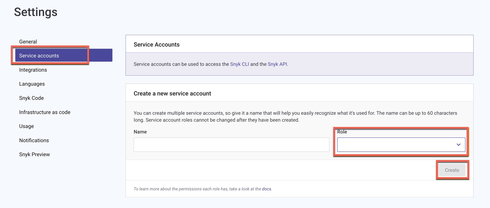

# Manage User Roles


**Feature availability**\
This feature is available for Enterprise customers. See [Plans and pricing](https://snyk.io/plans/) for details.


Snyks Member Roles functionality enables you to manage default and custom roles, allowing you to create and enforce set permissions to roles that reflect the users and functions in your Organization. Permissions for default Snyk roles, such as Group Admin, cannot be changed.

You can [manage roles](manage-member-roles.md#manage-roles), [assign roles](manage-member-roles.md#assign-roles) to users or service accounts, and [use roles with SSO](manage-member-roles.md#use-roles-in-custom-sso).

## Manage roles

You can [create](manage-member-roles.md#create-a-role), [edit](manage-member-roles.md#edit-a-role), [duplicate](manage-member-roles.md#duplicate-a-role), and [delete](manage-member-roles.md#delete-a-role) custom roles, granting your users exactly the permissions they need to do their jobs across the Snyk platform. Thus you can ensure the right people have the right access to the right resources at the right time, thus maximizing transparency, and reducing risk.

### Create a Role

**Group Admins** can select their Group and find this option in **Settings > Member Roles**.

You will find the default roles, **Org Admin** and **Org Collaborator**. When you click each of these roles, you can view the associated permissions, but you cannot modify the default roles.

Click the **Create new Role** button and enter the **New role name** and **Description**. Role names should be unique and can contain alphanumeric characters plus spaces.

<figure><figcaption>
Create a new role
</figcaption></figure>

Click the **Create role** button. Basic details about the role appear in the top section of the Role details screen.

<figure><figcaption>
Basic information about the new role
</figcaption></figure>

The bottom section lists all the permissions available at the Organization level that you can use to define the role. For more information about these permissions, see [Default user roles](default-user-roles.md).

<figure><figcaption>
Organization level permissions
</figcaption></figure>

<figure><figcaption>
More Organization level permissions
</figcaption></figure>


If you specify Move project permissions for the role, you must include Add project permissions for the Organization to which the Project is being moved.


Choose the required permissions and click **Update Role Permissions**.

<figure><figcaption>
More Organization level permissions and Update Role Permissions
</figcaption></figure>

When the process of creating a role completes, a confirmation message appears.

<figure><figcaption>
Role creation confirmation message
</figcaption></figure>

### Edit a Role

**Group Admins** can select a role, except for the default roles that are marked as locked, from the list on the Member Roles page and update the name, description, and permissions at any time. You can view how the default roles are set up and duplicate those roles, but you cannot edit them.

<figure><figcaption>
Update Role Details
</figcaption></figure>

Select the permissions from the list at the bottom and click **Update Role Permissions**.

<figure><figcaption>
List of permissions and Update Role Permissions
</figcaption></figure>

When the process of updating a role completes, a confirmation message appears.

<figure><figcaption>
Role update confirmation message
</figcaption></figure>

### Duplicate a Role

Group Admins can create a copy of an existing role by using the Duplicate role functionality. The system copies only the permissions associated with the role that you are duplicating and role memberships are not copied over.

To copy a role, use the **Duplicate** button next to each role in the Member Roles list, or select a role from the Member Roles list page, and when the Role details page opens, click the **Duplicate Role** button.

<figure><figcaption>
Member Roles List with Duplicate button for each role
</figcaption></figure>

<figure><figcaption>
Role details page with Duplicate button
</figcaption></figure>

Enter a unique name and description and click the **Duplicate Role** button. A Group Admin can then edit this role to assign new permissions to it or rescind any permissions already assigned.

<figure><figcaption>
Enter new role details
</figcaption></figure>

### Delete a Role

Group Admins can delete a role if it is no longer needed by opening the role from the Member Roles List by clicking the **Delete** button, and confirming the delete action.

<figure><figcaption>
Delate role
</figcaption></figure>

If the role is assigned to one or more users including service accounts, you must select another role for those users in order to delete the current role. This restriction prevents the Group Admin from accidentally deleting a role and leaving members with no access to Snyk.

When the current role is deleted, all its existing members including service accounts are reassigned to the new role selected.

<figure><figcaption>
Prompt to delete a role and reassign members
</figcaption></figure>

## Assign roles

### Assign roles to users

Users who have the permissions required to manage members can assign roles to members across all Organizations in the Group.

Using the [Update a member's role in the organization API call](https://snyk.docs.apiary.io/#reference/organizations/organization-settings/update-a-member's-role-in-the-organization) you can update the role of the members in their Organizations.

In the Web UI, select an Organization and then select the **Members** option.

For any member Name except a Group Admin, you can select the dropdown next to the current role and choose any role to assign that role to the member.

<figure><figcaption>
Select member role
</figcaption></figure>

\
You can invite new members to the Organization with an assigned role.

Click the **Add members** button > **I**nvite new members and select the role to assign from the **New Members join as** dropdown.

<figure><figcaption>
Invite new members with an assigned role
</figcaption></figure>

Click the **Add members** button > **Add existing members** to promote current Group Members to an Organization-specific role.


Snyk prevents users from assigning roles to others that have more privileges than those the user who is assigning roles already has. If you try to update the role of a member, invite a new member, or add an existing member with a role that has more privileges than you have, you will see the error **Cannot assign higher privilege role**.


<figure><figcaption>
User cannot assign a more privileged role to another user
</figcaption></figure>

### Assign roles to service accounts

Users who have permission to create an Organization-level or Group-level service account can set up new service accounts for their Organization and assign a role. For details about permission to create service accounts, see the [service account information on the Manage permissions page](broken-reference).

Select an Organization and navigate to **Settings** > **Service Accounts**. Provide a name, choose a role from the dropdown, and click **Create**.

<figure><figcaption>
Select a Role while creating Org Service Account
</figcaption></figure>

When you open a role that is assigned to a service account, the system displays a warning message. Consider the possible impact when you update the permissions associated with or delete a role that would lead to reassigning the service accounts and users to a new role.

<figure><figcaption>
Warning that you are about to change a role assigned to a service account
</figcaption></figure>


Snyk prevents users from creating Organization service accounts with a role that has more privileges than those the user creating the service account has. If you try to create a service account with a role that has more privileges than you have, you will see the error **Cannot create a service account with a higher privilege role than yours**.


<figure><figcaption>
User cannot assign a more privileged role to a service account
</figcaption></figure>

## Use roles in custom SSO

Member roles are supported as part of a customized SSO authentication flow. All new and existing customers who have customized SSO can use new roles they create in their IDP SAML assertions to provision users in their Organizations with those roles.


If you are a customer who already has Custom SSO set up, or you are planning to create Member Roles after setting up Custom SSO, you can use Member Roles _with no modification_ to the Custom SSO configuration on the Snyk side, as long as you send the normalized role name in your payload in the agreed format.


New member role SAML assertions follow the existing Snyk pattern for declaring Organization memberships in IDP payloads: `{snyk-prefix}-{org-slug}-{normalized-role-name},` for example: `snyk-goof-developer_readonly` where:

* snyk-prefix = `snyk`
* org-name = `goof`
* role-name = `developer_readonly`

<figure><figcaption>
Normalized name for a member role displayed in the Web UI
</figcaption></figure>

## Sample roles

### Org Collaborator who cannot ignore issues

Create a new role similar to Org Collaborator but blocks the ability to ignore issues.

Permissions:

* `Add Project`
* `Create Jira issues`
* `Create Pull Requests`
* `Edit Project`
* `Edit Project Tags`
* `Project Status`
* `Remove Project`
* `Remove Targets`
* `Test Packages`
* `Test Project`
* `User Leave`
* `View Audit Logs`
* `View Entitlements`
* `View Integrations`
* `View Jira issues`
* `View Organization`
* `View Organization Reports`
* `View Preview Features`
* `View Project`
* `View Project History`
* `View Project Ignores`
* `View Project Collections`
* `View Targets`
* `View Users`

### Dashboard and report reviewer

Create a new role with permissions only to review dashboards and reporting for their management and executive teams.

Permissions:

* `View Organization`
* `View Organization Reports`
* `View Project`
* `View Project History`

For additional operations on the Dashboard, add:

* `Add Project`
* `Create Pull Requests`

### Read-only CLI Tester

Create a new role that blocks use of `snyk monitor`.

Permissions:

* `View Organization`
* `View Project`
* `Test Packages`
* `Test Project`
* `View Preview Features`

### **Full Access CLI Tester**

Create a new role that can use `snyk test` and `snyk monitor`.

Permissions:

* `View Organization`
* `View Project`
* `View Project History`
* `Test Packages`
* `Add Project`
* `Test Project`
* `View Preview Features`

## Permissions (role) required to edit Project attributes from the Snyk CLI

The Organization Collaborator role lacks permission to edit Project attributes, including using the CLI [`snyk monitor`](../../snyk-cli/commands/monitor.md) command with arguments such as `--project-environment`. Attempting to use these arguments without the proper permission causes the `snyk monitor` command to fail.

Users or service accounts requiring the ability to edit Project attributes must be an Organization Admin or have a custom role with the `org.project.attributes.edit` permission assigned. A user who does not have this permission must remove any arguments that edit the Project attributes to use the `snyk monitor` command.

## Things to remember in working with Member Roles

* Permissions granted to users by means of Roles enable the same capabilities across all Snyk environments: Web UI, API, CLI, and IDE.
* The permission `View Organization` is needed by default for all Organization-level member roles.
* If the role is expected to view Project-related data for an Organization along with other operations, the `View Organization`, `View Project`, and `View Project History` permissions should be added to the role at a minimum.
* For `Integration Edit` abilities, the `Organization Edit` permission is also required.&#x20;
* The permission `View Preview Features` is required to run `snyk container test` and `snyk iac test`.
* Snyk prevents role privileges from escalating. Thus, users cannot assign a higher privileged role to others and cannot create service accounts with a higher privileged role.
* It is advisable to use the Duplicate Role functionality and create a copy of a standard role and then amend the permissions rather than build a role from scratch if you are unsure about the permissions.
