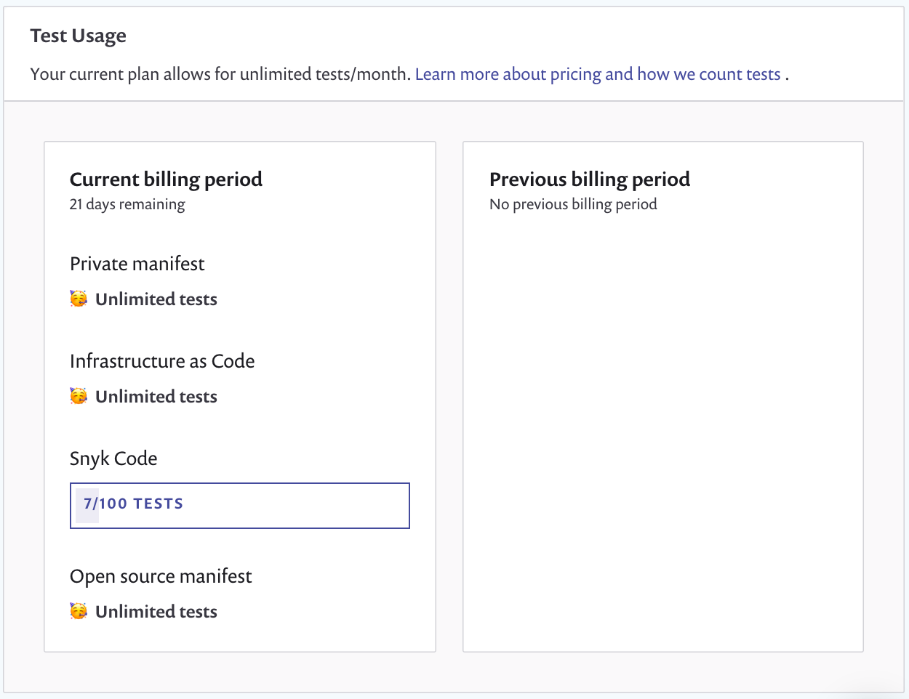
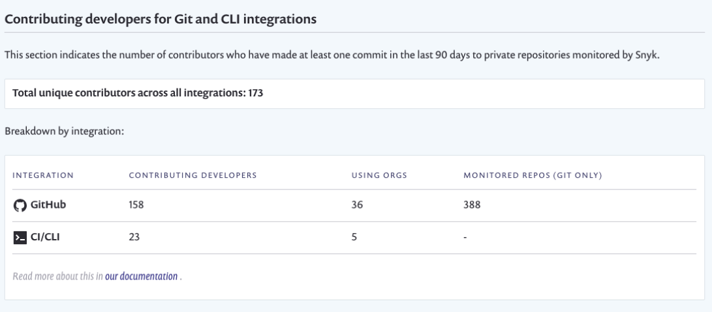

# Usage settings

In your Group or Organization, select **Settings** > **Usage** to view Snyk usage details for your Group or Organization:

* [Test usage](usage-settings.md#test-usage): the number of tests used
* [Contributing developers](usage-settings.md#contributing-developers): the number of developers contributing to Projects


For more information about test frequency settings, see [Project actions](../introduction-to-snyk-projects/#project-actions-on-the-project-listing-page) on the Project Listings page, where bulk actions are also explained.


## Test usage

The **Test Usage** section shows how many tests you are using over the current billing period:

<figure><figcaption>
Test usage data
</figcaption></figure>


Test limits vary for Snyk products and plans. See the [Pans and pricing page](https://snyk.io/plans/) for details.



See [What counts as a test?](../../scan-using-snyk/working-with-snyk-in-your-environment/what-counts-as-a-test.md) for details of how Snyk counts tests.


## Contributing developers


Snyk has developer counts are for the GitHub, GitHub Enterprise, and GitLab integrations and for the Snyk CLI.


Snyk defines contributing developers as developers having made a commit to a private repo monitored by Snyk in the last 90 days.

The **Contributing developers for Git and CLI integrations** section shows contributing developer counts, both at the Organization level and the Group level.

The counts indicate the number of contributing developers to the default branch of the private repos connected with the integration.

Snyk does not count contributions to public (open-source) repos because the pricing model is based on the number of contributing developers to private repositories.

An example of the count of contributing developers follows:

<figure><figcaption>
Contributing developers count
</figcaption></figure>

* **Total unique contributors across all integrations:** the number of contributors across all the integrations in your Snyk account. Contributing developers are only counted once, even if they have contributed to multiple integrations or multiple repositories.
* **Breakdown by integration**: the number of contributors, Organizations, and repos in that integration.

Each contributor is **counted by** the **author** email field, which is set within the local Git configuration in the developer’s machine.

###
