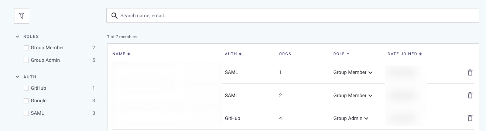

# Manage users in your Group


**Feature availability**\
Groups are available with Enterprise plans. See [pricing plans](https://snyk.io/plans/) for more details.


Select the Group and **Members** top-level menu option to manage your group members:

<figure><figcaption>
Manage Group members
</figcaption></figure>

As a Group Admin (see [Managing permissions](managing-permissions.md)), you can:

* [View group and org members](manage-users-in-your-group.md#view-group-and-org-members)
* [View individual members](manage-users-in-your-group.md#view-individual-members)
* [Filter and sort views](manage-users-in-your-group.md#filter-and-sort-views)
* [Delete members](manage-users-in-your-group.md#delete-members)
* [Promote group member to a group admin](manage-users-in-your-group.md#promote-group-member-to-a-group-admin)


You cannot add external users directly to Groups; you must first add them to an Organization, then to a Group. See [Manage users in your Organizations](manage-users-in-your-organizations.md) for details.


### View group and org members

In the Group members page, you can find all the members associated with your Group, their respective roles and authentication type, and the number of Organizations they are members of.

There are two standard roles available under group level - **Group Member** and **Group Admin**. Group Admins have all permissions at Snyk; see [Managing permissions](managing-permissions.md). However, being a Group Member does not directly grant the user any rights. They need to be added as org members or promoted as Group Admins.

<figure><figcaption>
View Group members
</figcaption></figure>

### View individual members

Click on each member to view more details about their memberships.

If the user is a **Group Member**, you can see their role for each of the orgs they are a member of. You can filter by role since a Group Member can have different roles for different orgs. You can also remove the user from the group or orgs by invoking the respective delete buttons.

<figure><figcaption>
View member roles
</figcaption></figure>

For a **Group Admin**, they are by default added as Org Admin across all Organizations in your Group. You cannot change a group admin's role for a specific org, or delete them from one or more orgs. However, you can remove a group admin from the group using the **Remove from group** option.

### Filter and sort views

#### Filter views

Click the filter icon () to expand the filter sidebar, to filter members displayed, by role or authentication method:

<figure><figcaption>
Filter views
</figcaption></figure>

#### Sort views

You can sort by Name, Authentication method, Role, and Date joined.

You can sort user views by clicking on the column heading:

<figure><figcaption>
Sort views
</figcaption></figure>

### Delete members

To delete a member from the group:

1. Click the  icon next to the user.
2. Click **Delete member from** _**your group's name**_ when prompted.

### Promote Group Member to a Group Admin

You can promote a Group Member to a Group Admin by selecting the role dropdown next to them and choosing the Group Admin role.

<figure><figcaption>
Promote to Group Admin
</figcaption></figure>


If the user is not already a part of your group, you must first add that user as a member of at least one Organization; see [Add Members](manage-users-in-your-organizations.md#add-members). The user then appears here with the role as Group Member, so you can then promote the user to Group Admin.

