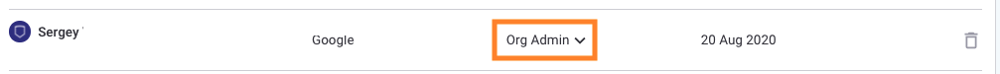

# Manage users in Organizations

In the **Organization** where you want to manage users, select the **Members** menu option. You can do the following:

* [Add members](manage-users-in-organizations.md#add-members)
* [Revoke pending invites](manage-users-in-organizations.md#revoke-pending-invites)
* [Change member roles](manage-users-in-organizations.md#change-member-roles)
* [Delete members](manage-users-in-organizations.md#delete-members)
* [Filter and sort views](manage-users-in-organizations.md#filter-and-sort-views-of-organization-members)


You must have the permissions required to perform these tasks. For details, see [Default user roles](../user-roles-and-permissions/pre-defined-roles.md).


## Add members

To add new users to your Organization, click **Add members**:

<figure><figcaption>
Add members to your Organization
</figcaption></figure>

You can do the following on the **Add members** screen:

* Select **Invite new members** to send an email invitation to a new user. Enter the email addresses of users to invite, separated by commas, and click **Send invite**.
* Select **Add existing members** to add existing members of your Group to the Organization. Select the members when prompted and click **Invite members.**
* For Free plan users only:\
  Select **Invite by link** to send a link; click **Copy link** and send the link yourself.
* Use the **New members join as** dropdown to define the default role of a member when joining, such as **Org admin**. For details, see [Manage permissions](broken-reference).

To see a demonstration of adding members, play this video:


Inviting members to an Organization


## Revoke pending invites

Follow these steps to cancel pending invites:

1.  On the **Members** page, click the **Revoke pending invites link**, which appears when there is at least one pending invite.\
    \

    <figure><figcaption>
Revoke pending invites
</figcaption></figure>
2. In the **Pending invites in \_your organization's name**\_ modal that appears, click the trash icon next to the name of the user to cancel the invite.

## Change member roles

To change the role of a member, click on the **Role** entry for the member and use the dropdown to select the new role:

<figure><figcaption>
Selec new role
</figcaption></figure>


For Enterprise plan customers who create custom member roles, Snyk prevents users from assigning roles to other users who have more privileges. If you try to update the role of a member, invite a new member, or add an existing member with a role that has more privileges than you have, you will see the error **Cannot assign higher privilege role**.


<figure><figcaption>
<strong>Cannot assign higher privilege role error message</strong>
</figcaption></figure>

## Delete Organization members

Follow these steps to delete a member from the Organization:

1. Click the trash icon next to the user.
2. Click **Delete member from** _**your organization’s name**_ when prompted.

## Filter and sort views of Organization members

### Filter views

Click the filter icon to expand the filter sidebar and then choose to filter the members displayed by role or authentication method:

<figure><figcaption>
Filter members by role or by authentication method
</figcaption></figure>

### Sort views

Click on the column heading to sort user views:

<figure><figcaption>
Sort user views
</figcaption></figure>

You can sort by name, authentication method, role, and date joined.
