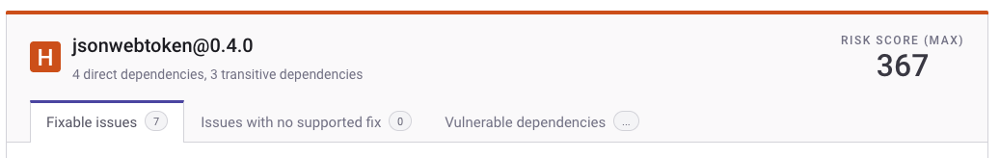
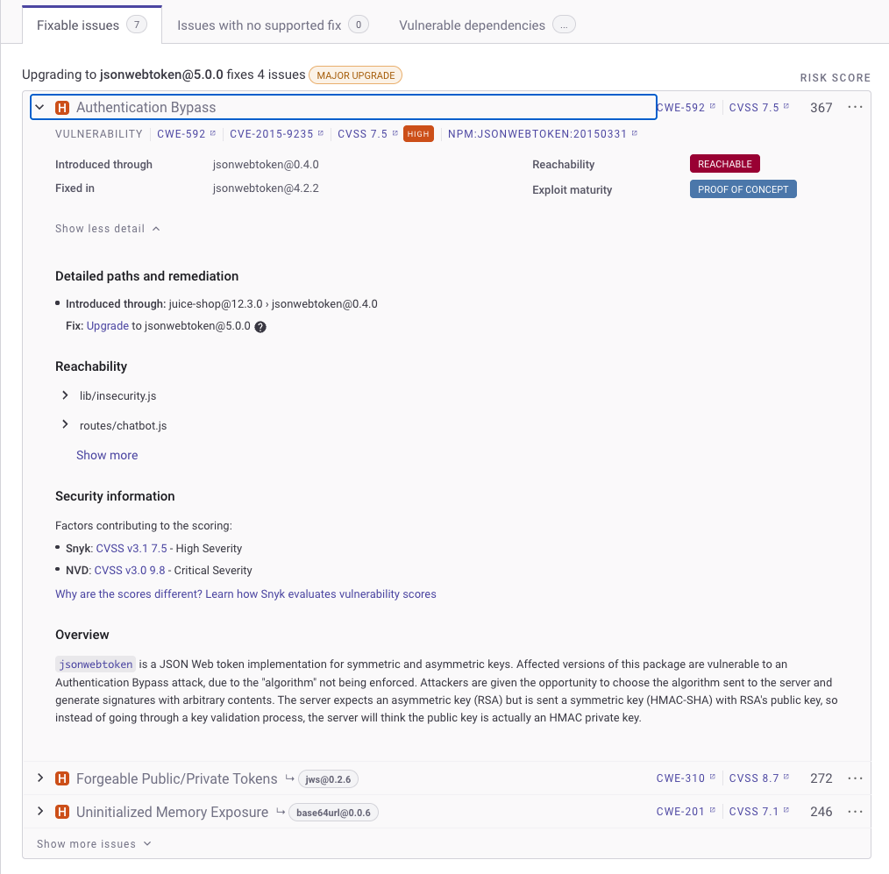

# Issue card information

Issue cards appear on the details page for a Project. You can use available options to do the following:

* [View dependency card information](issue-card-information.md#view-dependency-card-information).
* [Expand an issue card to show more details](issue-card-information.md#expanded-vulnerability-section).
* [Filter and sort issue cards](issue-card-information.md#filter-and-sort-issue-cards).
* [Perform additional card actions](issue-card-information.md#perform-additional-card-actions).

## View dependency card information

Dependency cards show details for a specific dependency, its associated vulnerabilities or license issues, and actions you can take.

<figure><figcaption>
Issue card for the npmconf vulnerability
</figcaption></figure>

The dependency card provides a [Header section](issue-card-information.md#header-section) and [Body section](issue-card-information.md#expanded-vulnerability-section) with information as explained in the next sections of this documentation.

### Header section

<figure><figcaption>
jsonwebtoken issue card header
</figcaption></figure>

* [Severity level](../../manage-risk/prioritize-issues-for-fixing/severity-levels.md): for example, **High**. For dependencies with multiple severity levels, the severity shown in the header is the maximum of all listed issues under that dependency.
* Dependency name: for example, **jsonwebtoken** or **libxmljs2**.
* **Score**: [Risk Score](../../manage-risk/prioritize-issues-for-fixing/risk-score.md) or [Priority score](../../manage-risk/prioritize-issues-for-fixing/priority-score.md): 0 to 1,000. For dependencies with multiple scores, the score shown in the header is the maximum of all listed issues under that dependency. This will show as Priority score unless you are opted-in to the Early Access for Risk score.
* Tabs separating out the fixable issues, issues with no supported fix, and vulnerable dependencies.

### Expanded vulnerability section

<figure><figcaption>
jsonwebtoken issue card body details
</figcaption></figure>

* **Issue Name**: the vulnerability name, in this case "Authentication bypass".
* Type: **VULNERABILITY** or LICENSE ISSUE
* Links to [CWE](https://cwe.mitre.org/index.html) (Common Weakness Enumeration), [CVSS](https://www.first.org/cvss/calculator/3.1) (Common Vulnerability Scoring System), and [Snyk Vulnerability Database](https://snyk.io/vuln) information for the issue. You can use these links to view more information about the CWE, CVE, and CVSS scores or navigate to the Snyk Vulnerability Database information for a specific vulnerability from its issue card.
* [**Exploit maturity**](../../manage-risk/prioritize-issues-for-fixing/view-exploits.md): for example, **Mature** or **Proof Of Concept**, which indicates how well known the implementation of this exploit is.
* The exploit's **reachability**, for example, **Reachable**. This indicates whether a path from your first party code to the vulnerable code element exists, For information and an example, see [Reachable vulnerabilities](../../manage-risk/prioritize-issues-for-fixing/reachability-analysis.md).
* **Fixed in:** The file the vulnerability is fixed in
* **Social Trends**: Snyk occasionally shows a [Trending](../../manage-risk/prioritize-issues-for-fixing/vulnerabilities-with-social-trends.md) banner for issues that are being actively discussed on X (formerly known as Twitter).

## Filter and sort issue cards

You can apply multiple filters to a Project to show a set of issues based on specific criteria:

* Vulnerability or license issue
* Issues with a specific severity
* Issues within a range of the priority score
* Issues that have an exploit and how mature the exploit is
* Issues that are open or have been patched or ignored

You can sort the issue cards in a Project based on their priority score or severity.

## Perform additional card actions

You can perform the following actions on the issue card by clicking the tri-dot menu associated with each vulnerability:

* [Ignore the issue](../../manage-risk/prioritize-issues-for-fixing/ignore-issues/): if you do not need to take action on an issue, or it does not need to appear on your reports, you can ignore it.
* [Create a Jira ticket](../../integrate-with-snyk/jira-and-slack-integrations/jira-integration.md): if you have the Jira integration, you can link your issue boards to Snyk and create Jira tickets directly from the Project details page to fix vulnerabilities.

You can also open a PR if a fix is available by clicking the "**Upgrade to X.X.X"** button at the bottom of the card.

* [Fix the vulnerability](../../scan-with-snyk/snyk-open-source/manage-vulnerabilities/fix-your-vulnerabilities.md): if a fix is available, you can fix individual vulnerabilities.
