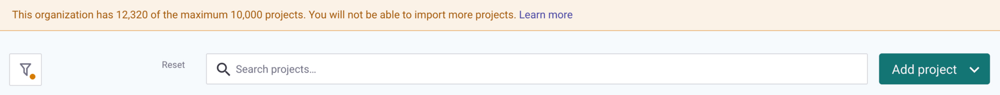

# Maximum number of Projects in an Organization

The number of Projects you can have in a single Snyk Organization depends on your Snyk [pricing plan](https://snyk.io/plans/).

| Plan       | Number of Projects |
| ---------- | ------------------ |
| Free       | 10,000             |
| Team       | 25,000             |
| Enterprise | 25,000             |

When you reach the limit for your pricing plan, Snyk stops importing Projects into the Organization.

## **Notification of reaching the limit**

You will know you have reached the limit when you see the following warnings.

In the Snyk Web UI, this warning banner appears:

<figure><figcaption><p>Banner at top of Projects listing showing how many Projects you have over the limit</p></figcaption></figure>

In the Snyk CLI, the `snyk monitor` command returns the following error:

`Maximum number of projects reached for this organization. You cannot import more projects.`

In the Snyk API, an import request returns this error:

```
"data":{
        "code":400,
        "message":"This organization has 25000 of the maximum 25000 projects.
        You will not be able to import more projects: https://docs.snyk.io/getting-started/introduction-to-snyk-projects/maximum-number-of-projects-in-an-organsation",
        "errorRef":"5bc3fb50-cbcd-4c15-81f6-b183fc95d10f"
    },
```

## What to do when you are near the maximum number of Projects

This limit is in place to protect your experience with Snyk. There are no restrictions on the number of Organizations you can create.

If you are getting close to these limits, you can create more Organizations and split your Projects across them.
