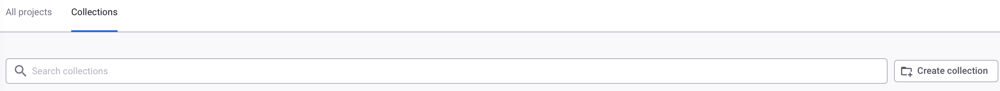
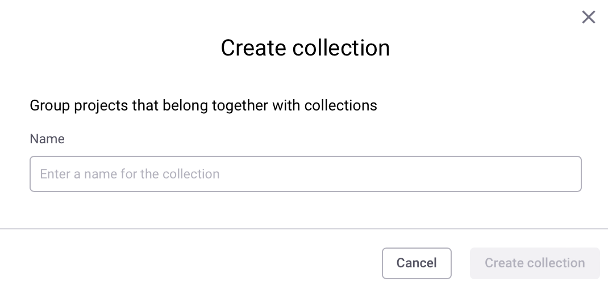

# Project collections

On this page you will find information about how to create and use Project collections:

* [Select all filtered Projects that are visible to create a Project collection](project-collections.md#select-all-filtered-projects-that-are-visible-to-create-a-project-collection)
* [Add Projects to an existing Project collection using filters](project-collections.md#add-projects-to-an-existing-project-collection-using-filters)
* [Add individually selected Projects to an existing Project collection](project-collections.md#add-individually-selected-projects-to-an-existing-project-collection)
* [Manage a Project collection](project-collections.md#manage-a-project-collection)
* [Perform actions on Projects within a collection](project-collections.md#perform-actions-on-projects-within-a-collection)
* [View your Project collections on the collection listing page](project-collections.md#view-your-project-collections-on-the-collection-listing-page)


If you move a Project between Organizations, the Project will also be removed from any Project collections it is part of.


## Select all filtered Projects that are visible to create a Project collection

1.  On your Projects page, select the **Collections** tab, and click the  **Create collection** button at the end of the search field. You can also create a collection through an empty Collection listing page.

    <figure><figcaption>
Enter the Collections listing page
</figcaption></figure>
2.  Enter a name for your collection in the **Name** field, then click **Create collection**.\
    Only alphanumerics and the characters -\_/:. are permitted in collection names.

    <figure><figcaption>
Name your collection
</figcaption></figure>
3. You have successfully created a collection that you can populate.

## Add Projects to an existing Project collection using filters

1. On the right side of the Project listing page, beneath the View Import Log button, select **Group by none** from the drop-down list.
2. Using the **Filters** drop-down, apply the filters corresponding to the Projects you would like to add to a newly created Collection.&#x20;
3.  Select all of your filtered Projects that are visible on the page using the **Select All** button beneath the Projects count, and then click **Add selected projects to a Collection**

    <figure><figcaption>
Select all filtered Projects that are visible
</figcaption></figure>
4.  Enter the name of the collection you would like to add your selected Projects to and click **Add to collection**.

    <figure><figcaption>
Enter a name for your collection
</figcaption></figure>
5.  Your Projects are now in the collection that you created previously.&#x20;

    <figure><figcaption>
View your Projects in the previously created collection
</figcaption></figure>

## Add individually selected Projects to an existing Project collection

1. In the Projects page, select the Projects that you want to add to a collection, and then select **Add selected projects to a collection**. &#x20;
2. Enter the name of the collection you would like to add your selected Projects to and click **Add to collection.**&#x20;
3. View your selected Projects in your collection.&#x20;

## Manage a Project collection&#x20;

1. On your Projects page, select the **Collections** ta&#x62;**.**
2. For the collection you want to manage, select the three dots next to the collection.
3.  Choose the option to rename or delete the collection.&#x20;

    <figure><figcaption>
Click the three dots next to the collection you want to configure and either rename or delete the collection
</figcaption></figure>

## Perform actions on Projects within a collection&#x20;

1. In your collection, use the checkboxes to select individual Projects or the **select all** checkbox to select all visible Projects in a collection.&#x20;
2. You can perform the following actions:
   1. Activate selected Projects.
   2. Deactivate selected Projects.
   3. Add the selected Projects to a collection. In this case, the action will add the selected Projects to another collection that you have created.
   4. Remove selected Projects from a collection.&#x20;
   5. Delete selected Projects.

This example shows what happens when you click **Remove selected projects from a collection**.

3. You have successfully removed the selected Projects from your collection. &#x20;

## View your Project collections on the collection listing page

If you have created a collection or multiple collections, you can view them on the collection listing page.&#x20;

1. On your Projects page, select the **Collections** ta&#x62;**.**
2. You can view all of your collections on the Collections listing page and sort by name, number of Projects, and issue count.&#x20;
