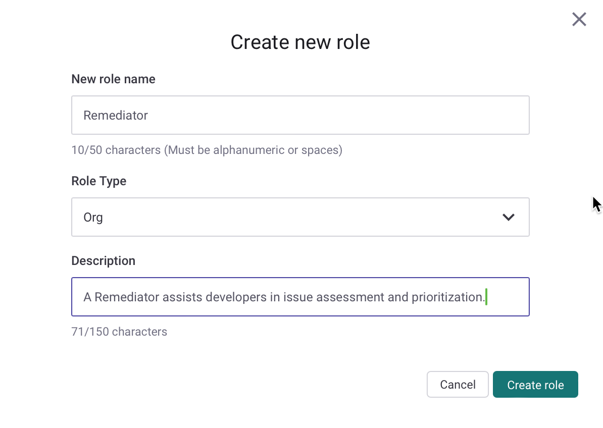
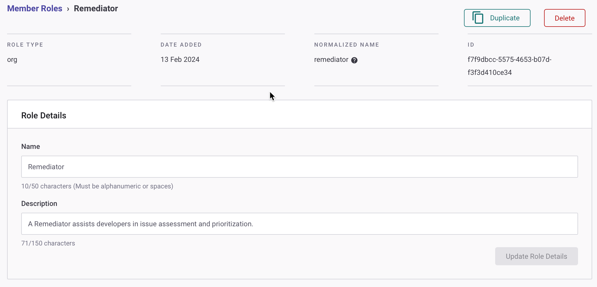
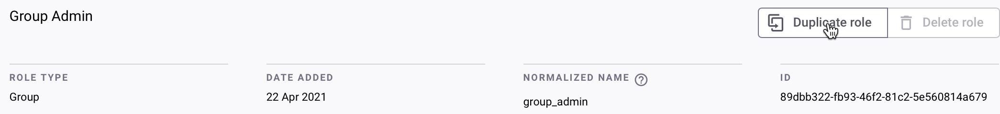
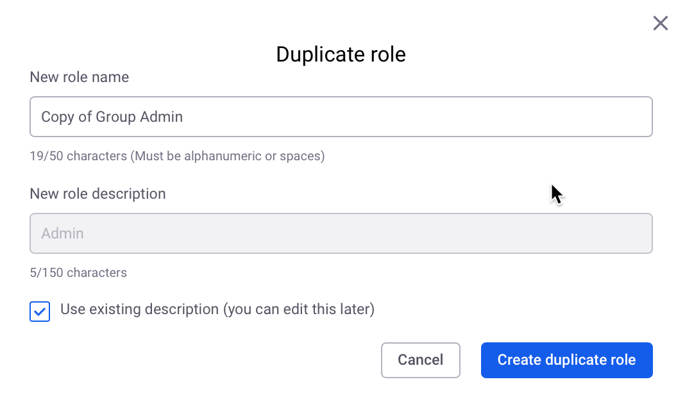

# User role management


**Feature availability**&#x20;

Managing user roles is available only for Enterprise plans.

For more information, see [Plans and pricing](https://snyk.io/plans).


Snyk **Manage roles** functionality enables you to manage pre-defined and custom roles, allowing you to create and enforce set permissions for roles that reflect the users and functions in your Organization.

Under **Manage roles**, you can:

1. [Create a custom role](user-role-management.md#create-a-custom-role)
2. [Edit a custom role](user-role-management.md#edit-a-custom-role)
3. [Duplicate a pre-defined or custom role](user-role-management.md#duplicate-a-pre-defined-or-custom-role)
4. [Delete a custom role](user-role-management.md#delete-a-custom-role)
5. [Assign roles to users](user-role-management.md#assign-roles-to-users)
6. [Assign roles to service accounts](user-role-management.md#assign-roles-to-service-accounts)
7. [Change the role of a user](user-role-management.md#change-the-role-of-a-user)
8. [Use roles in custom SSO](user-role-management.md#use-roles-in-custom-sso)

If you use the Snyk API, see [User management with the Snyk API](../../snyk-api/user-management-with-the-snyk-api/) for more information.

## Essential information for working with Member roles

* Permissions granted to users using the **Member roles** functionality enable the same capabilities across all Snyk environments: Web UI, API, CLI, and IDE.
* The permission **View Organization** is needed by default for all Organization-level member roles.
* If the role is expected to view Project-related data for an Organization along with other operations, the **View Organization**, **View Project**, and **View Project History** permissions should be added to the role at a minimum.
* For [Integration edit abilities](custom-role-templates/integration-editor-implementor-role-template.md), the **Edit Organization** permission is required.
* Snyk prevents role privileges from escalating. This means users cannot assign a higher privileged role to others and cannot create service accounts with a higher privileged role.
* It is advisable to use the **Duplicate Role** functionality and create a copy of a standard role, then amend the permissions rather than build a role from scratch if you are unsure about the permissions.

## Manage roles

You can create, edit, duplicate, and delete custom roles, granting your users the exact permissions they need to do their jobs across the Snyk platform. This ensures the right people have the right access to the right resources at the right time, maximizing transparency and reducing risk.

You will find [pre-defined roles](pre-defined-roles.md) such as **Organization Admin** and **Organization Collaborator** listed under your Group. These roles can be selected to view their associated permissions, but permissions cannot be added, edited, or removed. Pre-defined role permissions can be duplicated to act as a starting point for any custom role creation.

### Create a custom role

Role management for Groups takes place in **Settings** > **Member roles**. This is accessible to **Group Admins** or custom roles with **Role management** permissions.

Click the **Create new role** button and enter the **New role name**, **Role Type**, and **Description**. Role names should be unique, reflecting the user purpose in Snyk, and can contain alphanumeric characters plus spaces. The **Role Type** reflects the permission sets the user can have, Organization or Group.

<figure><figcaption>
Creation of a custom Org-level role
</figcaption></figure>

If you would like to continue, you can click the **Create role** button. Basic details about the role are visible in the top section of the **Role details** screen.

<figure><figcaption>
Role Details for a custom role
</figcaption></figure>

The bottom section lists all the permissions available at the level you specified under **Role Type**, at the Organization or Group level. For more information about the available permissions, see [Pre-defined roles](pre-defined-roles.md).


Snyk provides custom role templates to provide inspiration for your own roles. For more information, see [Custom role templates](custom-role-templates/).


Choose the required permissions and click **Update Role Permissions**.

Permissions are grouped under categories. This is done so you can understand what functions assigning a permission might enable, and because some permissions require similar permissions to function fully. For example, for a user to move Projects (**Move Project** permission) in an Organization, the user must also be able to add Projects (**Add Project** permission) to that Organization, as these permissions work in tandem.

When the process of creating a role is completed, a confirmation message appears.

<figure><figcaption>
Role update confirmation message
</figcaption></figure>

### Edit a custom role

**Group Admins** can select a custom role from the list on the **Member Roles** page and update the name, description, and permissions at any time. You can view how pre-defined roles are set up and duplicate those roles, but you cannot edit them.

Select the permissions from the list at the bottom and click **Update Role Permissions**.

When the process of updating a role completes, a confirmation message appears.

### Duplicate a pre-defined or custom role


**Feature availability**

Duplication of Group-level roles, like **Group Admin,** is an Early Access feature. To use this, you must be a Snyk Admin user type who can enable the`groupCustomRole` feature flag.


**Group Admins** can create a copy of an existing role using the Duplicate role functionality. The system copies only the permissions associated with the role that you are duplicating and role memberships are not copied over.

To copy a role, use the **Duplicate** button next to each role in the Member Roles list, or select a role from the Member Roles list page, and when the Role details page opens, click the **Duplicate Role** button.

<figure><figcaption>
Duplicate a role using the copy icon on the Member Roles page
</figcaption></figure>

<figure><figcaption>
Duplicate a role using the Duplicate role button  under Role Details
</figcaption></figure>

A Duplicate role pop-up will appear, prompting you to enter a unique name and description. You can select the option to use the description from the role you copied from, but this can be edited later. Click the **Duplicate Role** button to proceed with creation. A **Group Admin** or a custom role with **Role management** permissions can edit this role to assign new permissions to it or remove any permissions already assigned.

<figure><figcaption>
Duplicate role creation
</figcaption></figure>

### Delete a custom role

Group Admins can delete a custom role if it is no longer needed by opening it from the **Member Roles** list and clicking the **Delete role** button.

If the role is assigned to one or more users, including service accounts, you must select another role for those users to delete the current role. This restriction prevents the Group Admin from accidentally deleting a role and leaving members without access to Snyk.

When the current role is deleted, all its existing members, including service accounts, are reassigned to the new role selected.

Pre-defined roles cannot be deleted from your Group.

<figure><figcaption>
Prompt to delete a role and reassign members
</figcaption></figure>

## Assign roles

### Assign roles to users


If you use the Snyk API, you can update the role assigned to a user in an Organization. See the [Update a member's role in the organization API call](https://snyk.docs.apiary.io/#reference/organizations/organization-settings/update-a-member's-role-in-the-organization) for details.


Users with **Role management** permissions can assign roles to users across all Organizations in the Group.

Select an Organization and then select the **Members** option.

For any member Name except a Group Admin, you can select the dropdown next to the current role and choose any role to assign that role to the member.

<figure><figcaption>
Select member role
</figcaption></figure>

\
You can invite new members to the Organization with an assigned role.

Click **Add members** > **Invite new members** and select the role to assign from the **New Members join as** dropdown.

<figure><figcaption>
Invite new members with an assigned role
</figcaption></figure>

Click the **Add members** button > **Add existing members** to promote current Group Members to an Organization-specific role.


Snyk prevents users from assigning roles to others with more privileges than those the user who is assigning roles already has. If you try to update the role of a member, invite a new member, or add an existing member with a role that has more privileges than you have, you will see the error **Cannot assign higher privilege role**.


<figure><figcaption>
User cannot assign a more privileged role to another user
</figcaption></figure>

### Assign roles to service accounts


**Feature availability**\
Service accounts are available only to Snyk Enterprise customers. Free and Team users have access to [personal tokens](../../snyk-cli/authenticate-the-cli-with-your-account.md#methods-of-authenticating-with-snyk) only. Personal tokens are recommended for use with IDEs and the local CLI.

See the [Plans and Pricing](https://snyk.io/plans/) page for more information.


Users with the Group-level View, Create, and Edit service account permissions can change the assigned role and related permissions of a service account. For detailed steps, see [Assign roles and permissions to a service account](../../enterprise-configuration/service-accounts/#assign-roles-and-permissions-to-a-service-account).

## Change the role of a user

**Group Admins** or a user with the **Manage Users** Organization-level permission can assign roles to other users. If you want to add a Group Admin, and your company currently does not have any Group Admins, ask Snyk [support](https://support.snyk.io/hc/en-us/requests/new) to promote at least one user.

Follow these steps to change the role of a Group or Organization user:

1. Log in to your Snyk account and navigate to the Group or Organization where you want to change the role of a user.
2. Select the **Members** option.
3. Find the member to update.
4. Update the role for that member using the dropdown next to the user.

Alternatively, use the [Manage member's roles in the organization API v1 calls](https://snyk.docs.apiary.io/#reference/organizations/organization-settings/update-a-member's-role-in-the-organization) to update the role of members in your Organization. This API call does not support updating the role of Group Members.

If the user is not already a part of your Group, you must first add that user as a member of at least one Organization; see [Add members on the Manage users in Organizations page](../groups-and-organizations/organizations/manage-users-in-organizations.md#add-members). The user then appears on the **Group > Members** page with the role **Group Member**, allowing you to change the role to Group Admin or Group Viewer.

## Use roles in custom SSO

Member roles are supported as part of a customized SSO authentication flow. All new and existing customers who have customized SSO can use new roles they create in their IDP SAML assertions to provision users in their Organizations with those roles.


If you are a customer who already has Custom SSO set up, or you are planning to create Member Roles after setting up Custom SSO, you can use Member Roles with no modification to the Custom SSO configuration on the Snyk side, as long as you send the normalized role name in your payload in the agreed format.


New member role SAML assertions follow the existing Snyk pattern for declaring Organization memberships in IDP payloads: `{snyk-prefix}-{org-slug}-{normalized-role-name},` for example: `snyk-goof-developer_readonly` where:

* snyk-prefix = `snyk`
* org-name = `goof`
* role-name = `developer_readonly`

<figure><figcaption>
Normalized name for a member role displayed in the Web UI
</figcaption></figure>

## Permissions required to edit Project attributes from the Snyk CLI

The **Organization Collaborator** role lacks permission to edit Project attributes, including using the CLI [`snyk monitor`](../../snyk-cli/commands/monitor.md) command with arguments such as `--project-environment`. Attempting to use these arguments without the proper permission causes the `snyk monitor` command to fail.

Users or service accounts requiring the ability to edit Project attributes must be an **Organization Admin** or have a custom role with the **Edit Project Attributes** permission assigned. A user who does not have this permission must remove any arguments that edit the Project attributes to use the `snyk monitor` command.
