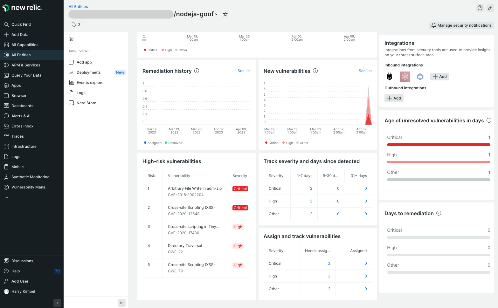
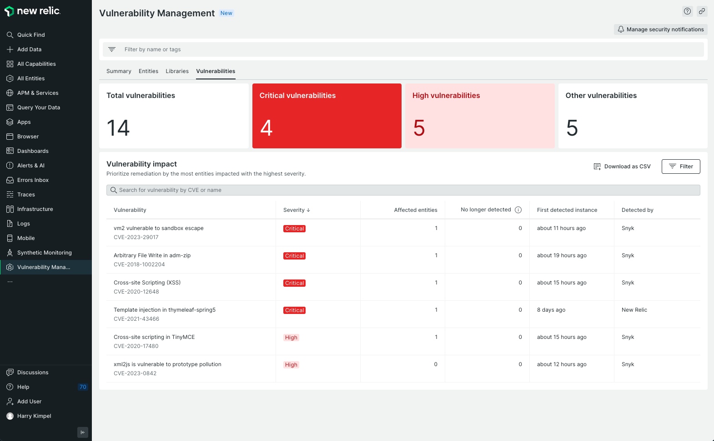

# Using Snyk Webhooks to integrate New Relic with Snyk

New Relic Security API is the most recent approach to having New Relic send any type of security-related information into the New Relic platform.

Using New Relic Security API is beneficial because New Relic “understands” the type of data being ingested and is able to provide a curated user interface for the information. New Relic also offers a standardized way of correlating this information with other types of data that New Relic is able to consume. You can see the correlations on the tabs in New Relic, including the Vulnerability Management section of an entity.

<figure><figcaption>
Entity-level Vulnerability Management
</figcaption></figure>

Examples of such correlations are:

- For an application monitored by New Relic APM (Application Performance Monitoring), the Snyk Webhook provides the repository where the application resides. New Relic can then correlate issues Snyk identifies from an application security perspective with the APM data.
- For a container that is running inside a Kubernetes cluster where New Relic knows everything about the runtime behavior, the Snyk Webhook provides the ImageID. New Relic can then correlate detailed information provided about security aspects for the container.

New Relic also provides a dedicated Vulnerability Management section for all of your security related issues. The information shared using the Snyk webhook will automatically also be populated in this section.

<figure><figcaption>
Vulnerability Management
</figcaption></figure>

To set up the integration between Snyk and New Relic, follow the steps on these pages. There are two ways to achieve this:

1. New Relic's native security ingest processor: Follow the guide on [New Relic docs](https://docs.newrelic.com/docs/vulnerability-management/integrations/snyk/) to get started
2. Through an Azure Function App that acts as a proxy: Begin with [Create an Azure Function App](create-an-azure-function-app.md).

If you have **problems** setting up or using the Snyk Webhook, **contact** your Solutions Engineer or Technical Success Manager for help.
