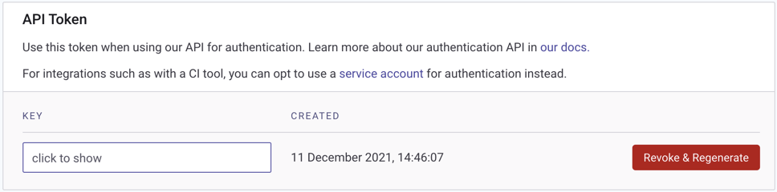

# Authenticate the CLI with your account

To associate the Snyk CLI for use with your Snyk account, you must first authenticate your machine. No repository permissions are needed at this stage, only your email address. When you have authenticated, you can [get started](getting-started-with-the-cli.md) using the CLI.

You can authenticate:

* Through your browser by running `snyk auth` from the CLI; see the [Auth command help](commands/auth.md).
* Using your API token
* Using the `SNYK_TOKEN` environment variable; see [Configure the Snyk CLI](configure-the-snyk-cli/). Use `SNYK_TOKEN` in a CI/CD environment.

To authenticate using your API token:

1. Go to [your Snyk account](https://app.snyk.io/account) (**Account Settings > API Token** section).
2. In the **KEY** field, click **click to show**; then select and copy your API token. A screenshot follows.
3. In the CLI, run `snyk auth [<API_TOKEN>]` or `snyk config set api=<token>`. The `<API_TOKEN>`is validated by the Snyk API.

